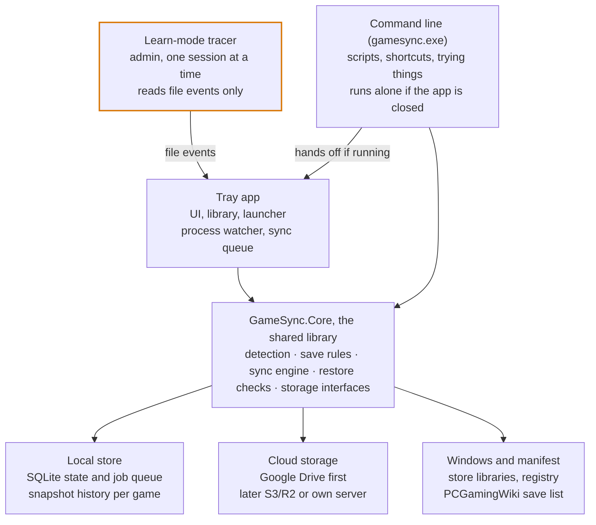
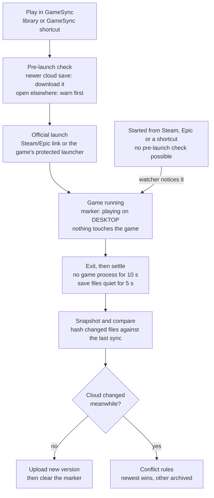

# GameSync: design

Last updated 2026-09-27. This file is the source of truth for the design. A Claude Doc copy with drawn diagrams exists as a snapshot of the same date (link in `CLAUDE.md`).

## Overview

GameSync keeps each game's saves backed up and synced across your PCs, launches your games, and shows every problem on the game it belongs to. It exists because Ludusavi compares whole folders and can't say which game is in conflict.

It's for the owner and a few friends: free, open source on GitHub, Windows first. Each person syncs their own saves between their own PCs; shared co-op worlds come later, with a server.

**Goals**

- Find installed games and their save locations with little or no setup.
- Sync on game launch and exit, plus a daily backup at a time you choose, across two or more PCs.
- Never lose a save: every overwrite keeps the previous version.
- Show one specific status per game, with a manual button for every automatic step.
- Ship as one installer that friends can run without installing anything else.

**Not in scope yet**

- Mods, trainers and anything else that is code.
- Games whose progress lives on the game's servers; they're detected and left unticked.
- Two-way sync for games with Steam, Epic or Xbox cloud saves; those are backed up only.
- Consoles, Linux and Steam Deck; the UI toolkit leaves the door open.

**Principles**

1. Everything is per game: state, history, errors and conflicts. One broken game never blocks the rest.
2. Never destroy a save: snapshot before every overwrite, and keep history, not a mirror.
3. Remember the last synced state, so a failed upload is "pending", not a conflict.
4. Automatic by default, manual always, with a preview of what the next sync will do.
5. Readable without the app: plain files and JSON in the cloud, plus a restore script.
6. Quiet when healthy, specific when not, and never on top of a fullscreen game.
7. Harmless: only save data moves, and nothing touches a running game beyond watching it.

## Architecture

Two small programs share one engine: the tray app, which has no window until you open it, and the command line. A small helper runs as admin only during learn mode.



Only one engine ever touches saves at a time. The tray app and the command line take the same lock, a file in the data folder that Windows lets go of if its program dies. A command waits while the tray app finishes a sync, and says so. The daily run and "I'm done playing" are handed to the tray app when it's running. The highlighted tracer is the only part that runs as admin.

- **GameSync.Core**: all the logic and no UI: game detection, save rules, sync decisions, sessions, safety checks, storage interfaces. Testable without Windows or a cloud.
- **Tray app** (`GameSync.Tray.exe`): Avalonia UI, library and launcher, the agent with its process watcher, Windows' own tray icon and menu, and notifications. Starts at sign-in and runs once per Windows user; closing its window leaves it in the tray (see Background work). It also runs single jobs with no window, such as the daily run from Task Scheduler and launches from Steam's launch options.
- **Command line** (`gamesync.exe`): the same verbs in a terminal (`sync --all`, `plan`, `launch <game>`, `restore <game> <version>`). It's a second program because a Windows program either opens with no window or prints to a terminal, not both.
- **Learn-mode tracer** (after v1, the owner, 7 Oct 2026): a separate small exe, started as admin only for a learn session. It streams file events to the tray app and writes nothing. As GameSync installs per user, the tracer will come with a per-machine part of its own, in a folder only an administrator can change (R18).
- **Local store**: `%LOCALAPPDATA%\GameSync\` holds `state.db`, `history\`, `art\` (cached cover art) and `logs\`. You can move `history\`, the backup folder, anywhere on your PC (Settings, Storage and folders).
- **Cloud storage**: behind two small interfaces, so Drive, S3/R2 and a future server are interchangeable (see Storage backends).

## Game library and detection

The library is built from each store's own records plus a scan of your game folders. Games are matched by IDs and folders, never by display name.

| Source | Where GameSync reads it | How it launches |
| --- | --- | --- |
| Steam | `libraryfolders.vdf` and `appmanifest_*.acf` | `steam://rungameid/<id>` |
| Epic | `C:\ProgramData\Epic\EpicGamesLauncher\Data\Manifests\*.item` | `com.epicgames.launcher://apps/<app>?action=launch` |
| EA app | `__Installer\installerdata.xml` in each game folder | through the EA app |
| Xbox / Microsoft Store | installed game packages | through Windows (backup only) |
| Loose folders | folders you add (e.g. `E:\Games`, `G:\`), matched by folder and exe names | the game's main exe |
| GOG, Ubisoft (later) | GOG registry keys and `goggame-*.info`; Ubisoft's `Installs` registry keys | their own launchers |

**Matching a game**, first hit wins:

1. Store ID (Steam app ID, GOG ID) to the manifest entry with that ID.
2. The manifest's `installDir` names against the install folder's name.
3. Folder, exe and exe product names, compared as letters and digits only ("Slay the Spire 2" equals "SlayTheSpire2").
4. A fuzzy title match, only as a suggestion you confirm.

Each game keeps every ID it has (GameSync ID, store IDs, manifest title, install folder, main exe), so a rename or reinstall still matches.

**Flags set during detection**

- **Anti-cheat**: EasyAntiCheat, BattlEye, GameGuard, EA AntiCheat or XIGNCODE files in the install folder, PCGamingWiki's anti-cheat info, or set by hand. Turns off learn mode and forces the official launch route. Example from the owner's PC: Apex Legends, Helldivers 2, Rocket League, GTA V Enhanced.
- **Store cloud**: the manifest's cloud info (Steam, Epic, GOG, Ubisoft, EA) and every Xbox game. The store moves these saves between PCs, so GameSync keeps a backup of every version and leaves the syncing to it. The status reads "Synced by Steam" (or Epic, Xbox), since "Backup only" confused the owner (28 Sep 2026).
- **Probably online-only**: only settings files found, or progress known to live on servers. Unticked by default.

**Your fixes stick.** Merge two entries ("Spacewar" into the real game), split one, rename, or add a game by hand; the mapping survives rescans.

**Your own games and folders** (LIB-13, asked for by the owner, 28 Sep 2026): Add a game or folder, in first run and the library, takes a name and a folder, such as a game GameSync didn't find or a Minecraft server's world, and syncs it like any game. A session is when the program you pick (optional) runs; without one, the folder counts as quiet, and syncs, once nothing in it has changed for 5 minutes, so a server's world syncs between its autosaves and when it stops. All the usual guards apply: the files have to settle before a copy, program files are never copied (R1: pick the world, not the server folder), a folder that shrinks by over half or empties is held, and every version is kept. Two PCs changing the same world is a conflict like any other.

Built on 30 Sep 2026 (design system version 22, AddGameDialog), with `gamesync add <name> <folder> [--program <exe>]` doing the same from the command line:
- **In the library.** The game joins this PC's library under the person's name for it, with the folder as a place they added (found "by hand"). Rescans keep it and that place; it's installed while its folder is here.
- **With a program**, it's a game in its own folder (LIB-24's): the agent watches that program like any game's, and Play starts it.
- **Without one**, the agent watches the folder all the time. A change opens a session from just before it, and 5 quiet minutes close it. While the folder is changing it counts as in use: no sync, restore or backup touches it, but it doesn't hold other games' syncs back (BG-08 is for play). Once quiet it syncs, and its changes count as made in a session, so they aren't held for review. Stopping GameSync closes an open spell at its last change, and after a crash the next start closes it from the files' own times, as a game's session is closed.
- **Not play.** A folder's spells of changes aren't play: Home never makes it the hero or puts it in Jump back in, the activity calendar and play time leave it out, and its page offers Back up now, with Last changed where a game has Last played.
- **Its ID comes from its name**, so the other PC joins by adding its own folder under the same name. A folder outside Windows' own folders is kept as a full path, and a PC whose folder is elsewhere keeps its own path, as with an install folder.
- **In first run**, Something missing?'s Add a game or folder adds it unconfirmed, ticked in Sync, and Start using GameSync confirms it with the rest.
- **What's refused**, with why: the folders Add a place refuses (a drive's root, a whole Windows folder, Program Files, GameSync's own folders), a file rather than a folder, a name another game already has, and a program that isn't an `.exe` or sits in one of those folders.

**Games in their own folders** (the owner, 29 Sep 2026; LIB-22 to LIB-24): a game outside Steam, Epic and EA, such as `G:\Black Myth Wukong`, is found only in a folder GameSync is told to look in; until then its saves may be found but the game reads Not installed, with no Play. The library's Local view lists the games in their own folders and offers **Scan a folder for games…**: the folder picked (`G:\`, `E:\Games`) joins the ones every scan looks in, and this PC is scanned at once, outside the engine lock (only folding the findings into the library waits for a sync in the background). Each folder in it with a game's program becomes a game, joining the one its saves were already known by. A folder with no program of its own is looked into (LIB-28, the owner's `E:\Games`, 30 Sep 2026): one game in it is that game, kept at the outer folder but named by the folder inside or its program (`FNF\funkin-windows-64bit\Funkin.exe` is Friday Night Funkin', from the program's own description; `OG\MAME` is MAME); several are a folder of games, each its own game (`COD\Call of Duty Black Ops II`, `COD\t7_full_game`), with launchers, redistributables, backups and extras left out. A name is the folder's when it reads as one, without build words and site names (`Call.of.Duty.Infinite Warfare.RexaGames.com` is Call of Duty Infinite Warfare); a code such as `t7_full_game` takes the program's product name or description, or its file name split into words (BlackOps3 is Black Ops 3). Save managers and other tools aren't games (`Game Save Managers`, ludusavi, Playnite, rclone). A game's folder can also say what it is (KAN-69, 1 Oct 2026): a GOG install's record, `goggame-<id>.info`, gives its GOG ID and name (Guacamelee! Super Turbo Championship Edition), and a `steam_appid.txt` its Steam app ID, both looked up in the save list; failing those, a name without its series is the one title in the list that ends with it, Roman and plain numbers alike (Black Ops 3 is Call of Duty: Black Ops III), for a name of two words or more when exactly one title ends so. For a game in its own folder whose list entry gives only settings (the list often knows a store's save path and not a GOG copy's), the name search still looks, and a place joins only if it holds more than those settings. A folder an earlier scan took for a game that a scan no longer does while it's still there leaves the library, unless the person decided something about it (their own name for it, ignored, synced, located, merged); one that isn't there is Not installed, as before (LIB-08). Windows' folder, the whole system drive, the user folder, Program Files and AppData as a whole are refused, since they hold far more programs than games. For one game, its page offers **Locate the game…**: the program picked marks it installed in its game's own folder (the program's folder, above `Binaries\Win64`, `bin\x64` and the like, and above an Unreal project folder that sits beside `Engine`), and Play starts that program. Rescans keep a located game installed there while the folder is on this PC. The view picked (All games, Installed, Local) is kept per PC.

**Rescans** run at startup, when a store's records change, and on demand. A game that disappears becomes "not installed", never deleted, and its saves stay in the cloud.

**Onboarding groups**

| Group | Ticked by default | Why |
| --- | --- | --- |
| Sync | yes | saves found, no store cloud |
| Synced by their store | yes | Steam, Epic or Xbox already syncs it; GameSync keeps a backup of every version |
| Probably online-only | no | only settings files found |
| Saves found, game not installed | yes | keeps history until you decide |
| Installed, no saves found yet | watching | the first session may reveal them |

"Saves found, game not installed" comes from checking every game in the save list for saves on this PC, from its paths that don't need an install folder (built in Milestone 3; Cyberpunk 2077, The Witcher 3 and Forza Horizon 6 on the owner's PC). In the command line, `confirm --all` also leaves out games only the name search found, since it goes by names alone.

**First run** (ONB-01 to ONB-06; built 30 Sep 2026 from the design system's OnboardingScreen and ConnectCloudDialog, version 21): four steps down the left, with no rail until it's done. Until **Start using GameSync** there's no `games.json`, the scan only reads, and nothing syncs.

1. **Scan this PC** starts when the window opens. It reads what Steam, Epic and EA know and looks through the game folders added there (Add a game folder, LIB-05, which scans again). Each store's games show as soon as they're read, then the progress of looking for each game's saves.
2. **Choose games** shows the groups above. Each group is ticked or unticked whole and shows its first four games until Show more. Each game shows where its saves are, as a person reads it ("Documents\My Games\Terraria", "Game folder\Saves"), and how they were found. Games that ship an anti-cheat are named in a note (ONB-05). Steam's software (Wallpaper Engine, 3DMark) is left out once Steam's store has said what it is. On a fresh PC it hasn't yet, so as soon as the scan finishes the store is asked the usual once-per-game question (ART-09) while the person chooses: Home then has the art, and knows the software, by the time setup is done.
3. **Connect the cloud**: Sign in with Google, or a folder, or Skip for now.
   - Google needs GameSync's Google client (CLOUD-12); a copy without one keeps the button off and says why.
   - A folder can be a NAS, a USB drive or another disk. GameSync keeps its files in a `GameSync` folder inside it, and never in its own data folder.
4. **Backups and startup**: Start GameSync when you sign in, and the daily backup at 20:00 (Change time). Both are on by default, as the person's own Run key and task, with no admin (BG-01, BG-02).

Start using GameSync saves the cloud, then confirms the ticked games with the command line's checks (FIND-06, R8). It sets the two switches and turns the window into Home, and the agent makes the first backup in the background.

**Skip for now** (ONB-06, 30 Sep 2026): the cloud is `none` in `games.json`, and a stand-in cloud answers every call "not connected", so syncs work as they do offline.
- Every version is kept in the backup folder on this PC and waits in the outbox.
- A game's first sync keeps its files aside, as it does offline, and the first-sync rule runs once a cloud is there.
- Statuses say "No cloud is connected yet" rather than offline.
- Nothing about it is trouble: the tray reads synced ("every version is kept on this PC"), nothing needs you, and the agent doesn't retry uploads.

Home's top bar shows **Connect the cloud** in place of where the saves go. Its dialog offers the same two ways and connects the choice at once, under the engine lock, then syncs, so what waited goes up.

**A copy on another data folder never changes what starts at sign-in**: first run sets the Run key and the daily task only when GameSync runs on its usual data folder (`%LOCALAPPDATA%\GameSync`). A copy on another one (a test, a second setup) says so instead, since its entries would replace the real ones.

**Moving from Ludusavi** (ONB-04, decided 28 Sep 2026; since later that day a command-line tool only, `gamesync import-ludusavi`, because almost nobody migrates that way, so first run doesn't offer it): the import takes over Ludusavi's ignore list (games already confirmed in GameSync stay synced) and the games added by hand in it, and brings each game's latest Ludusavi backup into its history as a named save, "Ludusavi backup (date)": kept aside and pinned, never current by itself. An older backup as a game's first current version would win that game's first sync over the live save, so it isn't one. A game no longer installed gets its backup as history under the save list's rules. Ludusavi's own files are never changed.

## Save discovery

Four layers look for save locations in order. The first answer you confirm is pinned to the game, so later list updates can't silently change what's synced.

| Layer | Uses | Catches | Cost |
| --- | --- | --- | --- |
| 1. PCGamingWiki list | the Ludusavi manifest: about 22,000 games with file paths | most commercial games | instant |
| 2. Engine rules | Unity `app.info`, Unreal `*-Win64-Shipping.exe`, Godot `.pck`, GameMaker, Ren'Py, RPG Maker | indie games the list misses | instant |
| 3. Name search | folder, exe, and the exe's company and product names, against the usual save folders | most of the rest | about a second |
| 4. Learn mode | one play session: a folder watcher (no admin), plus optional admin file tracing | anything, including emulator folders on other drives | one session |

In the spike (`spikes/Find-GameSaves.ps1`) on 16 loose game folders, layers 2 and 3 alone found 12; the other 4 need learn mode.

**Learn mode's watcher** (FIND-04; built 4 Oct 2026, Milestone 6, KAN-134; design system version 43; `docs/milestone-6.md` has the details). A game GameSync hasn't found saves for and doesn't sync is watched the next time it's played, however it starts, as first run promised ("watched the first time you play"): the files written in the usual save folders, Steam's `userdata`, the save folders added in Settings and the game's own folder are noted with no admin and nothing touching the game (R13), GameSync's own folders and names that are never saves left out. When it closes, they're grouped into places, a game's folder under each watched folder narrowed to the deepest folder its files share, a loose file offered alone, the noise (temporary files, caches, logs, crash dumps, program files, R1; anything the guard blocks, R5) left out, those that look like saves first. The person is told ("ROUNDS: learn mode found where it saves"); the game's saves page has a Learn mode card and See what it found, which lists the places, the likeliest ticked, each checked as Add a place would; Sync these saves adds the ticked ones as Add a place does, so the game starts syncing; Watch again; Not these. Nothing syncs until they pick. A saves page turns it off, or on for any game; never for a game with an anti-cheat (R15) or Steam's software. `gamesync learn` does the same from the command line. Registry writes aren't watched (the engine rule finds Unity's at the next scan); the admin tracer (FIND-05) comes later in Milestone 6.

**Where it looks**: Documents, Public Documents, Saved Games, AppData (Roaming, Local, LocalLow), ProgramData, the install folder, the registry, Steam's `userdata`, and any folders you add. On the owner's PC, Roaming was the most common location (5 of 12).

**Save rules.** A game's saves are a list of rules, each with a root, a pattern, a category and a mode:

```yaml
game: Cuphead
rules:
  - path: "<roaming>/Cuphead/**"
    category: save
  - registry: "HKCU/Software/Studio MDHR/Cuphead"
    category: config        # Unity PlayerPrefs
found: name search, confirmed 2026-09-27
```

- **Roots** are placeholders each PC resolves for itself: `<documents>`, `<savedGames>`, `<roaming>`, `<localAppData>`, `<localLow>`, `<public>`, `<publicDocuments>`, `<programData>`, `<home>`, `<installDir>`, and `<steamRoot>` (Steam's own folder, where `userdata` is). User IDs are `<steamUser>` and `<epicUser>`; in paths from the save list, an account folder is a `*`, so each PC's own matches.
- **A rule's root key** comes from its portable root (`<documents>/My Games/Terraria` is `documents-my-games-terraria`), so both PCs give the same folder the same key.
- **Categories**: `save` syncs. `config` is backed up but stays per PC unless you opt in. `screenshots` is off by default.
- **Excludes**: logs, crash dumps, shader and web caches by default, plus the fixed safety blocklist (see Safety rules).
- **Choosing files** (FIND-12, the owner, 29 Sep 2026): a game's Properties → Saves lists every file in its save places, ticked when it's backed up, with why each other one is out: you left it out, it's a log, dump or cache (the default excludes), or it's a program file, which is never taken (R1). Unticking a file adds an exclude for it to the game's own rules (dropping a rule of its own first, if it had one); unticking a whole place excludes all of it; ticking a file the defaults skip gives it a rule of its own. A file left out stays on the PC, untouched. The choices are rules like any other, so they travel with the saves and another PC is asked before it takes them (R8). Nothing changes until Save changes, and the dialog shows the effect first ("12 of 14 files, 5.9 MB").
- **Places by hand** (FOLD-01, built 29 Sep 2026): Add a place, on a game's saves, picks a folder or one save file and shows how every PC will read it (the portable form, with `<installDir>` for the game's own folder) and what's there before anything is added. It becomes a root of the game's own, keyed from its portable form like any other, with a rule taking all of it (or just the file), so it travels with the saves (R8). A drive, a whole Windows folder (Documents, AppData and the rest), the game's whole install folder, GameSync's own data and backup folders, and anything the safety guard blocks (R5) are refused with the reason; program files in it are counted and never taken (R1); another game saving there too is a warning. The game's rules are checked as the engine checks them before they're saved, so games.json always opens. On a game not syncing yet (its Saves found card, KAN-23, the owner, 3 Oct 2026) Add a place starts it syncing: with another PC's rules first when one syncs it already, as Sync these saves does (PC-04, R8), then the place; otherwise with the place alone, not what the scan found. The dialog says so, its button reads Add and sync, and the game syncs at once.
- **Defaults** (SET-06, designed 29 Sep 2026, built 1 Oct 2026): Settings → Backup and sync → What to back up sets what every new game starts from: game saves always; settings files synced between PCs, backed up on this PC only, or not backed up; screenshots; logs, crash dumps and caches skipped; extra patterns to skip. Changing a default offers to apply it to the games already syncing, which otherwise keep their own. A game takes them when it starts syncing on this PC (Sync these saves, first run, Add a game or folder, `gamesync confirm`); one that takes up another PC's rules keeps those rules exactly (R8) and takes only this PC's own choices (settings files synced, screenshots, who wins). A pattern with no folder in it skips that name in any folder (`*.bak` skips `old/slot1.bak`); one with a folder is taken from the save folder's top; a pattern that would skip every file (`**`), names a place on the PC or leaves the game's folder is refused. Patterns apply to a game's whole-folder rules; a rule for one particular file keeps it. Applying the defaults to the games already syncing changes their files and who wins, never removes what's already backed up, and leaves a game whose rules wouldn't pass the checks as it was.

**Shared and ID-named folders**

- **ID-named folders**: you mark a folder whose subfolders are named by Steam app ID (Steam's `userdata`, emulator save folders, Ubisoft's numbered folders). The manifest's Steam IDs map each subfolder to its game. These folders live in your local settings, not the public repo.
- **Shared folders**: several games may claim different files in one folder. Two rules claiming the same file is an error shown on both games.
- **Swap mode**: for games that write identical file names to the same place, GameSync keeps each game's copy, swaps it in before launch and back out after exit. Those games must launch through GameSync.
- **Session attribution**: files written into a shared folder while a game runs are proposed for that game. That's how Spacewar's screenshots get matched to the game that actually took them.

**Registry saves** are exported per key to JSON (value names, types, data) and restored only under that game's approved key.

- Each key is exported, before each scan of the game, into GameSync's own folder (`%LOCALAPPDATA%\GameSync\registry\<game>`), which joins the game as one more root, so versions, history and crash-safe restores treat the export like a save file. The export takes the key's own last-change time, so a change made during play counts as in-session.
- A restored export is checked before anything is written (it must name one of the game's own keys, never a startup key, R7), then written back once the files are in place. Values keep their exact type and bytes, including Unity's 8-byte REG_DWORD floats.
- A key that vanishes leaves its last export: missing isn't deleted.

**Rules travel with the saves.** Each version records the portable rules it was taken with. A PC that doesn't sync the game yet is offered those rules and the save (PC-04); a PC whose rules differ is told, and keeps its own until you confirm the other PC's (R8). A restore leaves alone the files outside the rules its version was taken with.

**Confirm once, then pinned**

- Every found location is a proposal with its evidence: layer, files, size, newest date. You confirm once.
- Confirmed rules are pinned. Changes in the list or engine rules show up as suggestions.
- If a pinned folder stops changing while a new one appears during play, the game shows "saves may have moved".

## Sessions and launching

A session starts when a game's process appears. It ends once none has run for 10 seconds and the save files have been quiet for 5; every sync decision hangs on that.



Only launches through GameSync can pull a newer save first. Games started elsewhere join at "Game running", so a newer cloud save found at exit becomes a conflict for that game instead of an overwrite.

**Spotting the game with minimal access**

- Running processes come from a system-wide snapshot, which opens no process.
- Only processes named like one of the game's exes are opened, once each, with query-limited access (what Task Manager uses) to confirm the path and start time.
- The session starts at the process's real start time minus 2 seconds, because games write saves the moment they start.
- Launchers, crash reporters and anti-cheat services are ignored. `gamesync done` ends a stuck session; the app has no button for it (the owner, 3 Oct 2026: not needed; it was tried beside Playing on a game's saves and taken out). Whatever of the game still runs then, such as an emulator still closing (the owner's shadPS4 ran on for minutes after its window closed, 2 Oct 2026), no longer counts as the game, for the agent or the app's own actions; a new start of it is a new session (KAN-93).
- If the watcher stops mid-session (a crash, a power cut), the session is recorded up to the last save written, and the game syncs when the watcher starts again.

**Every game installed here is watched** (the owner, 29 Sep 2026; PLAY-12): not only the games that sync, so Home shows what's being played, however it started, and its play time and the activity calendar count it. The game playing now is Home's hero ("Playing now · since 20:41 · In its own folder"), the rail's library dot names it, and its tile, row and page say Playing. Only a game that syncs gets the now-playing marker, the Playing status, the sync after its session and the pause on disk work (BG-08); a game that doesn't sync is just watched, as it was never watched at all before, so a program taken for a game never holds every sync back. Ignored games and Steam's software (Wallpaper Engine) aren't watched: Steam says an app is software in the same request that brings its art, so a fresh install learns it at its first art refresh, and the agent then reads its watch list again. A game's programs are looked for again within the hour, or at once when a game is located, a folder is scanned or a game starts syncing.

**Launch routes**

- Store games start through the store's own link, so its DRM and anti-cheat start normally. A game with an anti-cheat that no store starts goes through its anti-cheat's own launcher in its folder (Easy Anti-Cheat's `start_protected_game.exe`, BattlEye's `_BE` program), never its program; with none, GameSync doesn't start it and Play says to start it from its launcher (R15, the safety audit, 7 Oct 2026).
- Loose games start from the program picked for them in their Properties on this PC, or else the biggest program in their folder, with the game folder as working directory and the launch options typed there, never as admin (PLAY-11). Both choices are this PC's own. A store game's launch options belong to its store: Properties shows Steam's, read only, beside the line to paste into them.
- Swap-mode games must start through GameSync; the watcher warns if one starts elsewhere.
- Shortcuts call `gamesync launch <game>`, so they get the pre-launch check too. Steam's launch options call `GameSync.Tray.exe launch <game> -- %command%`, which runs Steam's command itself with no window.
- GameSync never stands between you and the game. From Steam's launch options, the game starts even when the check can't run, and you're told why. A launch waits up to 2 minutes for a sync in the background, then starts without the check.

**Now-playing marker**

- A small cloud file per game, written at launch with the device and start time, and cleared after the exit upload.
- A marker older than 12 hours with no upload reads "DESKTOP never synced back". You can play anyway; if both PCs then change the save, the conflict rules apply.
- Each PC notes the markers it put up, so one it couldn't clear (offline at the game's exit) is cleared at a later sync.

**Long sessions** (after v1, the owner, 7 Oct 2026; PLAY-10): optional local-only snapshots every 30 minutes guard against in-game corruption. They're never uploaded before the session ends. Until then a save is backed up after every session and once a day.

## Achievements

*Added 28 Sep 2026, for after v1 (the owner's request); moved before Milestone 6 on 3 Oct 2026 (the owner: "After that we need to work on the achievements"). The spike passed the same day: every achievement list Steam keeps on the owner's PC reads, with unlock dates; the icons aren't kept on the PC. Redrawn the same day as design system version 33, after the owner found the first build "too basic": "It needs to be aesthetically impressive. There should be a way to see all unlockable achievements. Hidden achievements stay hidden until they're unlocked. There should be a way to track platinum / 100% achievements."* Each game shows its achievements the way Steam does, with more polish: which ones you've unlocked and when, how rare each is, its metal, and how far you are to the game's Zenith.

- **Steam games first.** Steam keeps a copy of each account's achievement progress on the PC (`appcache\stats`), so GameSync can read it there with no key, offline too. Names, descriptions and icon names come from the game's achievement list, and rarity from Steam's public global percentages, which need no key. A Steam Web API key the person adds in Settings, like the SteamGridDB key, may later fill in whatever the local files miss.
- **Tiers, from rarity** (design system version 33): an unlocked achievement is Gold when under 5% of Steam's players have it, Silver under 20%, Bronze otherwise; none until Steam's percentages are kept. Rarity in words follows Steam's bands: Ultra rare under 1%, Very rare under 5%, Rare under 20%, Uncommon under 50%, else Common. The metals (bronze, silver, gold, platinum, each with a deep shade) are fixed tokens, the same in every theme, as the status colours are. Since version 49 the Zenith is red and gold, and platinum stays for what still uses it.
- **A Zenith is a game's 100%** (Platinum until 3 Oct 2026, when the owner renamed it: "change the name from platnium to zeniths"; the shelf is Zeniths, the metal still platinum): every achievement unlocked. A game's ring turns gold to red and its medal is earned (below; platinum with a sheen until version 49), on the day the last one was unlocked. A game is never shown at 100% before then: its percent rounds down.
- **The tiers are banners, each a harder mountain** (design system version 49, KAN-141; the owner, 5 Oct 2026, asking for something simpler than version 45's badge: "What if we had flags. I want the color of zenith to be red. Like the main its silver bronze and gold? zenith will be red", "There needs to be a greater difference between silver and gold in design. And also maybe try difficulty of mountains as the tiers", "Keep everest as zenith and K2 as second. And the corners are clipping so center them a little"): Bronze is Fuji on teal (a walk-up: one point, a bronze band, a plain rod), Silver the Matterhorn on blue (two tails, a band and a line, knobs on the bar and loops round it), Gold K2 on purple (three tails with a gold fringe, stitching with a lozenge in each top corner, a spear tip, cords and tassels), and the Zenith Everest on red (its plume of snow, the sun at its height above the summit, a chief with three gold stars, a braided gold border, a laurel, a sun on its bar, a tassel on every tail). Each tier adds a layer, and the mountains sit a little smaller about the cloth's middle, clear of the border. Drawn once (`TierBanner` in the design system, `GsTierBanner` in the app, which leaves out the cloth's faint weave), in colours fixed in every theme; under 40px the cloth, one border and the mountain. The Zenith's banner is the Zenith medal everywhere it shows (a game's page, the Achievements page's shelf and table, a cover's corner, the popup; Home's card until version 52, below), the Zeniths monument and the Zeniths card's mark; the four rise at the right of the Achievements page's band. An achievement's own badge keeps its game's icon in its metal, and a tier's dot stays a dot: the Zenith's was gold with red in the middle (the owner: "lets keep zeniths dot as gold with red in the middle"), orange to red since version 52. Zenith's word is gold to red (a deep gold to the Zenith's red in light, so it reads on white). Not yet earned, the medal is the banner's dashed outline round the `zenith` icon.
- **Home's Zenith is a dot** (design system version 52, ACH-12; the owner, 7 Oct 2026, of Home's achievements card with Counter-Strike 2 at 100%: "have dot version for zenith, not the flag. Use a red orange gradient, similar to the text color right now"): Home's card puts the Zenith's dot under the tiers' dots, its words where their counts start ("Zenith" in gold to red, or "48 to go for its Zenith" beside an empty ring), in place of the 34px banner that sat beside the dots. The Zenith's dot runs orange (#ffb54b) to red (#e0483a) from its top left, as the metals' dots run light to deep, with a warm red-orange glow, the same in every theme like the metals; it reads as the word does. A game's page keeps the banner, which its moment unfurls; on Home the moment pops the dot in at the same beat.
- **Light that keeps moving while a page waits costs little** (design system version 50, PERF-07; found 6 Oct 2026, measuring before animating the monument): a 100% ring's rays, glow and glint, and the Zeniths monument's light, tick on one slow clock, 15 times a second and 30 while a glint passes, and hold still while GameSync's window isn't the active one. On Avalonia's own animations the ring ran at the screen's rate, 142 frames a second on the owner's 144 Hz screen, and on the CPU renderer every frame costs the window about 3 ms whatever moved: Home with Counter-Strike 2's 100% ring took about half a core, and takes 8.5% now; the Achievements page with its turning light takes about 4%. Short motion (a moment, a fade, a page's banners rising) still uses Avalonia's animations: it ends.
- **A game's 100% ring is gold and red, and its moment** (design system version 49, KAN-142; the owner, 5 Oct 2026: "can the 100% be animated? or glowy or something to show its zenith. I really want players to feel awarded when they hit 100%", "the platinum ring could be gold read ring", then "gold and red seems good"): the ring runs from gold at the top to deep red at the bottom and back; a warm gold glow breathes round it (four seconds each way), a glint of light runs round it every six seconds, and faint sun rays turn behind it once a minute, reaching about a fifth of the ring past it so they stay in its card. The first time a game's 100% is seen on this PC, on its page or on Home's card, its moment plays: the ring fills its last stretch, flashes and pops a little larger, light bursts out with gold sparks past the card's edge, then its glow and rays come up and the Zenith banner beside it unfurls from its bar (on Home's card the Zenith's dot pops in instead, since version 52). Once per game on each PC (the setting `achievements.zenith.seen.<game>`), and only once the ring is wholly on screen, so a card below the fold plays it when it's scrolled to (found while building, 6 Oct 2026: Counter-Strike 2's page in a smaller window had played it out of sight). The burst is drawn above the page while it plays, as a page's scrolling would cut it off at the card's edge. With Windows' animation effects off the ring and its glow simply show, still.
- **Hidden achievements stay hidden until they're unlocked**: one the game marks hidden and still locked reads "Hidden achievement", with "Keep playing to reveal it.", a "?" on stripes for its badge, and only its share of players. Its name, what it asks and its icon are never shown, its icon is never even fetched, and a search never finds it (whether a word would find it is a secret too). Unlocked, it's like any other.
- **Where they show**:
  - **A game's page**: Achievements in its play bar (unlocked of total), and the Achievements card under About: the game's overview (its ring with the percent and unlocked of total, its Gold, Silver and Bronze, and its Zenith or how many to go), the latest five unlocked in their metals with their days, the rarest one you have in its own light (its badge large, what it asks, its tier and "Very rare · 2.7% of players"), and View all.
  - **Every achievement of a game** (View all; design system → AchievementsScreen): beside the library's list with Back and My games › the game › Achievements. The header holds "Achievements in <game>", where they come from, the game's art faint behind and its overview. The list has All, Unlocked, Locked and Hidden with their counts, Find an achievement (names and descriptions, never a hidden one's), and a sort: Recently unlocked (unlocked first, newest first, then the rest with what most players have first, what's within reach), Rarest first, Most players first, Name. Each row has the badge in its metal (locked: dimmed with a lock), the name and what it asks, and the day it was unlocked or how many players have it. The one picked shows large in its light: its name, what it asks, its tier, when (day and time) or Not yet, how many players have it with a bar, its rarity, and where it stands among yours ("Your 3rd rarest"). One Tab stop; Up and Down move through it and the details follow; Esc clears the search, then goes back. Opening it asks Steam for every icon it shows that isn't kept yet.
  - **Home's Achievements card** (the hero game's, or the last game played that has some, saying so): the overview small, with the tiers in a column and the Zenith's dot under them (since version 52), and the last two unlocked; its arrow opens every achievement of that game, Back returning to Home.
  - **The Achievements page** (the rail's trophy, between the library and the save manager; design system → TrophyRoomScreen): every game's together. A band with the average completion of the games you've started (as Steam reckons it), achievements unlocked in all and across how many games, your Zeniths (the medal, the count, the latest), the tiers you hold, and the rarest you have with its game. Then Zeniths, a shelf of each game finished, newest first, its cover with the medal and the day ("None yet" and the game that's closest when there are none); Closest to a Zenith (the five started and furthest along, each with its bar and how many to go); Recent unlocks (the last five of every game; one opens its game's achievements with it picked); and Every game, a table of each game with achievements here (its cover and name with the medal for a Zenith, its bar and percent, unlocked of total, its tiers, its last unlock), sorted by any heading, a second click reversing it, one Tab stop, Enter or a click opening the game's achievements on this page with Back to it. Refresh rarity asks Steam again for every game; otherwise it's asked once a week. A game nobody here has unlocked one of is only in Every game. Its look is the glow, as Settings has; a game open on it shows the game's art.
  - **A game's cover** (design system version 39, ACH-02; built 3 Oct 2026): once one of its achievements is unlocked, a small ring at the cover's bottom right, opposite the save mark, fills with the share unlocked (rounded down) round a trophy, on the art's dark tint; once every one is, the Zenith medal takes its place. Its words ("Achievements: 71% · 123 of 171") are in the tooltip and the tile's screen-reader name. Only games whose achievements count (Steam's own files, not left out); on the library's covers and Home's Jump back in. A ring, not a bar along the bottom: Steam draws downloads that way.
- **Built 3 Oct 2026** (design system version 33): all of the above, read from Steam's own files on this PC (`Host/Achievements`: `GameAchievementsView`, `AchievementTiers`, `ForAll`, `FetchAsync` and `FetchAllAsync`). Icons come from Steam's shared image server (`shared.akamai.steamstatic.com/community_assets/images/apps/<app>/<icon>`, which holds every game's; the older `cdn.akamai.steamstatic.com/steamcommunity/public/images/apps/` is asked when it has none) by the file name in Steam's list, only names that are a hash and an image extension, checked like cover art and kept under `art\achievements`; rarity from `ISteamUserStats/GetGlobalAchievementPercentagesForApp` (no key), asked again after a week, and first, so the rarest one's icon comes with the latest five. `gamesync achievements [game] [--fetch]` prints the same: Zenith or how many to go, the tiers, the rarest, and each achievement with its tier, hidden ones kept secret.
- **Every game's page has its Achievements card** (design system version 35; the owner, 3 Oct 2026, of Cuphead and Child of Light: "it should still have achievements on its game page. Let it say 0"). A Steam copy Steam on this PC has run shows its own, as above. Otherwise the card shows Steam's public list of the game's achievements, asked by its app ID with no key (`IPlayerService/GetGameAchievements`, kept on this PC, asked again after a month), every one locked at "0 of N", with the list's own percentages for their tiers until Steam's weekly ones are kept: a copy that isn't Steam's says what you unlock in it doesn't show here unless it keeps its own record, whose folder is added in Settings, Achievements (below); a Steam game Steam here has never run says nothing shows as unlocked until you play it here. Neither counts on the Achievements page, Home or in Settings. A game Steam lists none for (asked, and empty: Child of Light, whose achievements are Ubisoft's) says "0 achievements on Steam" and, for a copy that isn't Steam's, that a game with its own launcher may keep them there. A game with no Steam app ID (Bloodborne on shadPS4) says GameSync reads Steam's for now. A folder of your own (LIB-13) has no card.
- **A copy Steam doesn't run counts from its own record** (KAN-123, ACH-11; the owner, 4 Oct 2026: "so the achievement system just copies from steam? its useless without the game being in steam library and being launched?", then "do it. As long as my offline games also have achievements"; design system version 48). A copy that plays Steam's part itself keeps a record of what's unlocked: one folder per game, named by its Steam app ID, with `achievements.ini` or `achievements.json` inside. The person adds the folder holding them once, in Settings, Achievements, **Copies Steam doesn't run** (or `gamesync add-achievement-folder <folder>`; `remove-achievement-folder` takes one off), and each folder there says how many games have a record in it. GameSync only reads the records, and names each achievement from Steam's public list with its icon and rarity, so the copy counts like a Steam game: its page's card ("85 of 137 unlocked · this copy's record", with a line saying they come from its own record and the names, icons and rarity are Steam's), View all ("From this copy's own record"), the Achievements page ("Every game's: from Steam on this PC, and your other copies' own records"), Home ("in its own record"), its cover's ring, and Achievements by game, where no launcher is named and GameSync's popup is on. A Steam copy is always Steam's to say, even with a record for the same app. Steam's list for each copy with a record is asked for once a run, so it counts before its page is opened. An INI record has a section per achievement with `achieved` and a time (`timestamp`, `UnlockTime` or `TimeUnlocked`), in Unix seconds or, in some records, thousands of seconds, read as such when the time would otherwise fall before 2000; a JSON one has `earned` and `earned_time`. A record with nothing in it is a game with none unlocked, and an unlock with no time counts with no day. **While such a copy plays** (the agent's own watcher says it runs, the window open or not), its record is read once a second: what it held as the game started is the baseline, a record first written since is news, one found only later (its folder added mid-game) is the baseline, and an unlock the record dates more than 20 minutes back never pops up (some records keep the time only to the nearest thousand seconds). Where such records live is the person's to add: no list of them comes with GameSync (the rules, as with save folders). Built 5 Oct 2026 and tried on a copy of the owner's library: every record read, dates included.
- **The popup when one unlocks while you play** (ACH-09; design system version 35 → AchievementPopup; the owner: "as someone is playing a game they need to be able to see a popup ... with a nice sound"). Steam names the game running (`HKCU\Software\Valve\Steam\RunningAppID`) and rewrites that game's progress file in `appcache\stats` the moment the game stores an unlock; GameSync looks at that one file once a second while the game runs, what was unlocked as it started being the baseline. An achievement unlocked in the last five minutes and not seen before shows; what Steam brings down from its servers as a game starts (unlocked long ago or on another PC) never does, nor does one seen once this session, even if the file is read half-written. The popup is GameSync's own small window in a corner of the screen the game is on (top right by default), over the game, click-through, never taking focus or a key, dark glass whatever the theme: the badge in its metal, "Achievement unlocked" (or "Hidden achievement unlocked") in the tier's colour, the name, the tier, rarity and share of players, and the game's progress after it ("124 / 171" with a bar); a Zenith gets its own wider popup with the medal, its banner unfurling in a gold and red glow since version 49. It slides in, stays about five seconds and slides out; several queue. A chime GameSync makes itself plays with it (Bronze two notes, Silver three, Gold four, a Zenith its own rising run over a soft chord), in one of five sounds the person picks (Soft bell, the default, Marimba, Glass, Harp, Pop) at one of four volumes (Quiet, Soft, the default, Medium, Loud), each measured by its average loudness so every sound is as loud as the others at the same volume; Soft is about a quarter as loud as the first chime, which the owner found too loud (3 Oct 2026, KAN-120: "it needs to be softer. Give me options i can choose from"), and Loud still below it. Over a game in exclusive fullscreen, which no other window can draw over, only the chime plays and a Windows notification lists what was unlocked when the game closes. Nothing touches the game: GameSync reads Steam's file and draws its own window (R13), and it draws nothing over a game with an anti-cheat, where only the chime plays and the notification follows when the game closes (design system version 51; a window on top of a game is what some anti-cheats look for). **For a game a launcher runs, GameSync's popup is off unless turned on for that game**, as the launcher shows its own (the owner, 3 Oct 2026: "By default the achievement system should not work for games managed by steam. This does not mean spacewar/toxik games"; asked, they chose the popup only: such games still count everywhere else; KAN-122; and on 4 Oct 2026: "games on steam/epic/official external launchers have their own achievement popups, so those games will have their popups turned off by default on gamesync"; KAN-131). The launchers that show their own are Steam, Epic and the EA app, the stores GameSync finds games in; Ubisoft Connect, GOG Galaxy and Xbox join them as GameSync learns their games. Each game's popup is its own choice since version 41, in Achievements by game; version 37's one switch for every game Steam runs is gone. A copy launched as Spacewar or from its own folder isn't run by Steam under its own name, so it gets GameSync's popup, from its own record when it keeps one (KAN-123, above). Try the popup (Settings, Achievements; now or in 10 seconds, so you can switch to a game) and `gamesync achievements popup [--tier gold|silver|bronze|hidden|zenith] [--in <seconds>]` show one of your own unlocked achievements as it would appear.
- **Settings, Achievements** (ACH-09, ACH-10; design system version 35 → SettingsScreen `#achievements`, versions 37 and 41): Show a popup, Play a sound, Sound (picking one plays it, with Hear it beside it), Volume, Where it shows (the four corners) and Try the popup; then **Copies Steam doesn't run** (version 48, KAN-123; above): the folders of copies' own records, each saying how many games have one there, with Add a folder and Remove; then **Games**, one row, **Achievements by game**, saying how many games count and how many have GameSync's popup ("12 of 12 games count on the Achievements page and Home. GameSync's popup is on for 0: Steam shows its own for the rest."), with **Choose games…** (version 41; the owner, 4 Oct 2026: "Game in your achievements makes no sense. Also it needs to be either a popup or a new window that shows all the games in the achievement system"; KAN-131). It opens a dialog over the page (design system → AchievementGamesDialog): every game GameSync reads achievements for (a Steam game Steam here has run, or a copy with its own record), found by name, each with its small cover, how far it is, its Zenith medal when it has one, the launcher that shows its own popup ("Steam shows its own popup"), and two switches under their headings, **Counts** and **GameSync's popup**. A game left out has no popup (its popup switch off and disabled) and isn't counted on the Achievements page or Home; its page's card says "Left out of your achievements" with Count it again, and Home doesn't say it has none. Every change applies at once; Done or Esc closes it (Esc clears the search first). Kept on this PC. It replaced version 35's Games in your achievements, a long list of switches whose meaning wasn't clear (the owner read them as the popups).
- **The Achievements page's personality** (design system version 35; the owner: "trophy figures emerging from the right", "a diamond or something like that to show its top", "the weird blank space"): the tiers rise from the band's right edge as the page opens (trophies in their metals until version 49, the tiers' banners since) (the Zenith's tallest, Gold and Silver beside it, Bronze in front; hidden when the window is narrow, still when Windows' animations are off); **Within reach**: the locked ones most players have, in games you've started and not finished, never a hidden one. In Glossy the page is full glass. A ring under 96px puts its count under itself (Home's card).
- **The Zenith's symbol was the Zenith badge from version 45 to 48** (its banner since version 49, above; design system version 45; the owner, 4 Oct 2026, of the Achievements page still showing the mountain and star: "you didn't make zenith changes here"; KAN-136): the badge (below) is the medal, the Zeniths monument, and the Zeniths card's mark beside its title; the card's corner has the Zenith's scene (below). Before it the mark was version 35's diamond, version 37's sword ("This looks like a cross on a mountain"), version 38's flag, and version 41's snowy mountain with a gold star over its summit (KAN-129; "Do something like this with a star/stars on top. ditch the flag"), made matte in version 42 (KAN-133) and put back in version 44 when the owner found matte worse (KAN-135). The line icon (`zenith`), the mark of a Zenith not yet earned, is still the mountain with a solid star over it.
- **The Zenith badge, a print in a ring with pointy mountains** (retired from the screens in version 49 and kept in the design system as it was; design system version 45; the owner, 4 Oct 2026, of version 44's print: "IN the red badge, make it pointy mountains"; KAN-136. Version 44 came from "The badge needs to be less cartoony. and be encircled. Similar to the last reference", a print of a red sun in rings of dots behind a summit, with a compass emblem in a ring; KAN-135): a misty blue-grey sky; a red sun with halftone rings of white dots round it, fading outward, and finer ones within it; a tall pointy peak in front of the sun, its left face lit and its right in shade, with faint facets; a pointy peak either side behind it and a jagged, hazy range behind those; dark pines either side; pale grass in front; a dark teal ring with a fine pale line, and a ring of dots round it all. Version 44 had a rounded, craggy summit with two figures on top. Its colours are fixed, like the metals. The pines and the grass are drawn once with seeded randomness and generated into both the design system and the app (`tools/design-system/zenith-art.js` makes `ZenithArt`), so both draw the very same badge. From 48px it has everything; from 30px a simpler halo, coarser grass and no facets; below that the sun, the peaks and the pines in the ring. As the medal, version 34's sheen crosses it once as it shows and again when pointed at (still when Windows' animations are off), and a thin glow hugs it, the ring's dark teal then a little of the sun's red, centred (KAN-118). Not yet earned, the medal is a dashed outline round the `zenith` icon. Home's achievements card kept version 41's night-sky patch in its Zenith strip for a while (KAN-136); since version 46 the card is the simple one, with no strip (KAN-137), so every Zenith medal is the badge. A finished ring's halo is round, drawn past the ring rather than cut off by its square box, which light mode showed (KAN-121).
- **The Zeniths card's corner is the Zenith's scene** (design system version 47; the owner, 4 Oct 2026, drawing over the card's corner: "Make it something like that"; KAN-138): the badge's red sun in its rings of dots behind a tall pointy peak with a smaller peak either side and a low range, free of the ring, rising from the card's bottom edge behind its covers, faint (13% in dark themes, 10% in light). The peaks are in the page's ink, lit from the left, so it shows on dark and light pages alike; a short card cuts the sun's top, as the drawing did. Version 45 had a large faint badge there.
- **Home's Achievements card is the simple one** (design system version 46; the owner, 4 Oct 2026: "The home achievement card should be the one before that. Without the zenith card. Where it was more simple"; KAN-137): the hero game's ring (76px, its count under it), its tiers in a column with a small Zenith line beside them (the medal and "Zenith", or how many to go), then the last two unlocked, each with its badge, name and day, as before version 41. Version 41 (KAN-130; "Occupy the space better. The colors look kinda of cheap") had made it a two-colour 104px ring, tier coins, a Zenith strip with a bar or a starry night, and the last three unlocked with their tier and rarity; the owner preferred the simpler card, so those went.
- **The Zeniths monument** (design system version 40; the owner, 3 Oct 2026, of the band's small medal: "I want it to be bigger, take more space. It needs to look mighty, something thats monumental"; KAN-128): on the Achievements page's band, since version 49 the Zenith's banner drawn large in a gold light (the Zenith badge from version 45, KAN-136; the Zenith's mark before), almost as big as the average's ring, light fanning out from behind it all round like a sunburst and a glow, the count in big numerals in the Zenith's own colour, and "Latest:" over the game's name. With none yet the badge stands faint, without its light. Since version 50 its light moves (the owner, 7 Oct 2026: "Animate the light rays", with a screenshot of the band): the rays turn once a minute, a finer, fainter set between them turns the other way every 90 seconds, so the light shimmers where they cross, and the glow breathes, four seconds each way; still with Windows' animation effects off. Before it, nothing moved there while the page waited. The band's other columns gave it room.
- **The page's cards line up** (version 37; the owner: "I really dont like this weird gap left by close to a Zenith and within reach"; KAN-119): two rows the columns share, Zeniths beside Recent unlocks, then Closest to a Zenith ("The games you've started, by how far you are") beside Within reach, each card filling its cell, Within reach's rows as tall as Closest's.
- **Safety and privacy**: read only. Icons are untrusted images, cached and checked like cover art (ART-07, ART-08). Nothing is uploaded, and achievements don't sync between PCs, since the store already keeps them per account.
- **Later, your account** (the owner, 3 Oct 2026: "These will later be tied to an account. The user logs in and their progress for achievements is saved"): signing in will keep a person's achievement progress, Zeniths and history with them on every PC, and keep it should they leave Steam. Until then everything is read from Steam on each PC and nothing about achievements leaves it. Open: which account (the Google account GameSync already signs in to, kept in its Drive folder, or an account on GameSync's own server, planned for later), and what's kept (only what's unlocked and when, never the game's lists). It will be the person's choice, off until they turn it on.
- **Other stores** (Epic, Xbox, GOG) come after Steam, each through its own records or API. Games with their own launchers (Ubisoft Connect, the EA app, Rockstar's) keep their achievements there and show no popup through GameSync; their lists and what's unlocked may later come from those launchers' own records (the owner, 3 Oct 2026; KAN-112, open). Emulated games' trophies are another later piece (KAN-113): shadPS4 keeps a game's trophies only when its trophy key is set up, which the owner's isn't; until then Bloodborne's card says GameSync reads Steam's for now.

## Sync engine

Each game syncs on its own, by comparing this PC's saves and the cloud's newest version against the version both last agreed on.

**Terms**

- **Snapshot**: a game's save files on this PC right now: path, size, modified time, SHA-256.
- **Version**: an immutable cloud record of one snapshot: file list, parent version, device, time and session. File contents are stored once, by hash.
- **Base**: the version this PC last synced for that game.

| This PC vs base | Cloud vs base | Action |
| --- | --- | --- |
| same | same | nothing |
| changed | same | upload a new version whose parent is the base |
| same | changed | download the cloud version; the local snapshot is archived first |
| changed | changed | conflict for this game only, unless both are identical |

Two uploads from the same parent show up as two newest versions (a fork), which counts as a conflict. That's how Drive works without locks.

**Conflict policy**

- Default: the newest save wins, judged by the save files' own modified times. The other side is kept as a pinned version, and a notification offers Swap.
- Never automatic, so the game shows "Conflict: needs you" instead, when:
  - it's the first sync of this game on this PC (the cloud wins, local is archived);
  - the newer side lost more than half its size or files, or is empty;
  - the newer side changed while the game wasn't running;
  - this PC's clock is more than 2 minutes off Google's.
- Per game, you can switch to "always ask" or "this PC always wins". Settings → Backup and sync → When two PCs disagree sets the default a game starts with when it starts syncing on this PC, Newest wins or Always ask; changing it offers to apply it to the games already syncing between PCs, which otherwise keep their own (SET-07, 1 Oct 2026).
- **The conflict screen** (SYNC-10, built 29 Sep 2026) shows both sides from this PC's own records: when each saved, its last session and play since the last sync, size, and changed files, with Compare files listing what changed on which PC. It suggests a side (the newest, and the longer play; not a side that lost half its files or changed outside play) and says why GameSync asked, in the words the engine used when the conflict arose, which a waiting conflict keeps until it's settled. Keeping this PC's save uploads it at once; keeping another PC's writes its files here, so it asks first. Settled, by newest wins or by hand, the same screen says which save is current and offers Swap, until a newer save or a restore replaces the winner; the game's saves show the same in one line.

**Guardrails**

- **Missing is not deleted.** A vanished folder, unplugged drive or uninstalled game never becomes an empty version; the game shows "Drive G: not connected" or "not installed".
- Deleting some files inside a session is normal (rotating autosaves) and syncs. Losing every file never does.
- **Out-of-session changes are held.** They're backed up, but not made current or pulled by other PCs until you approve. That stops ransomware and stray edits from spreading.
- No download or restore while any of the game's processes run.

**Game updates keep the old save**

- GameSync watches each game's build: Steam's `buildid`, Epic's app version, or the main exe's version and date for loose games.
- As soon as the build changes, before the updated game runs, it saves the current files as a pinned old version, labelled like "before update to build 20117 (27 Sep)".
- If the update converts or overwrites the save slot, that version is one click away. Its label shows which build wrote it, since older saves may need the older game.
- A fresh download or reinstall that writes a new save into an existing slot hits the first-sync rule: your existing save wins, and the new one is kept as an old version.
- Nothing is ever deleted, so the last version before any update stays in history even if that snapshot is missed.

**Named saves** (added 27 Sep 2026, BAK-18 and BAK-19)

- **New named save…** (Save as… until 1 Oct 2026, when the owner asked for a create-named-save button where named saves are; KAN-75) keeps the save as it is now under a name you give, like "Before Lady Maria". It sits on a game's Named saves card, and on its page's Saves card. Since 1 Oct 2026 (the owner: like Add a place, not just a grey box; KAN-77) it opens a dialog: the save it keeps (its folder on this PC, its files, size and newest save, and how many more places), the name, and Keep this save, which waits until it's kept and then closes, or says why it couldn't be; a name the game has already is turned away, since two saves under one name couldn't be told apart. It's a version with a named pin, so it's never thinned, syncs to every PC, and stays in this PC's backup folder while it fits in the size limit.
- When nothing else changed, the named save is also the new current save. Asking for it counts as your say-so, so a change made outside play isn't held. When the other PC changed the game too, it's set aside with its name, and the next sync decides as usual.
- Named saves are listed by when the save was made, and one restores in a step like any version: your current files are kept first. A name can be changed or removed; removing it leaves the save in history.
- **Import kept saves** brings in folders you made by hand next to the live save folder, like Bloodborne's `CUSA00207\Before Orphan\SPRJ0005` next to the live `CUSA00207\SPRJ0005`. A folder holding a copy of the live folder, the save's files directly, or a `.zip` of one becomes a named save, named after the folder. The folders are never changed, files a copy shares with another are stored once, and `.rar` files are listed as skipped. The same checks as any import apply (R1, R6).
- For a game like that, the save rule points at the live folder (`SPRJ0005`), never the folder around it, or every kept copy would count as part of the live save.
- **When the scan finds it that way** (drawn 1 Oct 2026 in design system version 27, KeptCopiesDialog and GameSavesScreen `#bloodborne`; built the same day, KAN-61, BAK-21): the owner's Bloodborne was found by name search as its whole `savedata` folder, the live save and every copy (1 GB). A live save beside copies kept by hand is a folder with at least two folders beside it that each hold a folder of its name (`Before Orphan\SPRJ0005`), with copies named like it (`SPRJ0005 - Copy`), nested ones (`Before sus\ded beast\SPRJ0005`) and `.zip` files counted as Import kept saves counts them. A game's saves then show the live save alone under Where the saves are, and under it the copies beside it (how many, where, how big) with Bring them in…. Sync these saves opens a dialog that syncs only the live save and brings the copies in as named saves in the same step, each named after its folder and one the same as another not named twice; it can be unticked, leaving the copies in their folders, not backed up. Sync all of it instead keeps the whole folder as one save, for a folder that isn't what it looks like. From Back up now, New named save… or Import kept saves… on a game not syncing yet, the same dialog backs it up only (KAN-63). The folders are never changed, and copies made there later aren't synced: New named save… keeps one in a step. Built: the game's rules take the live save's folder alone (its whole folder's proposal narrowed to it, and remembered, so a later scan that finds the whole folder again doesn't offer it as more saves), the copies come in as Import kept saves brings them (a copy one folder further in counts even with none directly inside; a `.rar` is listed as one GameSync can't open), and a sync or backup follows at once. The owner's folder, read only: the live `SPRJ0005` (34 files, 33.6 MB) beside 38 copies (989 MB), found in 89 ms. A game already kept with the whole folder isn't narrowed, since its versions are laid out by the rules it has. First run and `gamesync confirm` do the same (1 Oct 2026): Choose games shows the live save's folder and size, with the copies in its tooltip, and finishing brings the copies in as named saves in the background; `gamesync show` says what confirming will do, `confirm` keeps the live save alone and prints the `import-saves` line that brings the copies in, and `--whole` keeps the folder whole.
- In the app (29 Sep 2026): a named save's ⋯ on the game's saves renames it or takes its name away, and **Import kept saves…** in the top bar of the game's saves (since 1 Oct 2026, KAN-64; it was on the Named saves card) picks the folder and lists each copy by name before anything is imported. A copy the same as another in the folder isn't named twice, and one already in the history only gets its name.
- **Before syncing** (the owner, 30 Sep 2026; KAN-63, BAK-20): New named save…, Back up now and Import kept saves… work on a game that doesn't sync yet. The first of them keeps the game's saves: every version backed up on this PC and in the cloud, with named saves and Restore, but not synced between PCs (the game's Sync is set to back up only). It reads Backed up, and its saves page offers Sync between PCs, which makes it sync like any other game. Each of the three says so before it acts, with the files and size the last scan found (Bloodborne: 1,051 files and 1022.2 MB, its copies kept by hand included; KAN-61). A game its store syncs keeps its store's words (Synced by Steam).
- New named save… works while the game runs: it reads the save files as they are, so save in the game first (or quit to the title screen) for a clean copy. So does Back up now since 2 Oct 2026 (KAN-91, the owner): the save as it is at that moment is kept here, as a version made while playing, and its upload waits until the game closes (BG-08).
- **Restore asks first, and works while the game runs** (KAN-89, KAN-91; the owner, 1 and 2 Oct 2026: "Many games' saves can be replaced when you're in the menu. When the user wants to restore, do it; if there's an error, report it"; replacing BAK-10's wait until the game closes). A named save's or a version's Restore opens a small ask over it: "Restore Bloodborne GOTY's save to “befo ludwig”?", when and on which PC it was saved, that the current save is kept first, Cancel and Restore. While the game runs it adds, in the warn colour, that the save may need loading again from the game's menu and that the game may write over it as it quits. Then the restore goes ahead: the save there now is kept first (a rule that never breaks); a file the game holds can't be read to keep, or can't be moved, so the restore stops before anything changes and says which file: "Bloodborne GOTY has SPRJ0005\userdata0000 open, so nothing was restored and its save is as it was. Go back to the game's main menu, or quit it, then try again." If the game opens a file in the moment between that check and the swap, the swap puts back every file it had moved and says the same; only if that fails too does the journal finish the restore at GameSync's next start (BAK-08). A restore's own version is recorded once its files are in place, so one that stopped leaves nothing for a later sync to bring in by itself, or to fork the history with. A sync the agent runs still leaves a running game alone (BG-08), downloads included.

**Crash safety**

- Upload file contents first and the version record last, so a version exists only once it's complete.
- Restore into a temporary folder next to the target, check hashes, then swap by rename. The previous local state goes to local history first. A file something holds open stops the restore before the swap; one opened during the swap makes it put back what it had moved (KAN-91). The restored version is recorded after the swap, and a crash between the two records it at the next start.
- Restored files keep their original modified times, since some games pick "Continue" by date.
- The job queue lives in SQLite, so unfinished jobs resume after a crash or reboot.

**Retention: every version is kept forever**

- Nothing is deleted automatically, in the cloud now or on the server later.
- History stays small because each unique file is stored once and gzip-compressed; the `latest/` copy stays plain.
- Each game shows how much space its history uses, and the app warns when Drive passes 80% full.
- Thinning is a manual, per-game choice, and it never touches pinned versions: pre-update saves, conflict sides, or ones you pin. It also keeps the current version, this PC's base, held versions and each PC's newest. A thinned version leaves a small marker behind, so the history graph stays intact; only its files go to the trash.
- Local history is a fast cache of the last 10 versions per game (2 GB in total) by default; you can choose to keep everything locally too. The cloud holds everything either way.
- **Choosing the backup folder**: moving it copies every file, checks every hash, and only then removes the old copy; if anything fails, the old folder stays in use. It can't be inside a game's install folder, a folder another sync tool manages (OneDrive, Dropbox, Google Drive for desktop), Program Files or Windows. A missing drive pauses backups, never reads as empty.

**Plan preview**: the same decisions, computed without acting. The Sync button, the daily run and the Plan screen show one line per game: the action and the reason.

In the app it's the save manager's Plan tab (SYNC-14; built 30 Sep 2026 from the design system's PlanScreen), made the first time the tab opens and again on Check again:
- Each change shows with what it does (Upload, Download, Back up for a game its store's cloud syncs, Hold for review), why in the engine's own sentence, and how much would move. Every change starts ticked; unticking one skips that game this time only.
- The games that won't run say why, with their status's button: Resolve opens the conflict, the others the game's saves. The games already in sync fold away.
- Time passes between Check again and Run, so Run plans the ticked games again first. Each runs only if its plan is exactly as shown (the same inputs, the same action). One that changed since (a new save, another PC's upload) doesn't run, and the result names it, so the person checks again. Nothing runs that the person didn't see.

## Storage backends

The sync engine needs only a file store and a per-game version log, so Google Drive, S3-style buckets and a future server are interchangeable.

As built (`src/GameSync.Core/Storage/Interfaces.cs`). A folder backend (another drive, a NAS, the tests) and the Drive backend implement both, bundled in `ICloud` with devices, the `latest/` copy, the restore kit and account info:

```csharp
public interface IBlobStore
{
    Task<bool> ExistsAsync(GameId game, BlobId id, CancellationToken ct);
    // Throws if the content doesn't hash to id, so a file that changed mid-upload is never stored under the wrong name.
    Task PutAsync(GameId game, BlobId id, Stream content, CancellationToken ct);
    Task<Stream> GetAsync(GameId game, BlobId id, CancellationToken ct);
    Task TrashAsync(GameId game, BlobId id, CancellationToken ct);   // manual thinning only
}

public interface IVersionLog
{
    Task<IReadOnlyList<VersionRecord>> ListAsync(GameId game, CancellationToken ct);
    // Ids alone, cheaply, so a pull downloads only records it hasn't seen.
    Task<IReadOnlySet<VersionId>> ListIdsAsync(GameId game, CancellationToken ct);
    Task<VersionRecord?> GetAsync(GameId game, VersionId id, CancellationToken ct);
    // Appending an existing id throws. A server or S3 backend also rejects it when `parent` is no longer the newest version.
    Task AppendAsync(GameId game, VersionRecord version, CancellationToken ct);
    Task<IReadOnlyList<PinRecord>> ListPinsAsync(GameId game, CancellationToken ct);
    Task SetPinAsync(GameId game, PinRecord pin, CancellationToken ct);
    Task RemovePinAsync(GameId game, VersionId version, CancellationToken ct);
    // Thinning marks versions instead of deleting them, so which version replaced which is never lost.
    Task MarkThinnedAsync(GameId game, VersionId version, CancellationToken ct);
    Task<IReadOnlySet<VersionId>> ListThinnedAsync(GameId game, CancellationToken ct);
    Task<SessionMarker?> GetMarkerAsync(GameId game, CancellationToken ct);
    Task SetMarkerAsync(GameId game, SessionMarker? marker, CancellationToken ct);
}
```

| Backend | Who pays | Two PCs writing at once | When |
| --- | --- | --- | --- |
| Google Drive, each person's own | free; 15 GB shared with Gmail and Photos | fork found after the fact | v1 |
| S3-style bucket (Cloudflare R2, Backblaze B2) | the owner; R2 is free to 10 GB, then $0.015 per GB-month | conditional write on a head file; the second PC pulls first | v2 |
| GameSync server (ASP.NET Core, files in R2) | the owner | the server accepts one; the other pulls first | v3 |

**Local first** (built in Milestone 2)

- Every sync writes to the backup folder on this PC first, then uploads from there: new versions and pins go into an outbox, and a push sends each version's files first and its record last. Before planning, a pull copies the records this PC hasn't seen, so decisions read local files.
- Offline, a sync still snapshots this PC and queues the upload; downloads and conflicts wait for the cloud, with this PC's changes kept meanwhile (PC-05).
- The backup folder keeps every record, plus the files of the last 10 versions per game within 2 GB and anything not uploaded yet (BAK-17). Older files come back from the cloud when a restore needs them.
- If the cloud loses versions this PC has (its folder was deleted, or it's a new account), they go back in the outbox and upload again.
- A cloud folder that can't be reached is offline, never empty.
- **Uploads beside the work** (KAN-88, 2 Oct 2026, after the owner's named save, restore and Play each took ages on Bloodborne): a person's action in the app (a named save, a restore, Back up now, an import, a rename, Swap) and the app's own syncs do their work on this PC under the engine lock and return; the upload (the outbox, the plain latest copy, this PC's device record, the restore kit) runs beside them under its own upload lock, so nothing the person does waits on Google Drive. Their 113 MB of named saves had held the engine for minutes while it uploaded, and every action waited behind it. The upload pauses while a game that syncs is played (BG-08), waits 1 minute after a failure, then twice as long each time up to an hour (BG-04), and a person's action asks for it at once. A person's action waits at most 1.2 seconds to hear what's new in the cloud, then goes on with what this PC knows, as it does offline. Taking a name or a pin away is done here at once and reaches the cloud with the next upload; a pull doesn't bring it back meanwhile. A terminal's commands and the daily task Windows starts still upload within their run, taking the upload lock after the engine's, never the other way round, so the two locks can't deadlock. Pins read from Google Drive are known by their file and MD5 while the app runs, so a look at a game's saves reads only the pins that changed (it read all 36 of Bloodborne's every time). Play looks for the game again right before starting it, so a Play held up by the check can't start a second copy (KAN-90).
- **How far an upload or a download is** (KAN-80, 2 Oct 2026, the owner: "if it's uploading then I need a progress bar that shows the upload progress and speed"): an upload counts everything a game's outbox sends before the first byte goes, the files the cloud doesn't have yet (each once, however many versions share it, sizes before compression as everywhere else) and every version record, pin and pin removal, and reports as each file arrives; while Google Drive takes a big file in parts, each part's share counts as it goes, so a 300 MB world's bar moves instead of jumping when it's done. Reports only go forward. A restore of a save this PC doesn't have yet (another PC's) brings all of its files down first, four at a time, saying how far it is, before anything is written into the game's folders. The app shows each game's upload or download on its saves (`JobProgress`), at most ten times a second: how much of how much, how many files, the speed over the last few seconds and the time left, and how it ended: done with what it moved and how long it took (shown for a few seconds), paused while a game that syncs is played, or waiting after a failure with when it's tried again. A file counts for 256 KB beside its bytes in the bar and the time left, since each one is a call to the cloud. The tray icon's tooltip says which game is uploading and how far.

**Google Drive**

- Scope `drive.file`: the app sees only files it created. Your other Drive files are invisible to it, and to anyone holding its token.
- Folders are found by app properties, not names, so you can rename or move the GameSync folder. When two PCs create the same folder at once, the older one wins and the other's contents move into it. The emptied copy is renamed and unmarked, then trashed.
- Other apps can put files into GameSync's folders, such as a Drive sync client on another PC. `drive.file` hides those files from GameSync, and Drive then won't let GameSync trash the folder. Nothing in normal syncing trashes a folder, and a merged copy that can't be trashed just stays, renamed and unmarked.
- Each upload is checked against the MD5 Drive reports; a mismatch is thrown away and tried again.
- Sign-in: a "Desktop app" OAuth client with PKCE and a redirect to 127.0.0.1. The Google project is set to "In production", because "Testing" expires sign-ins after 7 days.
- Release builds carry GameSync's own client ID and secret, so friends sign in with one click and never make a Google Cloud project (decided 28 Sep 2026). They're kept out of the public repository and added when a release is built; Google treats a desktop app's client secret as not confidential, since anyone can read it out of the program. A build from source asks for a client JSON, as today. Built 1 Oct 2026: `tools/release/pack.ps1` puts the owner's client beside the programs as `google-client.json`, where the app looks for one (from `%LOCALAPPDATA%\GameSync`, where signing in keeps it, or `notes\`, both outside the repository; it never prints it), and `-NoClient` makes a zip that syncs through a folder only.
- One Google account per PC in v1: changing it means signing out and in again (decided 28 Sep 2026).
- Errors are typed (quota full, sign-in expired, rate limited, offline), retried with backoff where that helps, and shown on the game's status.
- Files Google flags as malware are never downloaded. The app doesn't set `acknowledgeAbuse`; it shows the error on the game.
- Drive handles many small files slowly, so a first upload of about 1,300 save files takes minutes. Later uploads send only changed files; bundling small files is a later optimisation.

```
GameSync/
  HOW-TO-RESTORE.txt
  restore.ps1
  devices/<device-id>.json
  games/<game-id> <title>/
    latest/                                  plain copy of the newest version, plus VERSION.txt
    versions/2026-09-27T21-04Z_DESKTOP_3f2a.json
    blobs/ab12….gz                           each unique file, stored once (in ab/ subfolders on a folder backend)
    pins/  thinned/                          pins added later; marks left by thinning
    playing.json                             now-playing marker
```

**Encrypted mode** (off on Drive, and perhaps a later opt-in there; the default on a shared server)

- Decided 27 Sep 2026: Drive stays unencrypted, so the `latest/` copy and `restore.ps1` get saves back without GameSync, and `drive.file` already keeps the app out of your other files. `IBlobStore` still takes an encrypting wrapper; turning encryption on later means one re-upload into the new layout.
- A sync key, shown once as a recovery code and entered on each PC, encrypts every file and version record with AES-256-GCM. Anything altered without the key fails to decrypt.
- File IDs become an HMAC-SHA256 of the content keyed with the sync key, so hashes don't reveal which files you have.
- The cost: no readable `latest/` copy, and losing the key makes the cloud copy unreadable. Local history still works.

**Future server**

- ASP.NET Core minimal API, SQLite or Postgres for version logs, R2 for files.
- Discord sign-in, one folder per user, a storage limit per person, short-lived upload and download links.
- Clients can add versions but never delete; only the owner can thin history, by hand.
- Groups for shared co-op worlds come after that.

## Multiple PCs

Each PC is a named device with its own base per game, and paths travel in portable form, so one save lands in the right place on every PC.

- **Device identity**: a random ID plus a name you pick (DESKTOP, LAPTOP), created at first run and recorded in `devices/<id>.json` with the app version and last-seen time.
- **Portable paths**: versions store `<documents>/My Games/Terraria/…` or `<installDir>/b1/Saved/…`, never `C:\Users\<you>\…`. Each PC fills in its own folders and install paths, so Wukong's saves move from `G:\Black Myth Wukong` to wherever the laptop installed it. The placeholders: `<home>`, `<documents>`, `<publicDocuments>`, `<roaming>`, `<localAppData>`, `<localLow>`, `<savedGames>`, `<programData>` and `<installDir>` start a folder; `<steamUser>` and `<epicUser>` can sit anywhere in it. One a PC can't fill makes the game Not available there, never empty.
- **Account IDs**: `<steamUser>` and `<epicUser>` resolve per PC. If they differ (another account), the game warns that some saves, like FromSoftware's, embed the ID and won't load.
- **Game not installed here**: its saves wait in the cloud, and a restore is offered once the game is detected. Install-folder saves need the game installed first.
- **First sync on a new PC**: the cloud wins and the local files are archived. That blocks the "fresh install overwrote 100 hours" disaster.
- **Clock check**: every sync compares the PC's clock with the `Date` header from Google. More than 2 minutes off turns off "newest wins" on that PC and shows a warning.
- **Settings stay per PC**: `config` files are backed up per device and synced only if you opt in, so the laptop keeps its own graphics settings.
- **Offline laptop**: sessions snapshot locally and uploads queue. Back online, the normal rules apply, conflicts included.

## Background work

The tray app does the work while it runs, a daily backup covers the rest, and neither ever interrupts a fullscreen game.

- **Tray app**: starts at sign-in from your own Run key (`GameSync.Tray.exe --background`), with no admin, so Task Manager's Startup apps lists it and can turn it off. It runs once per Windows user and data folder, held by a named mutex; starting it again asks the running one, over a pipe only your Windows user can open, to bring its window forward. The command line's `sync`, `plan`, `restore` and `launch` come the same way while it runs (BG-09, built 1 Oct 2026): the app does the job under the same engine lock as its own work, and the terminal shows what the job prints as it prints it, then its exit code, so `gamesync sync` no longer waits for the agent to let go, and a game launched this way is started by the app. A job whose terminal is closed part way (or stopped with Ctrl+C) finishes in the app all the same, so a sync is never left half done; one that fails in a way the command line wouldn't expect says so there, ends with exit 1, and leaves the whole story in the app's log. Steam's launch option, which carries its own command, runs in its own process as before, and an app running as administrator (which it never should, R17) takes no jobs, so the command line runs them itself: a job never gets more rights than the terminal that sent it. It holds the agent (the watcher and the syncs), the tray icon and the UI. Closing the window leaves it in the tray and lets go of the window's pictures, Skia's caches and the memory pages the window used (handed back to Windows, which returns them at once if the window opens again), so it waits small (PERF-01; KAN-62, 1 Oct 2026: a maximized window's library left 110 MB in Task Manager after closing, now about 10 MB, and it opens again in about 0.2 s); work in the background while it's closed is let go of the same way, at most once a minute; Quit is in the tray menu.
- **Between sessions**: every game syncs every 15 minutes and when the tray app starts, so what another PC played comes down without a click. Each synced game's build is read every minute, so its save is kept before an update runs.
- **Daily backup**: each person picks the time in Settings; setup suggests an evening hour when the PC is usually on. A Task Scheduler entry runs `GameSync.Tray.exe daily` with no window, or hands the job to the tray app when it's running. It runs as you, without admin rights, at below-normal priority, and never wakes the PC.
- **Missed runs catch up**: if the PC was off at that time, the backup runs about 10 minutes after the next sign-in (a second entry, which runs only then). Most syncing happens at game exit anyway; the daily run is the safety net.
- **What the daily run does**: skips games that are running, backs up and uploads changed games, checks for game updates, refreshes the save list weekly, and writes one line per game to the activity log (a game that changed has its sync's line). The saves it makes current carry the note "Daily backup", which a game's history and the Versions tab show.
- **Retries**: failed jobs wait 1 minute, then double the wait each time, up to 1 hour. Jobs survive restarts.
- **Notifications**: Windows toasts only for things that need you (a conflict needing a decision, an expired sign-in, saves not found, a blocked file, saves that may have moved), plus an optional daily summary (Settings → Notifications, off by default: one line after the daily backup, "Checked 12 games and uploaded 1 new save."). They're held while a fullscreen game runs (checked with `SHQueryUserNotificationState`) and shown after it closes; Settings → Notifications can turn the holding off. Each shows once while its problem lasts, an expired sign-in is one toast for all games, and more than three at once become one.
- **Tray icon** (the owner's choice, 28 Sep 2026): the GameSync mark in the taskbar's own white or black, like Windows' own icons, with nothing else when every game is synced. Anything else is a small badge in the fixed status colours, its symbol cut out so the taskbar shows through: an up arrow in cyan while working, "!" in amber when something needs you, a dash in grey when offline (the mark greys too), and a play sign in violet while a game runs. When several apply, needs you wins, then offline, playing, working. Hovering shows the news and the counts ("GameSync: 2 games need you", "41 of 44 synced · 2 need you · 1 waiting"). A click opens the window; the right-click menu is Windows' own, in Windows' light or dark (LOOK-11): Open GameSync, Sync now, Quit GameSync. `gamesync quit` asks the app to quit the same way and waits until it has, for scripts and an installer (KAN-140).
- **No disk work during play**: hashing and uploads wait for the session of a game that syncs to end. Only the watcher, and learn mode when you start it, run while you play. A game that doesn't sync is only watched, for Home (PLAY-12), and doesn't pause the other games' syncs.

## UI

Fourteen screens share one idea: every game shows exactly one status, and every status has a button that deals with it. The look, components and screens are in the GameSync design system; the older mockups are in `design/mockups/` (both links are in `CLAUDE.md`).

| Screen | Shows | Actions |
| --- | --- | --- |
| Onboarding | detected games in their groups, save paths found, cloud sign-in, daily backup time | tick or untick, confirm paths, Add a game or folder, connect Google Drive |
| Library | laid out like Steam's: every game by name in a list on the left (search, sort, Installed only, Favourites first) beside the cover grid, or beside the page of the game picked; a status badge on a game that needs a look, a small check in the ok colour on one whose saves are fine, playtime and last played per game | Play, search, sort, Installed only (kept per PC), add to favourites, hide from the launcher, filter by view (all, local, software, hidden), Scan a folder for games… (Local), open a game's page |
| Game detail | a game's page, beside the library's list, about the game like Steam's: its art and logo, where it's installed as the store's mark (words under the pointer), a play bar (last played, play time, achievements unlocked of total, its save status; Playing while it runs), About from its Steam store page, its Achievements (the overview, the latest five, the rarest), a small Saves card, and On this PC (where it's installed, its size, how it starts) | Back, Play (or its status's action; Install through Steam; Locate the game… for one no store installs), add to favourites, Properties, Change the art…, hide from the launcher, open the game's or the save folder, Back up now, Save as…, Sync these saves, Choose files…, Open in Saves, Store page, View all (its achievements) |
| A game's achievements | every one, beside the library's list or on the Achievements page: the game's overview (ring, tiers, Zenith), All, Unlocked, Locked and Hidden with counts, each in its metal with its day or its share of players, hidden ones secret until unlocked, and the one picked large with when, how many players have it, its rarity, its tier and its place among yours | Back, a tab, Find an achievement (never a hidden one), sort (Recently unlocked, Rarest first, Most players first, Name), pick one |
| Achievements | the rail's trophy: every game's achievements together: the average, unlocks, Zeniths, tiers, the rarest you have; the Zeniths shelf, Closest to a Zenith, Recent unlocks and Every game | open a game's achievements (from any of them), sort Every game by a heading, Refresh rarity |
| A game's saves | in the save manager: its status and what happened (and the last conflict, while its winner is current), a restore under way and then that it's in place, named saves (the one in place says so), where its saves are, every version from every PC, its log; for a game not syncing yet, the saves found | Back, Resolve, Retry, Keep the new save or Restore the previous save (held), See both and Swap, Import kept saves… and Back up now (in the top bar, for every game: on one not syncing yet they keep it backed up first), New named save… (on the Named saves card, KAN-75), Restore a named save or a version, rename a named save or remove its name, Add a place…, Export, Open the folder, Choose files… (once, beside where the saves are), Sync these saves, Sync between PCs (a game kept backed up only) |
| Game properties | a dialog like Steam's: General, Art (its cover, banner and logo), Launch, Installed files, Saves (every file in its save places, ticked when backed up) and Sync | rename, favourite, show in the library, copy its ID, choose its own cover, banner or logo and Use Steam's, pick the program, launch options, copy Steam's launch line, choose files, sync between PCs or back up only, who wins a conflict, stop syncing, Save changes, Cancel |
| Plan | what the next sync would do for each game, and why | Run, skip a game |
| Versions | in the save manager: every version of every game from every PC, newest first: when it was saved, the game, the PC, why it was kept (after play, the daily backup, the first backup, held, named, kept before an update or a restore, a conflict's other side), files and size; counts of versions, named, kept, this week and the oldest | pick a game or a PC, Named and kept only, Show N older, open a version in its game's saves (Restore is there) |
| Log | in the save manager: everything GameSync did, per game, newest first and kept for good, each line tagged with what it was about (upload, download, backup, restore, named, conflict, held, in use, session, daily and more) | search, pick a game, Only what needs you, Uploads, downloads and restores, Copy the log (never sign-in tokens or save files) |
| Conflict | in the save manager: both sides (changed files, sizes, save times, PCs, sessions), the suggestion and why GameSync asked; settled, which save is current | Back, Keep this PC's, Keep the cloud's, Compare files, Decide later, Change for this game; settled, Swap |
| Settings | appearance, storage and folders (backup folder, history to keep, game folders to scan, extra and ID-named save folders, where shared zips go), start at sign-in, the daily backup (its time, on or off, its last run), what new games back up (SET-06) and the conflict default (SET-07), cloud (Google Drive with its account and how full it is, a folder, or none yet), devices, notifications, safety (the games with an anti-cheat); the version at the foot of the column | pick a theme and colours, change or move a folder, add or remove a folder, rename a device, sign out, start at sign-in on or off, Copy diagnostics (logs and version lists, never tokens) |
| Launcher home | the game playing now (Playing now, since when, the banner glowing in the play colour), or else the last-played game, as a hero with its save status and newest named save, the hero game's achievements (its ring, tiers and Zenith, and the last two unlocked; or the last game played that has some), Jump back in, play activity by day, a month at a time (pointing at a day says the games played and for how long) | Continue playing (not while it runs), Save as…, Restore a named save, Manage saves (the game's saves), Properties, every achievement of the card's game, Conflicts (Needs you until 4 Oct 2026; the save manager's tab; its pill in warn with a caution mark while there are any, as the rail's Save manager is), a day's games (click a day), open a game from them, the month before or after |
| Save manager | every game's saves in dense console-style tables, the games that sync above every game's (status, path, versions, size, last backup), a stats strip (games, the space the backups take on this PC's drive with its free space, versions, last backup, needs you), the live log; its Needs you tab, the games waiting for the person with what happened | open a game's saves, sort each table by Game or Status on its own, select, Share selected, Share all, Import saves, Sync now; on Needs you, each game's Resolve, Review, See where or See why |

**Statuses**

| Status | Meaning | Buttons |
| --- | --- | --- |
| Synced | this PC and the cloud match | none |
| Playing | a session is running; sync waits | none in the app (`gamesync done` ends a stuck session) |
| Upload pending | changed here, with the reason (offline, quota full, sign-in expired) | Retry, Details |
| Newer in cloud | another PC uploaded; which one and when | Download, Compare |
| Conflict | both changed; resolved automatically or waiting for you | Swap, Keep this PC's, Keep the cloud's |
| Held for review | changed while the game wasn't running, or looks like a reset | Approve, Restore previous |
| Files in use | a save file is locked, and by which process | Retry |
| Saves not found | every path that was tried | Add a place, Learn mode |
| Not available | drive disconnected or game not installed | none |
| Blocked | antivirus, a Google malware flag, or a failed safety check | Details |
| Synced by Steam (or Epic, Xbox) | the store's cloud syncs this game; GameSync keeps a backup of every version | Back up now |

- **Look** (chosen 2026-09-27): the launcher follows the owner's reference images in `Design inspirations/` (dark rounded cards, pill tabs, a cover-art hero, a play-activity calendar), and the save manager uses the Console look, because it shows more detail. Tokens, components and showcase screens live in the GameSync design system (link in `CLAUDE.md`).
- **Theming**: Dark (default), Light or Match Windows; pure black backgrounds for OLED screens in dark mode; six preset themes (Arcade, the default cyan, then Moss, Tidal, Sakura, Citrus, Mono) plus one that follows the Windows accent colour. Each preset sets a primary and a secondary colour and a faint surface tint, and either colour can be swapped from 11 curated swatches. One engine derives every colour from those choices and keeps text at 4.5:1 and controls at 3:1 in every combination. Status colours never change with the theme. Choices are saved per PC and apply live. Later: any custom colour (adjusted until it passes contrast), theme export and import, tinting a game's pages from its cover art.
- **Glossy and Solid** (the owner's choice, 28 Sep 2026, drawn on the mockups canvas): two surface modes, picked under Appearance → Surface and saved per PC; a fresh install starts in Glossy (the owner, 28 Sep 2026) (LOOK-17). **Glossy** puts each page on a blurred, darkened copy of a game's art (the page's own game on game detail and conflict, otherwise the last one played) and lets it show through the surfaces, in strengths: full glass on Home, the library, game detail, conflict and the save manager; a soft glow at the top of the page over nearly solid cards on first run and settings. Home and the library were a step more solid until 1 Oct 2026, when the owner found Home's cards and the library's list grey over the art, the list taking its colour only once a game's page opened (KAN-68). A backdrop's colour is capped too: above an OKLab chroma of 0.10 it eases towards 0.15, keeping lightness and hue, so art filled by one vivid colour (Counter-Strike 2's orange) doesn't flood the app while muted art keeps its colour (KAN-67, 1 Oct 2026). **Solid** is the plain look, as the app was before Glossy. The app makes the backdrop once per game on the CPU (a small blurred bitmap, no live blur), so it runs on Windows 10 and 11 with the app's CPU drawing. Bright art is darkened more, so text keeps 4.5:1 on every surface over any picture (LOOK-18). Glossy falls back to Solid when Windows' transparency effects are off, with pure black, and on a page with no art. Light mode has its own Glossy since 3 Oct 2026 (design system version 35; the owner: "there isn't even any difference in glossy/solid in light mode"): the art frosted white instead of darkened, a light tint of the page over it from top to bottom, cards white at 60% with a bright edge and a soft shadow, controls the deep ink at 5 to 10%, dark text, the art lightened further where needed so text keeps 4.5:1; status chips keep their opaque light grounds.
- **Light mode redone** (3 Oct 2026, design system version 35; the owner: "no separation between background, foreground and elements ... it all looks white"): a cool grey page (lightness 91%), white cards with a hairline in the theme's deep ink and a soft shadow, wells and controls a step darker, so a card stands off the page in Solid too; Zenith's word on a page in a deep steel rather than the metal's pale blue (version 36). The owner's own redesign, perhaps with textures (KAN-78), can still come.
- **A change of look comes through softly** (the owner, 1 Oct 2026; KAN-76, LOOK-26): Dark to Light and back, pure black, a preset, a colour, or Glossy and Solid never jump. The window as it looked stays over the new look as a picture, and the new look comes through it from where the person clicked: a circle with a soft edge grows over 0.6 s, as a new game's backdrop lights up (KAN-54), clear inside so no text is seen twice for long. Glossy and Solid alone turn into each other evenly, all of the window at once, over 0.5 s (the owner, 1 Oct 2026: not a circle). When Windows makes the change (Match Windows), the old look fades out over 0.4 s. With Windows' animation effects off, the look changes at once (A11Y-04). In Glossy the new look's backdrop is made before the change starts, or found kept (both modes' are kept, and the other mode's is made in the background), so the window changes once and all of it; it used to show the new colours over the old glass for a moment, then change again with a second animation (the owner, 3 Oct 2026: "switching between darkmode and light mode when its in glossy mode is laggy"; KAN-124). The glass's colours are recoloured in place and the token colours swapped in one step, so the window's own work for a switch fell from 120 to 250 ms to about 100 ms (a debug build, 1920 × 1080).
- **Home's banner moves between the games played last** (the owner, 3 Oct 2026: "I want the main screens hero card to be scrollable, but I can't think of what it will scroll between. Recently played games?"; KAN-125; design system version 37): the game playing now or played last, then the next four played (a folder of your own isn't played), each with its art, words, status, Play and Achievements card. A glass pager at the banner's top right (the game before, a dot a game, the next), the mouse wheel over the banner, a two-finger swipe and Left and Right with it focused move between them, round from the last to the first. It never moves by itself: a launcher opened to carry on playing shouldn't change under you. Glossy's colours follow the game shown, the light coming through from the click (KAN-54), each game's backdrop made in the background beforehand. A refresh keeps the game shown, unless another game starts playing and becomes first, which then shows. **A click on the banner opens the game's page** (the owner: "if a user clicks on the hero card, shouldn't they be taken to that games page? By default."; KAN-126), anywhere but its buttons and the pager, and so does Enter with it focused; it shows the hand and a focus ring, and a screen reader hears "Apex Legends, 1 of 5. Enter opens its page; Left and Right show the other games you played last."
- **Small asks and dialogs** (the owner, 1 Oct 2026): a small question that opens from its own button (Swap, Restore, a named save's Rename) floats on the dialog's surface, like a menu, never Windows' grey; anything that asks for a name or shows what it will act on is a dialog with a head, a body and a foot, like Add a place and New named save (design system README, Shape and space).
- **The game library, like Steam's** (the owner's wishes, 28 Sep 2026; drawn in the design system, version 14, 29 Sep): every game by name in a list down the left, with a search at its top (Ctrl+F, or the rail's Search), the sort under it (Recently played, the default, Name, Hours played, Recently added) and Favourites first; the covers beside it, favourites first there too, or the page of the game picked, so the next game is one click away (LIB-14 to LIB-18). The views are All games, Local (games in their own folders, with Scan a folder for games…), Software and Hidden (LIB-22); Installed only, a tick box beside the sort, shows only the games installed on this PC and is kept per PC like the sort (30 Sep). The view, the search, the sort and Installed only apply to both sides, and the rail's Game library always opens every game, with no game's page, search or view left from before (30 Sep). A row shows the status under the name only when the game needs you or runs, and a game not installed here is dimmed. A right-click offers Play, Add to favourites and Hide from the launcher. Favourites and the sort are kept per PC, like hidden games. A game's page is read from this PC alone (the backup folder's copy of the version records, pins and PCs), so it opens at once, offline too; a game not syncing yet shows the saves found with Sync these saves, which confirms them (FIND-06).
- **The owner's wishes of 30 Sep 2026, late night** (built overnight; KAN-44 to KAN-51):
  - A copy not from a store is never "synced by its store": one located or added by the person, or in its own folder, syncs between PCs (KAN-44).
  - A game whose saves are fine (Synced, or backed up while its store syncs it) shows a small mark in the ok colour on its cover, on the art's deep tint, and at the end of its row, with its words in the tooltip and for screen readers ("Synced between your PCs", "Backed up; Steam syncs it"); the badge stays for statuses that need a look, and ends in … when it's too long for its box (KAN-45, KAN-48; LIB-25). The mark says which: a cloud with a check for Synced, a shield with a check for backed up, never a bare tick (the owner, 3 Oct 2026: "the tick mark ... should be replaced with a SYNCED symbol"; design system version 35), on covers, the library's list and every Synced or backed-up badge.
  - What needs you is the save manager's, not a kind of game: the library's Needs you view went, and the save manager has a Needs you tab with each waiting game's status, what happened and its button; Home's Needs you tab and card lead there (KAN-46; MGR-10). Renamed **Conflicts** on 4 Oct 2026 (the owner: "Rename needs you to conflicts"; KAN-132): the pill, the tab, the stats, the rail's and the tray's "2 conflicts", the daily summary and the command line's plan. The rail's Game library always opens every game (LIB-21).
  - Installed only in the library's list replaces the Installed view (KAN-47; LIB-22).
  - The save manager's Saves tab has two tables in one scroll, Syncing above Every game, with the same columns, each under a heading that says what it holds, with its count (the owner, 3 Oct 2026: "it should be more clear what the top table is and what the bottom table is"; design system version 35): **Syncing between your PCs** (backed up here and in the cloud, the newest save brought to your other PCs) and **Every game with saves on this PC** (everything the scan found, syncing or not); a click on GAME or STATUS sorts both, again reverses, with an arrow on the heading and the order in each table's command line (KAN-49; MGR-01, MGR-05). Status sorts what needs you first, then playing, waiting to move, synced, backed up while the store syncs it, not available, not syncing.
  - The game playing now glows on Home: a ring and a soft light in the play colour, held still, so it's the same with Windows' animation effects off; any pulse waits for the animations pass, which follows that setting (KAN-50; PLAY-12, A11Y-04).
  - Restoring a named save is one question, then it's in place, and the page says so: "Bringing back …" while it runs, then "… is back in place", or why it couldn't be; the named save in place says In place, and the current version keeps its "Restored from …" note (KAN-51; BAK-18). In place means the game's files on disk are still that save: once the game saves over it, Restore is back, though nothing is backed up until the game closes; when the files can't be read, the newest version stands in. The page reads them again when the window comes forward (KAN-94, 3 Oct 2026).
- **The owner's review of 30 Sep 2026, evening** (their own library, the overnight build; KAN-54 to KAN-62; built the same evening, not committed):
  - Opening a game's page, its colours grow in as a circle from where the person clicked, over half a second; with Windows' Animation effects off they change at once (KAN-54; LOOK-21, A11Y-04). Only the backdrop grows; the surfaces switch at the start.
  - A game's page shows where it's installed as the store's mark (Steam, Epic, EA, from Simple Icons, CC0), "Installed through Steam" under the pointer; a folder and its path for a game in its own folder (KAN-55; LIB-26).
  - A game's right-click menu offers Properties, as LIB-20 asked (KAN-56). Each of the save manager's tables sorts on its own, and a heading that sorts shows a small sort mark (KAN-49; MGR-05). Every scroll bar is a thin round thumb in the theme's ink (KAN-57; LOOK-20).
  - Scrolling was choppy because the Glossy backdrop, a small blurred picture, was stretched across the window by the CPU on every frame: 62 ms a frame in the real window. It's now drawn once at the window's size and copied: 16 ms (KAN-58; PERF-04). GameSync keeps drawing on the CPU: the GPU was measured too, no faster after the fix and heavier in memory. After the window closes, memory now comes down only slowly (about 260 MB for minutes; a full collection reaches 131 MB private); that's KAN-62.
  - Art for a game Steam doesn't have comes from its own folder first, with no network: a PS4 dump's `sce_sys` icon and background, a PS3 game's `PS3_GAME` ones, checked like downloaded art and copied into the cache. A square or wide picture sits whole in the middle of a 2:3 cover over a blurred copy of itself (KAN-59; ART-10). A keyless web source (Wikipedia's page images) was considered and left for the owner to decide, as it would send game titles to another site.
  - A game that syncs but hasn't had its first backup says "Not backed up yet", never Synced (KAN-60; LIB-27). A copy located by hand before KAN-44 is put right when GameSync opens its data, since no scan may ever see it again (KAN-44).
  - Named saves, Save as… and Restore need versions, so a game not syncing yet says they start once it syncs. Their Bloodborne's save folder holds the live save and 35 copies kept by hand (1 GB), which Sync these saves would take whole; syncing only the live save and bringing the copies in as named saves in one step waits on a design (KAN-61). Superseded the same night by KAN-63, below.
- **The owner's review of 30 Sep 2026, night** (KAN-54, KAN-63 to KAN-66; built 1 Oct, not committed):
  - The colour change is light, not a circle: like lights behind a wall getting brighter, a soft glow with no edge spreads from where the person clicked and brightens over three quarters of a second until the new backdrop is fully lit. Only the lighting changes; the page switches at once, and with Windows' animation effects off the colours change at once (KAN-54; LOOK-21, A11Y-04). It's drawn with Skia in one pass (a radial light masking the new backdrop over the old), since Avalonia's opacity masks cost about 45 ms a frame on the CPU; about 29 ms a frame in the real window.
  - Named saves, Back up now and Import kept saves… work before a game syncs, keeping it backed up only (KAN-63; BAK-20; see Named saves). A game's saves page has Import kept saves…, Save as… and Back up now in its top bar for every game, and one Choose files…, beside where the saves are; the Named saves card lost its Import button (KAN-64; MGR-07).
  - Scan a folder for games… reads folders of several games, games in a folder of their own, names from programs, and leaves tools out; what an earlier scan got wrong leaves the library (KAN-65; LIB-28; see Games in their own folders).
  - Then their look at that build (1 Oct 2026; KAN-67, KAN-68): Counter-Strike 2's backdrop was too orange while Peak's, Bloons TD 6's and Risk of Rain 2's looked right. Measured on their art: what shows of CS2's colour averaged 0.033 in OKLab chroma, the others 0.009 to 0.024; the cap brings CS2 to 0.021, beside Peak, and moves the rest by a tenth at most. Home and the library take full glass, as a game's page does.
  - Then, the same night (1 Oct 2026; KAN-71 again, KAN-75): the scroll bar sat against the window's edge, so every page's bar sits in the middle of the 24px gap between the content and the window's edge, its thumb 9px clear of each; and the Named saves card has its own New named save… (the top bar's Save as… went; design system version 25).
  - Then their look at the rescan (1 Oct 2026; KAN-69 to KAN-74): Black Ops 3 and Guacamelee go by their proper names (see Games in their own folders); Friday Night Funkin' and MAME take their programs' icons as covers (see Cover art); every page's scroll bar sits in the page's right gutter, clear of the covers and cards, the content still in line with the top bar (KAN-71); Home's hero fades to the next game's picture (0.7 s) and its playing glow eases in and out (0.9 s), both at once with Windows' animation effects off (KAN-72); and Playing is Spotify's green, #1ed760 in dark mode (the older #1db954 was too dark on its badge over bright art) and #0f6e35 in light mode, changed in the design system first (version 24) (KAN-73). Green is also the Moss theme's primary and the Green, Mint and Lime swatches; a status always has its icon and word. The Activity card gets an overhaul later, with statistics and graphs (KAN-74, an open question).
  - Home's Activity says, for each day, what was played and for how long: under the pointer, the day and its play, then each game and its time; a click on a day with play (or Enter on it; the arrow keys move between days) lists that day's games with their covers and times, each opening its page. The card shows a month at a time, with arrows back to the first month with play (a year at most), since a month's first days show little (KAN-66; PLAY-13).
- **A game's page is about the game** (the owner, 29 Sep 2026; design system versions 16 and 17): like Steam's, with the save work moved to the save manager. The hero shows the art and the logo; under it, a play bar holds Play (or, when the game needs you, its status's own action with Play beside it; Install through Steam for a Steam game not installed here), Last played, Play time, Achievements once they're read, and Saves with its status, then the favourite star, Properties and More. About comes from the game's Steam store page (description, developer, publisher, release date, top tags as genres, engine); a small Saves card says what's happening and when it last backed up, with Back up now and New named save… (Sync these saves and Choose files… for a game not syncing yet) and Open in Saves; On this PC shows where it's installed, its size, how it starts and its launch options (LIB-19). A game's saves open in the save manager: its status, with Keep the new save and Restore the previous save for a held one, named saves, where its saves are, every version from every PC, and its log (MGR-07).
- **A game's saves after the owner's review of 1 Oct 2026** (design system version 31, built 2 Oct; KAN-79, KAN-81 to KAN-87, KAN-92): the top bar has **Share…** beside Import kept saves… and Back up now: the share window with its current save ticked, any named save or version a pick away (off for a game with an anti-cheat, saying why; SHARE-14). **Named saves** show their count in the heading, a search (Find a named save) and a sort (Newest first, the default, or Name, kept per PC), and the list keeps the card's height, scrolling inside it, so 36 don't make a long page (BAK-23). No pin on them: every named save is pinned, so it said nothing and looked like a button; pins stay in the history, saying "Kept forever: never thinned". Each has Restore, **Export** (a zip, through the share window) and ⋯: Rename; **Where it's kept**: in GameSync's history, its files stored once by content in the backup folder on this PC and in the cloud, with no folder of its own (the owner's choice, 2 Oct 2026, over a plain folder per name, which would cost every copy's full size); **Export as a folder…**, a plain copy in a folder the person picks, named after it, holding each save folder by its own name with the files' own dates, never over anything ("befo ludwig (2)"), written beside its place and named once whole; Open the backup folder; and Remove the name (BAK-24). **Where the saves are** says what's kept there in words: "The folder SPRJ0005 and everything in it", with the numbers of what's kept, never the scan's whole-folder count (the live save's own numbers once its rules take it alone; KAN-81). A **Current save** card under it, from the owner's drawing: when the game last wrote it, its files and size, when it was backed up and whether that's in the cloud yet (or that it changed since), and the named save it's the same as, with when it was restored when it came back that way (MGR-10). Every action says in its tooltip what it does and what's kept safe, and the kept-copies dialog says what syncing is ("Sync keeps every version, on this PC and in the cloud, and brings the newest to your other PCs") with buttons that say what they keep: "Sync SPRJ0005 + 36 named saves" and "Sync the whole folder as one save" (A11Y-06).
- **A program in a save folder** (R2, the safety audit, 7 Oct 2026; design system version 51, GameSavesScreen `#wukong-program`): a program file found in a place is never backed up (R1), and the place says so under its numbers in `warn` ("A program is in this folder and isn't backed up: Uninstall.exe. Programs never travel with saves; if you didn't put it there, check where it came from."); the game's log says it once, when it's first found, not at every backup. It isn't a status of its own: the saves still sync.
- **Game properties** (the owner, 29 Sep 2026; LIB-20): a dialog like Steam's, from the gear, a game's menus and On this PC, in six sections: General (name, favourite, shown in the library, the ID for the command line), Art (its own cover, banner and logo, ART-06; also from its More menu, Change the art…), Launch (PLAY-11), Installed files, Saves (choosing files, FIND-12) and Sync (between PCs or back up only, who wins when both PCs changed it, stop syncing). Changes wait for Save changes, which the foot counts; Cancel, Esc and the close button ask before dropping them.
- **Settings** (built 1 Oct 2026; design system version 26, SettingsScreen; SET-01 to SET-08): the sections down the left, one at a time on the right, each opening at its top; what a change came to is said in the card it was made in, in words, and in warn when it couldn't be. The look changes live and is kept per PC (LOOK-07). Storage and folders moves the backup folder through Windows' folder picker: a folder that isn't empty gets a GameSync folder inside it, and the move shows its progress, checks every file and keeps the old folder until it's done (FOLD-02, FOLD-03); a folder it refuses says why in the field (FOLD-04). Adding or removing a game folder or a save folder scans this PC again at once, so its games show as installed or Not installed straight away (FOLD-07, FOLD-08); a save folder whose folders are mostly numbers is taken as one named by Steam app ID. Backup and sync has Start GameSync when you sign in, the daily backup's time with Change time and its switch, and its last run with Run now, which the agent runs at once, skipping games being played (SET-02, SET-03, SET-08); a copy of GameSync on another data folder, such as a test's, shows them but never changes what Windows starts. Cloud: Google Drive signed in as the account, with Open folder in Drive, how full it is (a warning past 80%, CLOUD-05) and Sign out, which asks first; signed out, Sign in with Google; a folder cloud, with its free space and Open in Explorer; no cloud yet, Connect the cloud (ONB-06). Encryption shows as Later. Devices lists every PC with its GameSync and when it was last seen; only this PC has Rename, since each PC names itself and the others see the new name after its next sync; a name another PC has is refused, so every save says which PC it came from (PC-02). Safety lists the games with an anti-cheat. The foot of the column has the version and Copy diagnostics (SET-05). Home's cloud and PC buttons lead to Cloud and Devices. Storage and folders also has Shared zips (built with sharing, 1 Oct 2026; FOLD-09): the folder Share saves puts its zips in, Downloads at first, with Change… and Open, and Ask where to save each time, which opens Windows' own Save as instead. Not shown until they're built, so nothing does nothing: snapshots of long sessions (PLAY-10) and learn mode's admin switch (with the tracer, SET-04), both after v1.
- **Updates** (built 7 Oct 2026; design system version 53, SettingsScreen `#updates`; PKG-03, R19): the card is named for the version this PC runs and says it's installed for this person alone, or where a build or the zip runs from (an update installs beside it, not over it). Then one row for what the updater knows: a newer version ready, with Restart to update as the primary, its release notes' bullets under What's new and Release notes on GitHub; or up to date, with when it last checked and Check now; or coming down, with a bar, how fast and how long; or refused in warn, saying it didn't pass GameSync's own check and why, with Try again; or that GitHub couldn't be reached. Check for updates every day (on unless turned off) and a note that GameSync isn't code-signed. Home's top bar shows Restart to update while one is ready, its tooltip naming the version, and the tray menu has Restart to update to it; both wait while a game is played, saying why. A notification says a version is ready, once.
- **Navigation and feedback** (the owner asked for Nielsen's heuristics and Shneiderman's golden rules, 29 Sep 2026; A11Y-05): the design system's README sets them for GameSync. Always a way back: Back at the top left of every page below a rail destination, with a breadcrumb, and Esc, Alt+Left and the mouse's back button doing the same (LIB-21). Status in words where it happens; nothing on screen that does nothing (disabled with the reason in its tooltip, or not shown until built); asking before anything writes into a game's folders; easy undo; recognition over recall; the same thing in the same place (Back top left, the gear is always Properties); shortcuts for people who use it a lot; errors that say which game, what happened and what to do.
- **The window** (the owner, 29 Sep 2026): no separate title bar. The page runs to the window's top edge, so Glossy's art does too; the top strip moves the window, and the minimize, maximize and close buttons sit level at its right in the theme's ink and light up under the pointer, close turning Windows' red, and keep Windows' own behaviour, snap layouts included (LOOK-19). A cover's hover ring is even on all four sides. Screens fill the window at any size with no gaps (the owner, 29 Sep 2026): on Home the cards take what their content needs and the banner, whose art is cropped to fit, takes the rest; side cards keep a readable width, and shelves show more covers on wider screens rather than bigger ones.
- **Sharing saves** (reworked 28 Sep 2026: sharing is mostly of current saves, and should be quick; built 1 Oct 2026, SHARE-01 to SHARE-13): the save manager's Syncing table has a tick on each game, with Select all in its heading, and its toolbar has Share selected and Share all (MGR-02). Share selected opens the share window with the ticked games, each taking its current save; a game's chevron lists its versions newest first, so exact ones can be picked, older and pinned ones too (SHARE-01, SHARE-02). Share all ticks the current save of every game that can be shared (SHARE-04), and Export on a version in a game's saves opens the window with just that version ticked (MGR-07). The window's foot counts the games and versions, names the zip and adds up the saves' size; the zip compresses, so it comes out that size or smaller, plus a few KB for its README and manifest (SHARE-03). Any version can be picked, including one that only the cloud or another PC kept: the window lists versions from their version records, which are small, and packing downloads only the files of the versions picked (SHARE-05). Only save data goes in: a program file is left out and said so (R1, SHARE-06). Single-player saves and multiplayer world files can be shared; games with an anti-cheat, or that play only online, are locked out, shown with a lock and the reason, and Share all names them as left out (R16, SHARE-07). The zip goes to Settings → Storage and folders → Shared zips (Downloads at first) as `GameSync-saves-<date>.zip`, then `(2)` and so on, or wherever the person says when Ask where to save each time is on (FOLD-09). Packing shows its progress, and Cancel leaves no zip behind, since the zip is written beside its place and only named once whole; Done says how many saves of how many games, the size and where, with Copy path and Show in folder (SHARE-09). Inside: a folder per game, one per save in it (its date and label, or the PC's name), and in that one a folder per place the game saves, holding the files with their own dates; `gamesync-share.json` says who packed it and when, each game's ID, title and portable rules, and each save's PC, dates, label, accounts and files with their hashes; `README.txt` says how to import it, and how to restore a save by hand without GameSync, naming each place (SHARE-08). **Import saves**, an icon in the save manager's top bar, opens a shared zip from Windows' picker, as does a zip dropped anywhere on the window (opening one from Explorer comes later), and lists its games before anything is added (SHARE-10). A game that syncs here gets its saves added. One GameSync found here that isn't kept yet is kept first, backed up only, with the rules the saves were taken with (R8, BAK-18). One this PC doesn't have joins the library as Not installed, kept the same way, so its saves wait until the game is found; a scan then finds it by its title and keeps those rules (SHARE-13). One whose rules don't fit this PC, such as a folder the safety guard refuses (R5), can't be ticked, and says why. Each save becomes a pinned version labelled "Imported <date>: <label>" (or "from <PC>"), never current, so nothing changes until one is restored from the game's saves (SHARE-10). Every file gets a restore's checks first: a safe path (R6), the hash the manifest says, no program (R1, left out and said so) and the antivirus (R3, which turns the whole save away); a save already in the game's history isn't added twice, and one taken from a place this PC's rules for the game don't have is turned away with the reason (SHARE-11). Registry saves arrive as their exported files, so restoring one writes only under the game's own key (R7). Saves made on another Steam or Epic account are flagged before anything is added, since some games check the account (SHARE-12). Sharing and importing are written to the log, tagged share. **Never into another account's game** (R16, the safety audit, 7 Oct 2026; design system version 51): a zip's game with an anti-cheat, or that plays only online, can't be imported, whether this PC has it or not, its row saying why with the shield; and a save from a zip is marked as shared in its version, so it's never restored into a game found later to have one.
- **Cover art**: official Steam art for every game with a Steam app ID, taken from the store's records or from the save list's Steam ID, so Epic and loose copies of Steam games get it too. Image file names come from Steam's store API (`IStoreBrowseService/GetItems` with `include_assets`, no key needed), because newer games keep their art under hashed paths that can't be guessed from the app ID. Tiles use the 600×900 library capsule; the hero uses the library hero with the game's `logo.png` over it, since Steam's hero art never contains text; rows use the 300×450 capsule.
  - The same request brings the store page's basics for a game's About (ART-09, 29 Sep 2026): its short description, developers, publishers, release date and top tags, named from Steam's tag list (asked for once a month, no key). Steam's words are cleaned, cut to length and kept with the art, never synced. It also says which apps are software rather than games. First run asks it as soon as its scan has found the games, while the person chooses (30 Sep 2026); covers the Steam client already has come straight after the scan, with no network.
  - Games with no Steam art take what they carry in their own folders (a console dump's icon and background, KAN-59), then, for a game in its own folder, its program's own icon if it's 128px or bigger (read from the program file as data, nothing run; Friday Night Funkin', MAME; KAN-70), then SteamGridDB only if the person has added their own free API key in Settings. Otherwise, and whenever nothing matches, the tile shows a title cover: the game's name on a themed tile, never an empty box.
  - **Your own art** (the owner, 29 Sep 2026; ART-06): in a game's Properties, Art, the person can use an image of their own for its cover, banner and logo, picked in Windows' picker. It's checked by its content like downloaded art (JPEG, PNG or WebP, up to 8 MB), kept on this PC in `art\own\<game>\` under a name of its own (so a new picture never shows as the old one), shown before Steam's everywhere, never synced or put in a shared zip; Use Steam's puts Steam's back.
  - Art is cached in `art\`, works offline, refreshes when Steam's image timestamp changes, and never goes to the cloud or into a shared zip. Downloaded images are untrusted: JPEG, PNG or WebP only, size-limited, checked by content.
  - `design/real-art-preview.html` shows the owner's library filled this way; it loads the images from Steam when opened.
- **Every wait moves** (KAN-80, 2 Oct 2026, the owner: "Whenever some processing is occurring, the user needs to see some way to know it's working and not crashed"; design system version 30): a button doing its job is busy from the press, saying what it's doing (Syncing, Backing up, Restoring, Keeping, Starting, Scanning) with three dots that count up after the words and the spinner in its icon's place; it keeps its colour (a greyed-out button looks broken: theirs did while the 36 copies came in), keeps its width, takes no clicks, and stays busy at least 0.4 s so a quick job doesn't flicker; a screen reader hears it busy. A job longer than that, or one that moves files, shows a `JobProgress` where its result will show: what it's doing, a bar, how far, how fast and how long; with nothing to count yet, a stripe slides along the bar. The kept-copies dialog's look and keeping, first run's scan, the game's uploads and downloads on its saves, Back up now, Sync these saves, a named save's and a version's Restore (with a line under the status saying what's coming back), New named save's Keep, Play's Starting… (from the press until the game runs, or half a minute), Scan a folder for games, Add, Import, Create zip, and Home's Sync now, whose arrows turn while GameSync syncs or uploads. Closing the kept-copies dialog while it works doesn't stop it, and the game's saves show how far it is. With Windows' animation effects off nothing turns or slides and the dots stay, while the words and numbers still change (A11Y-04).
- **Accessibility**: every status has a text label and an icon, not colour alone, and everything works from the keyboard. A list or table is one Tab stop, with Up and Down inside it (the design system's Shortcuts); in the save manager's tables Space ticks a game that syncs for sharing and Enter opens it (1 Oct 2026). Every control shows the 2px `primary` focus ring, and every menu item can be pressed by a screen reader. Since 3 Oct 2026 the Versions tab, a game's named saves (Left and Right between a save's Restore, Export and More) and the library's covers (the arrow keys across the grid, favourites first) are one Tab stop too. **Text size** (A11Y-04, 3 Oct 2026): GameSync's text follows Windows' Settings → Accessibility → Text size, read when the look is applied and whenever the window comes forward: every text size and line height is the design system's times Windows' scale, while icons, art and spacing stay as drawn; the library's list, Settings' and first run's columns and the dialogs widen by 60% of the text's growth (dialogs at most 30%, so Properties fits a 1280 window); the save manager's top bar puts its tabs under the title when they don't fit beside it. A title cover's big initial is part of the art and stays.

## Safety and security rules

Only save data ever moves, restores can write only inside a game's approved folders, and nothing touches a running game beyond watching it. Each rule below gets an automated test.

**Data only**

- **R1.** Program files are never backed up or restored. They're caught by extension (`.exe .dll .sys .scr .com .bat .cmd .ps1 .vbs .js .jse .wsf .hta .msi .lnk .url .reg .cpl .jar`) and by content (the Windows program header).
- **R2.** A program file found in a save folder raises a warning on that game.
- **R3.** Restored files are scanned through AMSI, Windows' built-in "scan this" interface, before they're moved into place. A detection blocks the restore.
- **R4.** Files Google flags as malware are never downloaded.
- **R5.** No rule can include browser profiles, credential stores, `.ssh`, `.aws`, crypto wallets, Windows credential folders, or GameSync's own token store.

**Restores**

- **R6.** Every restored path must resolve inside the game's approved folders: no `..`, absolute paths, alternate data streams, reserved names, or links that point elsewhere.
- **R7.** Registry restores touch only the game's own approved key, never `Run`, `RunOnce` or anything outside it.
- **R8.** Rules and paths from the cloud or the save list get the same checks, and a new or changed rule needs your confirmation.

**Accounts and tokens**

- **R9.** Google access uses the `drive.file` scope only.
- **R10.** Tokens are encrypted with DPAPI for your Windows user, and "Sign out" revokes them at Google.
- **R11.** Nothing listens on the network except the sign-in redirect on 127.0.0.1, for the seconds sign-in takes.
- **R12.** Launch commands never leave the PC, and `gamesync://` links can only launch a game GameSync already knows.

**Anti-cheat**

- **R13.** Game processes are opened with query-limited access at most: never memory access, injection, suspension, hooks, debugging or overlays.
- **R14.** No kernel driver. Learn mode uses ETW in its own uniquely named session, never the shared NT Kernel Logger, and never touches other sessions.
- **R15.** Learn mode is off for games with an anti-cheat, and those games launch only through their official route.
- **R16.** Saves are never edited. Saves of games with an anti-cheat, or that play only online, are never moved between accounts, sharing included; single-player saves and multiplayer world files of other games can be shared (widened 28 Sep 2026).

**Admin helper**

- **R17.** The main app never runs as admin.
- **R18.** The tracer runs only during learn mode. It's installed under Program Files, checked against its release's signature before it starts, reachable only through a pipe limited to your user, and accepts no command that writes.

**Releases**

- **R19.** Each release's installer is signed with GameSync's own release key, and the updater installs nothing else: it checks that signature before running an installer. There's no Windows code signing (the owner, 7 Oct 2026: "i dont really wanna pay for digital signing. Applyication will likely take a long time too"), so the release key is what keeps an update from being swapped; its private half never goes into the repository. Until 7 Oct 2026 this was code signing through SignPath's free open-source program.
- **R20.** GitHub uses a passkey or 2FA, a protected main branch, pinned dependencies (`packages.lock.json`), and CI with least-privilege tokens and pinned actions.

**Server, later**

- **R21.** Ownership is checked on every request, each person has a storage limit, and the owner gets a spending alert. Upload links are short-lived and scoped to one user's folder, clients can't delete, and encryption is on by default.

**The safety audit** (Milestone 6, 7 Oct 2026). Every rule has its tests, named after it: `SafetyTests` and `SafetyAuditTests` (`R1_…` to `R21_…`), and the feature tests that carry a rule's number (`SharingTests.R16_…`, `LearnModeTests.R15_…`, `GoogleAuthTests.R9_…`, `R10_…`, `R11_…`, `TwoPcTests.R1_and_R2_…`, `R3_…`, `R6_and_R8_…`, `RegistryTests.R7_…`, `LibraryTests.R8_…`). R18, R19 and R21 have nothing to test yet (the tracer, signing and the updater, the server), and their tests are skipped saying so; R12's `gamesync://` links and R14's ETW session come with the installer and the tracer. What the audit found and changed:

- **R2**: the warning for a program in a save folder reached only the command line. Now each scan keeps the programs it found with the game: its saves page shows them under their place, and its log says so once, when one is first found (design system version 51).
- **R3**: a file no antivirus answered for (none running, or one too big to hand it) is restored, and the game's log says so, as the interface always promised. A restore the rules turn away (R1, R3, R6, R7, R16) now says why on the game in the app; before, it escaped the app's job.
- **R5**: a folder reached through a junction or a symbolic link, anywhere along its path, is checked where it really leads, so a link can't lead a rule into a protected folder.
- **R6**: the reserved names with superscript digits (COM¹ to COM³, LPT¹ to LPT³) are refused too.
- **R11**: the app's pipe answers only programs on this PC; one reached from another PC is turned away.
- **R13**: GameSync keeps no handle to a game it starts: only its ID, watched with query-limited access. It draws nothing over a game with an anti-cheat: no achievement popup, only its chime and the notification after (design system version 51).
- **R15**: a game with an anti-cheat that no store starts goes through its anti-cheat's own launcher (Easy Anti-Cheat's `start_protected_game.exe`, BattlEye's `_BE` program), never its program, and with none GameSync doesn't start it; Properties' Change… takes only that launcher (design system version 51).
- **R16**: a shared zip's game with an anti-cheat, or that plays only online, can't be imported, saying why; a save from a zip is marked as shared (`SharedFrom` in its version, which older GameSync reads past) and is never restored into a game found later to have one.
- **R17**: started as an administrator, the app says so in Windows' own message box and closes.
- **R20**: CI (`.github/workflows/build.yml`) builds and tests every push and pull request on Windows, restoring packages in locked mode, with a read-only token and its actions pinned to their release commits.

| Threat | Stopped by |
| --- | --- |
| Malware spreading between PCs or friends | R1–R5 |
| A tampered cloud planting a program on your PC | R6–R8 |
| A stolen token reading or wiping your Drive | R9–R11, plus local history |
| Ransomware encrypting saves | held out-of-session changes (Sync engine), plus cloud history written through the API |
| Anti-cheat bans | R13–R16 |
| Abuse of the admin helper | R17–R18 |
| A malicious update reaching every friend | R19–R20 |

## Data model

Local state lives in one SQLite database; the cloud holds immutable JSON version records plus files stored by hash.

| Table | Main columns | Holds |
| --- | --- | --- |
| games | id, title, steam_id, install_dir, build, anti_cheat, store_cloud, online_only, selected | the library |
| save_rules | game_id, root, pattern, category, mode, source, confirmed_at | pinned save locations |
| devices | id, name, last_seen | known PCs |
| sync_state | game_id, base_version, local_hash, status, status_detail | each game's base and status |
| versions | id, game_id, parent_id, device_id, created_at, bytes, held, pinned, label | cloud versions seen |
| version_files | version_id, path, size, mtime, sha256 | each version's file list |
| sessions | id, game_id, started_at, ended_at, launch_route | play sessions and playtime |
| jobs | id, kind, game_id, state, attempts, next_run_at, last_error | the durable queue |
| events | id, game_id, at, level, message, tag | each game's activity log, kept for good; the tag says what a line is about (the Log tab, MGR-09) |
| settings | key, value | folders, schedule, backend config |

On disk, `%LOCALAPPDATA%\GameSync\` holds `state.db`, the backup folder in `history\` (the cloud's layout, plus `outbox\` per game for what hasn't uploaded yet; it can move, FOLD-02), cached cover art in `art\`, and `logs\`. A Drive sign-in adds `google-client.json` and `google-token.bin`, the token encrypted with DPAPI (R10).

A version record, as stored in the cloud (the shape built in Milestone 1):

```json
{
  "schema": 1,
  "id": "2026-09-27T21-04-10Z_DESKTOP_3f2a9c",
  "game": "sekiro",
  "parent": "2026-09-25T19-30-02Z_LAPTOP_91be04",
  "supersedes": [],
  "kind": "Normal",
  "origin": "Session",
  "device": { "id": "d-7c1e04b2a9f3d611", "name": "DESKTOP" },
  "createdUtc": "2026-09-27T21:04:10Z",
  "session": { "startUtc": "2026-09-27T19:12:40Z", "endUtc": "2026-09-27T21:03:55Z" },
  "pinned": false,
  "label": null,
  "files": [
    {
      "path": "saves/76561198000000000/S0000.sl2",
      "size": 10486304,
      "modifiedUtc": "2026-09-27T21:03:51Z",
      "hash": "9f2c…",
      "category": "Save"
    }
  ]
}
```

- **Kinds**: `Normal` versions form the history line; the current save is the Normal version nothing replaced, by `parent` or `supersedes`. Two such versions mean a fork. `Held` versions are out-of-session changes waiting for approval. `Kept` versions are copies set aside, such as a conflict's losing side or a PC's files before its first sync. Neither Held nor Kept ever becomes current by itself.
- **Paths**: a file's path starts with its rule's root key (`saves/…`), and each PC maps that key to its own folder, through placeholders such as `<roaming>`. A version records the account IDs its folders used (`"accounts": { "steamUser": "7656…" }`), so another PC can warn when its own differ (PC-03). `<steamUser>` will also record the form the game used (SteamID64, SteamID3 or hex), so each PC writes its own ID the same way.
- **Rules** (from Milestone 3): `"rules": { "title", "mode", "roots", "rules", "registry" }`, the portable save rules the version was taken with (see Save discovery → Rules travel with the saves). Records from before Milestone 3 have none.
- **Settings and screenshots** go into a per-PC stream of the game (`<game>--pc-<device>`), backed up only and never downloaded by another PC.
- The now-playing marker, `playing.json`, holds just the device and start time.

## Tech stack, layout and packaging

GameSync is C# on .NET 10 with an Avalonia UI, shipped as one installer whose updates carry GameSync's own release signature, with the sync logic in a library the future server can reuse.

| Need | Choice |
| --- | --- |
| Runtime | .NET 10 (LTS), C# |
| UI and tray | Avalonia, with the owner's own styles, drawn by Skia on the CPU so the app waits small in the tray (about 70 MB, against about 120 MB with the GPU); Windows' own tray icon and menu |
| Local database | SQLite through Microsoft.Data.Sqlite |
| Google Drive | Google.Apis.Drive.v3 |
| S3, R2, B2 | AWSSDK.S3 |
| Learn-mode tracing | Microsoft.Diagnostics.Tracing.TraceEvent |
| Daily backup | Task Scheduler, through `schtasks` and a task definition (no extra package) |
| Notifications | Windows' own toast API, no extra package |
| Save list | YamlDotNet, cached as a compact local index |
| Hashing and encryption | System.Security.Cryptography (SHA-256, AES-GCM, HMAC) |
| Release signature | GameSync's own release key (ECDSA P-256, in System.Security.Cryptography); no Windows code signing (the owner, 7 Oct 2026) |

```
GameSync.sln
  src/
    GameSync.Core/            detection, save rules, sync engine, sessions, safety checks, storage interfaces
    GameSync.Storage.Drive/   Google Drive backend
    GameSync.Storage.S3/      S3/R2 backend (v2)
    GameSync.Windows/         process watcher, known folders, registry, AMSI, DPAPI, the fullscreen check
    GameSync.Host/            the engine as a program: verbs, the agent, the daily run, Task Scheduler entries
    GameSync.Tray/            GameSync.Tray.exe: the app (window, tray icon, the agent inside), and jobs with no window
    GameSync.UI/              the screens, the theme engine and the design system's components
    GameSync.App/             gamesync.exe: the command line
    GameSync.Tracer/          the learn-mode helper
    GameSync.Server/          later
  tests/
    GameSync.Core.Tests/      decision table, guardrails, portable paths, safety rules
    GameSync.FakeGame/        a stand-in game for the watcher and session timing
    GameSync.Integration/     real folders, a fake cloud, two simulated PCs, crash and resume
  spikes/                     Find-GameSaves.ps1
  docs/
  design/mockups/
```

**Packaging**

- **A per-user installer** (Inno Setup; the owner, 7 Oct 2026: "yes, per-user install and tracer after v1"): GameSync goes in the person's own programs folder, `%LOCALAPPDATA%\Programs\GameSync`, with no admin prompt at install, update or uninstall, and its Start menu entry, its entry in Windows' installed apps, `gamesync://` links (R12) and `gamesync` in the person's terminal all under their own account. The data folder stays where it is (`%LOCALAPPDATA%\GameSync`). An unsigned installer for the whole PC would have shown Windows' admin prompt from an unknown publisher at every update. The admin tracer, which needs a folder only an administrator can change (R18), comes after v1 with a per-machine part of its own. Built 7 Oct 2026 (`tools/release/GameSync.iss`, which `tools/release/pack.ps1` builds with Inno Setup 6 beside the zip): its pages are the desktop shortcut (off unless ticked), Ready and the end with Open GameSync; `gamesync://` goes to `GameSync.Tray.exe --link`; the folder joins the person's own PATH; before replacing files it asks GameSync to quit (`gamesync quit`, which waits until it has). Uninstalling, from Windows' installed apps, runs `gamesync uninstalling` first (PKG-05): GameSync quits, the Run key's GameSync and the daily backup's tasks go only when they start this copy, and the data folder, the backups and the cloud copy stay; then the files, the shortcut, the links and the PATH entry go.
- Self-contained .NET publish, so friends don't need .NET installed. Until the installer (Milestone 6) it's a zip (1 Oct 2026, `tools/release/pack.ps1`): `GameSync.Tray.exe` and `gamesync.exe` in one folder for 64-bit Windows, about 53 MB, with a README saying where to unzip it, what to open and what Windows says about an unsigned program. Builds are 0.5.0 (`Directory.Build.props`), the zip's date in its name and product version, and every restore resolves for `win-x64` too, so the lock files pin the release's native packages (R20) and don't change between a build and a release.
- Runs on Windows 11 and Windows 10 22H2 (decided 28 Sep 2026). Nothing in it needs Windows 11: the fonts ship inside the app, and notifications, Task Scheduler and the process watcher all work on Windows 10.
- The updater checks GitHub Releases, downloads the installer and its signature, and runs it only if GameSync's own release key signed it (R19). The public half of the key is built into GameSync; the private half stays with the owner, out of the repository, backed up, as losing it means one release installed by hand to bring a new key. Each release also lists its files' SHA-256, for checking by hand. Built 7 Oct 2026 (`Host/Updates.cs`, `Host/Releases.cs`): two minutes after GameSync starts and every hour after, it asks GitHub for the latest release once a day has passed since it last did (six hours after GitHub couldn't be reached); Check now asks at once, and so does `gamesync update`. A newer release's `GameSync-Setup-<version>.sig` comes first (five lines: what it is, the version, the installer's name, its size and SHA-256, then an ECDSA P-256 signature over them); only if it checks out does the installer come down, hashed as it comes and never past the size it gives, into the data folder's `updates`; anything else is deleted and Settings says why. Restart to update checks it once more, holding the file so nothing can change it meanwhile, starts it with `/VERYSILENT /SUPPRESSMSGBOXES /NORESTART /CLOSEAPPLICATIONS /RELAUNCH=window|background` (and `/DATA=` for another data folder) and quits; the installer replaces GameSync and opens it again. Downloads come only from GitHub over HTTPS (its API, github.com and its download servers, redirects followed by hand); `GAMESYNC_UPDATE_FEED` points at a feed of the same shape on this PC, for trying an update without GitHub, the signature deciding all the same. The key comes from `tools/GameSync.Release` (`keygen`, made on 7 Oct 2026, its private half in the owner's `notes\release-key.pem`; `sign`; `verify`; `feed`), and `pack.ps1` signs each release's installer with it.
- **No Windows code signing** (the owner, 7 Oct 2026: "i dont really wanna pay for digital signing. Applyication will likely take a long time too"): no paid certificate, and no waiting on SignPath's free open-source program. So the first time a friend runs the installer or the zip's program, Windows' SmartScreen says it protected the PC (More info, then Run anyway), and the README and the release page say so; a PC with Windows 11's Smart App Control on blocks it outright (most have it off). The updater's own downloads aren't marked as coming from the internet, so updates don't ask again (checked on 7 Oct 2026: an update downloaded by GameSync installed with no prompt). If signing is ever wanted later, a release can be signed with nothing else changing.
- A portable zip for people who want no installer (the release zip, `tools/release/pack.ps1`).

**Testing**

- Unit tests for the decision table, every guardrail, portable path mapping, and every safety rule (R1–R21).
- An in-memory cloud that simulates two PCs, forks, offline stretches and clock skew.
- Crash tests that kill the process between uploading files and writing the version record, and between a temporary restore and the swap.
- A fake-game harness, as in the spike, for the watcher and session timing.
- CI on GitHub Actions Windows runners; releases are built only from the protected main branch, and signed with the release key, which never goes into the repository.

## Milestones

Six milestones, riskiest first: the sync engine is proven on copies of real saves before any UI exists. Each ends in something usable.

| # | Milestone | Builds | Done when |
| --- | --- | --- | --- |
| 1 | Sync engine, command line only | versions, three-way decisions, guardrails, crash safety | all decision and crash tests pass on copies of the owner's real saves |
| 2 | Google Drive and a second PC | Drive backend, device IDs, portable paths, markers | desktop and laptop sync for a week with no false conflicts |
| 3 | Detection and save discovery | store detectors, save list, engine rules, Ludusavi import | finds everything Ludusavi finds, plus 12 of 16 loose games |
| 4 | Sessions and launching | watcher, launch routes, daily backup, notifications | play, quit, and the laptop has it without a single click |
| 5 | The UI | launcher, library, save manager, game detail, plan, conflict screen, settings with appearance and folders, share and import, tray | a friend installs and syncs without help |
| 6 | Learn mode and release | learn mode's watcher, safety audit, release signature, per-user installer, updater (the tracer after v1) | every safety test green; v1.0 on GitHub, its installer carrying GameSync's release signature (no Windows code signing, 7 Oct 2026) |
| later | | learn mode's admin tracer and long-session snapshots (the owner, 7 Oct 2026), other stores' achievements, achievements kept with your account, S3/R2, own server, co-op worlds, Steam Deck | |

Milestone 1 can use the owner's Ludusavi backup folder (about 1 GB across 46 games) as test data from day one.

## Open questions

Fourteen decisions are still open; eleven are settled. Until chosen, the design assumes the first option in each. The requirements doc (link in `CLAUDE.md`) lists every testable requirement and the remaining gaps.

- [x] **UI look**: the reference-image launcher plus the Console save manager, with preset themes (see UI).
- [ ] **Name**: keep "GameSync" (check it isn't taken on GitHub first), or pick another?
- [x] **Daily backup time**: each person sets it; missed runs catch up after the next sign-in.
- [x] **Installer** (the owner, 7 Oct 2026: "yes, per-user install and tracer after v1"): installed for the person alone, with no admin prompt at install, update or uninstall (see Packaging), chosen over per-machine with one admin prompt and portable by default, as with no code signing (below) Windows would show an unsigned per-machine installer's prompt as from an unknown publisher at every update. The tracer, which needs Program Files (R18), comes after v1 with a per-machine part of its own.
- [x] **Code signing** (the owner, 7 Oct 2026: "i dont really wanna pay for digital signing. Applyication will likely take a long time too"): none, paid or applied for. Updates carry GameSync's own release signature, which the updater checks (R19); Windows warns the first time it's run (see Packaging).
- [x] **Encrypted mode on Drive**: off, so the `latest/` folder stays readable and you can restore without GameSync. It may come later as an opt-in (see Storage backends).
- [x] **Retention**: every version is kept forever; thinning is a manual, per-game choice.
- [ ] **Screenshots**: ignore them, back them up, or sync them?
- [ ] **Friends' setups**: Windows only, or does anyone need Steam Deck or Linux early?
- [ ] **Server**: build it after v1, or only if Drive falls short?
- [x] **Sharing between friends** (28 Sep 2026): single-player saves and multiplayer world files can be shared; games with an anti-cheat, or that play only online, stay locked out (R16).
- [x] **Share all** (28 Sep 2026): the current save of each game; any single version, even one only in the cloud, can be picked, and only its files download (see UI → Sharing saves).
- [x] **Tray icon** (28 Sep 2026): the mark in the taskbar's own ink, with a badge in the status colours (see Background work).
- [x] **Friends' sign-in, accounts, language, diagnostics, speed** (28 Sep 2026): release builds carry GameSync's Google client; one Google account per PC; English only in v1; Copy diagnostics in Settings (SET-05); the performance targets PERF-01 to PERF-03 stand.
- [ ] **SteamGridDB key**: each person adds their own free key (assumed), or the future server fetches art for everyone?
- [ ] **Activity with statistics** (the owner, 1 Oct 2026, KAN-74): the Activity card overhauled, with statistics like graphs and other fun things; to talk through and draw first. Today it shows each day's games and times, a month at a time (KAN-66).
- [ ] **An animated Home** (the owner, 29 Sep 2026: "we'll talk feasibility later"): art or animation on the front page, like the PS4's home screen. A slow pan or cross-fade over the hero's art is cheap; a trailer or music costs downloads, sound and memory (PERF-01).
- [ ] **Friends' activity** (the owner, 29 Sep 2026): a tab showing what friends are playing. It needs accounts that know each other, so it waits for the server.
- [ ] **Achievements kept with your account** (the owner, 3 Oct 2026: "These will later be tied to an account. The user logs in and their progress for achievements is saved"): which account (the Google account GameSync already signs in to, kept in its Drive folder, or an account on GameSync's own server, which friends' activity needs too), and what's kept (assumed: only what's unlocked and when, as the person's choice, off until they turn it on). Until then nothing about achievements leaves the PC (ACH-03). See Achievements.
- [ ] **Light mode's look** (the owner, 1 Oct 2026, KAN-78): light mode looks plain beside Glossy's dark, and the owner will redesign it in the design system, perhaps with textures, when they're ready. Redone on 3 Oct 2026 after their review (a grey page, white cards with edges and a lift, its own frosted Glossy; see UI); textures stay theirs to decide.
- [ ] **Achievements from other launchers** (the owner, 3 Oct 2026: "Games with their own launchers, achievements don't pop up from them but their information can be gotten from their respective managers"; KAN-112): Ubisoft Connect, the EA app and others keep a game's achievements in their own records; which can be read without a key or a sign-in, and how, is open.
- [x] **Achievements of copies Steam doesn't run** (the owner, 3 Oct 2026: "how can achievements be gotten for games that aren't launched through steam? I assume games like child of light?"; KAN-123): Steam never sees such a copy run, so its files hold nothing of it. Where a copy's achievements are depends on the copy: in its launcher's records (Child of Light's are Ubisoft Connect's; KAN-112), in a file the copy keeps itself, which the person would point GameSync at in its Properties (no list of such places in the repo, as with save folders), or in an emulator's trophy files (KAN-113). Each is read only, and its unlocks would pop up like Steam's. Looked into on 4 Oct 2026 (the owner: "Why can't child of lights achievements be gotten from ubisoft connect/some online reference"): the owner's Child of Light isn't Ubisoft Connect's, so Ubisoft Connect never ran it and keeps nothing of it; the copy itself keeps only its save, no record of achievements; and Ubisoft's own list asks for a Ubisoft sign-in. A public list from another site could show its achievements at 0, like Cuphead's, but nothing could say which are unlocked, so it isn't worth building for this copy; a Ubisoft Connect copy is KAN-112's. The owner's Sons of the Forest showed the same later that day (KAN-139: "It says it cant find sons of sthe forest achievements. eventhough its a steam game"): their copy, in its own folder, runs without the Steam client, so Steam keeps nothing of it; Home now says such a copy "isn't run by Steam here, so Steam keeps none of its achievements" rather than that GameSync can't read them, and its page shows Steam's list at 0. **Built 5 Oct 2026** for copies that keep their own record (the owner: "do it. As long as my offline games also have achievements"; design system version 48; Achievements, a copy's own record): the folder is added once in Settings rather than in each game's Properties, as such copies keep every game's record in one folder by its Steam app ID. Child of Light's copy keeps none, so it still shows 0 achievements on Steam; a launcher's records stay KAN-112's and an emulator's trophies KAN-113's.
- [ ] **Emulated games' trophies** (the owner, 3 Oct 2026, of Bloodborne on shadPS4; KAN-113): shadPS4 writes a game's trophies only once its trophy key is set up, which the owner's isn't. Reading them then, and what other emulators keep, is open.
- [ ] **The average completion dial, after v1** (the owner, 7 Oct 2026: "thinking about something different for the Average achievement completion dial"): the Achievements page's band leads with a large ring of the average completion of the games you've started, as Steam reckons it. Something different in its place is to think through and draw first, after launch; until then it stays as it is.
- [ ] **A colour-adaptive Zenith ring, after v1** (the owner, 7 Oct 2026: "color adaptive zenith wheel"): a game's 100% ring is gold to red on every game and in every theme (ACH-13). Its colours could adapt instead; what to (the game's own art, as Glossy's backdrop does, or the theme's colours) is open, to draw first, after launch.
