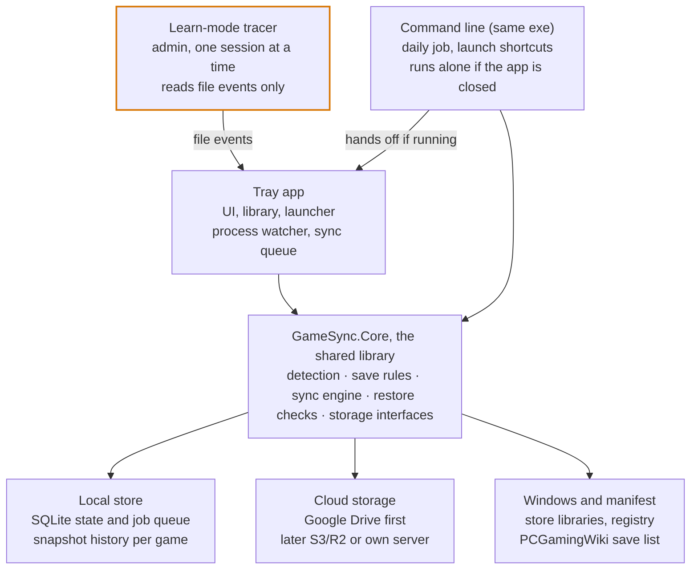
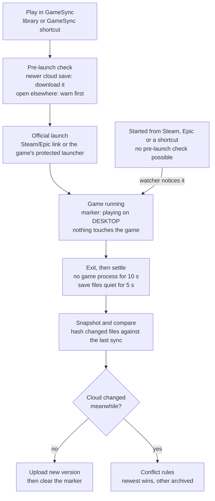

# GameSync: design

Last updated 2026-09-27. This file is the source of truth for the design. A Claude Doc copy with drawn diagrams exists as a snapshot of the same date (link in `CLAUDE.md`).

## Overview

GameSync keeps each game's saves backed up and synced across your PCs, launches your games, and shows every problem on the game it belongs to. It exists because Ludusavi compares whole folders and can't say which game is in conflict.

It's for the owner and a few friends: free, open source on GitHub, Windows first. Each person syncs their own saves between their own PCs; shared co-op worlds come later, with a server.

**Goals**

- Find installed games and their save locations with little or no setup.
- Sync on game launch and exit, plus a daily backup at a time you choose, across two or more PCs.
- Never lose a save: every overwrite keeps the previous version.
- Show one specific status per game, with a manual button for every automatic step.
- Ship as one installer that friends can run without installing anything else.

**Not in scope yet**

- Mods, trainers and anything else that is code.
- Games whose progress lives on the game's servers; they're detected and left unticked.
- Two-way sync for games with Steam, Epic or Xbox cloud saves; those are backed up only.
- Consoles, Linux and Steam Deck; the UI toolkit leaves the door open.

**Principles**

1. Everything is per game: state, history, errors and conflicts. One broken game never blocks the rest.
2. Never destroy a save: snapshot before every overwrite, and keep history, not a mirror.
3. Remember the last synced state, so a failed upload is "pending", not a conflict.
4. Automatic by default, manual always, with a preview of what the next sync will do.
5. Readable without the app: plain files and JSON in the cloud, plus a restore script.
6. Quiet when healthy, specific when not, and never on top of a fullscreen game.
7. Harmless: only save data moves, and nothing touches a running game beyond watching it.

## Architecture

One exe runs as both the tray app and a command line; a small helper runs as admin only during learn mode.



The command line hands its work to the tray app when that's running, so only one engine ever touches saves at a time. The highlighted tracer is the only part that runs as admin.

- **GameSync.Core**: all the logic and no UI: game detection, save rules, sync decisions, safety checks, storage interfaces. Testable without Windows or a cloud.
- **Tray app**: Avalonia UI, library and launcher, process watcher, job queue and notifications. Starts with Windows.
- **Command line**: the same exe with verbs (`sync --all`, `plan`, `launch <game>`, `restore <game> <version>`), used by Task Scheduler and shortcuts.
- **Learn-mode tracer**: a separate small exe, started as admin only for a learn session. It streams file events to the tray app and writes nothing.
- **Local store**: `%LOCALAPPDATA%\GameSync\` holds `state.db`, `history\`, `art\` (cached cover art) and `logs\`. You can move `history\`, the backup folder, anywhere on your PC (Settings, Storage and folders).
- **Cloud storage**: behind two small interfaces, so Drive, S3/R2 and a future server are interchangeable (see Storage backends).

## Game library and detection

The library is built from each store's own records plus a scan of your game folders. Games are matched by IDs and folders, never by display name.

| Source | Where GameSync reads it | How it launches |
| --- | --- | --- |
| Steam | `libraryfolders.vdf` and `appmanifest_*.acf` | `steam://rungameid/<id>` |
| Epic | `C:\ProgramData\Epic\EpicGamesLauncher\Data\Manifests\*.item` | `com.epicgames.launcher://apps/<app>?action=launch` |
| EA app | `__Installer\installerdata.xml` in each game folder | through the EA app |
| Xbox / Microsoft Store | installed game packages | through Windows (backup only) |
| Loose folders | folders you add (e.g. `E:\Games`, `G:\`), matched by folder and exe names | the game's main exe |
| GOG, Ubisoft (later) | GOG registry keys and `goggame-*.info`; Ubisoft's `Installs` registry keys | their own launchers |

**Matching a game**, first hit wins:

1. Store ID (Steam app ID, GOG ID) to the manifest entry with that ID.
2. The manifest's `installDir` names against the install folder's name.
3. Folder, exe and exe product names, compared as letters and digits only ("Slay the Spire 2" equals "SlayTheSpire2").
4. A fuzzy title match, only as a suggestion you confirm.

Each game keeps every ID it has (GameSync ID, store IDs, manifest title, install folder, main exe), so a rename or reinstall still matches.

**Flags set during detection**

- **Anti-cheat**: EasyAntiCheat, BattlEye, GameGuard, EA AntiCheat or XIGNCODE files in the install folder, PCGamingWiki's anti-cheat info, or set by hand. Turns off learn mode and forces the official launch route. Example from the owner's PC: Apex Legends, Helldivers 2, Rocket League, GTA V Enhanced.
- **Store cloud**: the manifest's cloud info (Steam, Epic, GOG, Ubisoft, EA) and every Xbox game. Makes the game backup only.
- **Probably online-only**: only settings files found, or progress known to live on servers. Unticked by default.

**Your fixes stick.** Merge two entries ("Spacewar" into the real game), split one, rename, or add a game by hand; the mapping survives rescans.

**Rescans** run at startup, when a store's records change, and on demand. A game that disappears becomes "not installed", never deleted, and its saves stay in the cloud.

**Onboarding groups**

| Group | Ticked by default | Why |
| --- | --- | --- |
| Sync | yes | saves found, no store cloud |
| Back up only | yes | Steam, Epic or Xbox already syncs it |
| Probably online-only | no | only settings files found |
| Saves found, game not installed | yes | keeps history until you decide |
| Installed, no saves found yet | watching | the first session may reveal them |

## Save discovery

Four layers look for save locations in order. The first answer you confirm is pinned to the game, so later list updates can't silently change what's synced.

| Layer | Uses | Catches | Cost |
| --- | --- | --- | --- |
| 1. PCGamingWiki list | the Ludusavi manifest: about 22,000 games with file paths | most commercial games | instant |
| 2. Engine rules | Unity `app.info`, Unreal `*-Win64-Shipping.exe`, Godot `.pck`, GameMaker, Ren'Py, RPG Maker | indie games the list misses | instant |
| 3. Name search | folder, exe, and the exe's company and product names, against the usual save folders | most of the rest | about a second |
| 4. Learn mode | one play session: a folder watcher (no admin), plus optional admin file tracing | anything, including emulator folders on other drives | one session |

In the spike (`spikes/Find-GameSaves.ps1`) on 16 loose game folders, layers 2 and 3 alone found 12; the other 4 need learn mode.

**Where it looks**: Documents, Public Documents, Saved Games, AppData (Roaming, Local, LocalLow), ProgramData, the install folder, the registry, Steam's `userdata`, and any folders you add. On the owner's PC, Roaming was the most common location (5 of 12).

**Save rules.** A game's saves are a list of rules, each with a root, a pattern, a category and a mode:

```yaml
game: Cuphead
rules:
  - path: "<roaming>/Cuphead/**"
    category: save
  - registry: "HKCU/Software/Studio MDHR/Cuphead"
    category: config        # Unity PlayerPrefs
found: name search, confirmed 2026-09-27
```

- **Roots** are placeholders each PC resolves for itself: `<documents>`, `<savedGames>`, `<roaming>`, `<local>`, `<localLow>`, `<publicDocuments>`, `<programData>`, `<installDir>`, `<steamUserData>`. User IDs are `<steamUser>` and `<epicUser>`.
- **Categories**: `save` syncs. `config` is backed up but stays per PC unless you opt in. `screenshots` is off by default.
- **Excludes**: logs, crash dumps, shader and web caches by default, plus the fixed safety blocklist (see Safety rules).

**Shared and ID-named folders**

- **ID-named folders**: you mark a folder whose subfolders are named by Steam app ID (Steam's `userdata`, emulator save folders, Ubisoft's numbered folders). The manifest's Steam IDs map each subfolder to its game. These folders live in your local settings, not the public repo.
- **Shared folders**: several games may claim different files in one folder. Two rules claiming the same file is an error shown on both games.
- **Swap mode**: for games that write identical file names to the same place, GameSync keeps each game's copy, swaps it in before launch and back out after exit. Those games must launch through GameSync.
- **Session attribution**: files written into a shared folder while a game runs are proposed for that game. That's how Spacewar's screenshots get matched to the game that actually took them.

**Registry saves** are exported per key to JSON (value names, types, data) and restored only under that game's approved key.

**Confirm once, then pinned**

- Every found location is a proposal with its evidence: layer, files, size, newest date. You confirm once.
- Confirmed rules are pinned. Changes in the list or engine rules show up as suggestions.
- If a pinned folder stops changing while a new one appears during play, the game shows "saves may have moved".

## Sessions and launching

A session starts when a game's process appears. It ends once none has run for 10 seconds and the save files have been quiet for 5; every sync decision hangs on that.



Only launches through GameSync can pull a newer save first. Games started elsewhere join at "Game running", so a newer cloud save found at exit becomes a conflict for that game instead of an overwrite.

**Spotting the game with minimal access**

- Running processes come from a system-wide snapshot, which opens no process.
- Only processes named like one of the game's exes are opened, once each, with query-limited access (what Task Manager uses) to confirm the path and start time.
- The session starts at the process's real start time minus 2 seconds, because games write saves the moment they start.
- Launchers, crash reporters and anti-cheat services are ignored. An "I'm done playing" button ends a stuck session.

**Launch routes**

- Store games start through the store's own link, so its DRM and anti-cheat start normally.
- Loose games start from their main exe, with the game folder as working directory, never as admin.
- Swap-mode games must start through GameSync; the watcher warns if one starts elsewhere.
- Shortcuts and Steam launch options call `gamesync launch <game>`, so they get the pre-launch check too.

**Now-playing marker**

- A small cloud file per game, written at launch with the device and start time, and cleared after the exit upload.
- A marker older than 12 hours with no upload reads "DESKTOP never synced back". You can play anyway; if both PCs then change the save, the conflict rules apply.

**Long sessions**: optional local-only snapshots every 30 minutes guard against in-game corruption. They're never uploaded before the session ends.

## Sync engine

Each game syncs on its own, by comparing this PC's saves and the cloud's newest version against the version both last agreed on.

**Terms**

- **Snapshot**: a game's save files on this PC right now: path, size, modified time, SHA-256.
- **Version**: an immutable cloud record of one snapshot: file list, parent version, device, time and session. File contents are stored once, by hash.
- **Base**: the version this PC last synced for that game.

| This PC vs base | Cloud vs base | Action |
| --- | --- | --- |
| same | same | nothing |
| changed | same | upload a new version whose parent is the base |
| same | changed | download the cloud version; the local snapshot is archived first |
| changed | changed | conflict for this game only, unless both are identical |

Two uploads from the same parent show up as two newest versions (a fork), which counts as a conflict. That's how Drive works without locks.

**Conflict policy**

- Default: the newest save wins, judged by the save files' own modified times. The other side is kept as a pinned version, and a notification offers Swap.
- Never automatic, so the game shows "Conflict: needs you" instead, when:
  - it's the first sync of this game on this PC (the cloud wins, local is archived);
  - the newer side lost more than half its size or files, or is empty;
  - the newer side changed while the game wasn't running;
  - this PC's clock is more than 2 minutes off Google's.
- Per game, you can switch to "always ask" or "this PC always wins".

**Guardrails**

- **Missing is not deleted.** A vanished folder, unplugged drive or uninstalled game never becomes an empty version; the game shows "Drive G: not connected" or "not installed".
- Deleting some files inside a session is normal (rotating autosaves) and syncs. Losing every file never does.
- **Out-of-session changes are held.** They're backed up, but not made current or pulled by other PCs until you approve. That stops ransomware and stray edits from spreading.
- No download or restore while any of the game's processes run.

**Game updates keep the old save**

- GameSync watches each game's build: Steam's `buildid`, Epic's app version, or the main exe's version and date for loose games.
- As soon as the build changes, before the updated game runs, it saves the current files as a pinned old version, labelled like "before update to build 20117 (27 Sep)".
- If the update converts or overwrites the save slot, that version is one click away. Its label shows which build wrote it, since older saves may need the older game.
- A fresh download or reinstall that writes a new save into an existing slot hits the first-sync rule: your existing save wins, and the new one is kept as an old version.
- Nothing is ever deleted, so the last version before any update stays in history even if that snapshot is missed.

**Crash safety**

- Upload file contents first and the version record last, so a version exists only once it's complete.
- Restore into a temporary folder next to the target, check hashes, then swap by rename. The previous local state goes to local history first.
- Restored files keep their original modified times, since some games pick "Continue" by date.
- The job queue lives in SQLite, so unfinished jobs resume after a crash or reboot.

**Retention: every version is kept forever**

- Nothing is deleted automatically, in the cloud now or on the server later.
- History stays small because each unique file is stored once and gzip-compressed; the `latest/` copy stays plain.
- Each game shows how much space its history uses, and the app warns when Drive passes 80% full.
- Thinning is a manual, per-game choice, and it never touches pinned versions: pre-update saves, conflict sides, or ones you pin. It also keeps the current version, this PC's base, held versions and each PC's newest. A thinned version leaves a small marker behind, so the history graph stays intact; only its files go to the trash.
- Local history is a fast cache of the last 10 versions per game (2 GB in total) by default; you can choose to keep everything locally too. The cloud holds everything either way.
- **Choosing the backup folder**: moving it copies every file, checks every hash, and only then removes the old copy; if anything fails, the old folder stays in use. It can't be inside a game's install folder, a folder another sync tool manages (OneDrive, Dropbox, Google Drive for desktop), Program Files or Windows. A missing drive pauses backups, never reads as empty.

**Plan preview**: the same decisions, computed without acting. The Sync button, the daily run and the Plan screen show one line per game: the action and the reason.

## Storage backends

The sync engine needs only a file store and a per-game version log, so Google Drive, S3-style buckets and a future server are interchangeable.

As built in Milestone 1 (`src/GameSync.Core/Storage/Interfaces.cs`), with a folder backend standing in for Drive:

```csharp
public interface IBlobStore
{
    Task<bool> ExistsAsync(GameId game, BlobId id, CancellationToken ct);
    // Throws if the content doesn't hash to id, so a file that changed mid-upload is never stored under the wrong name.
    Task PutAsync(GameId game, BlobId id, Stream content, CancellationToken ct);
    Task<Stream> GetAsync(GameId game, BlobId id, CancellationToken ct);
    Task TrashAsync(GameId game, BlobId id, CancellationToken ct);   // manual thinning only
}

public interface IVersionLog
{
    Task<IReadOnlyList<VersionRecord>> ListAsync(GameId game, CancellationToken ct);
    // Appending an existing id throws. A server or S3 backend also rejects it when `parent` is no longer the newest version.
    Task AppendAsync(GameId game, VersionRecord version, CancellationToken ct);
    Task<IReadOnlyList<PinRecord>> ListPinsAsync(GameId game, CancellationToken ct);
    Task SetPinAsync(GameId game, PinRecord pin, CancellationToken ct);
    Task RemovePinAsync(GameId game, VersionId version, CancellationToken ct);
    // Thinning marks versions instead of deleting them, so which version replaced which is never lost.
    Task MarkThinnedAsync(GameId game, VersionId version, CancellationToken ct);
    Task<IReadOnlySet<VersionId>> ListThinnedAsync(GameId game, CancellationToken ct);
    Task<SessionMarker?> GetMarkerAsync(GameId game, CancellationToken ct);
    Task SetMarkerAsync(GameId game, SessionMarker? marker, CancellationToken ct);
}
```

| Backend | Who pays | Two PCs writing at once | When |
| --- | --- | --- | --- |
| Google Drive, each person's own | free; 15 GB shared with Gmail and Photos | fork found after the fact | v1 |
| S3-style bucket (Cloudflare R2, Backblaze B2) | the owner; R2 is free to 10 GB, then $0.015 per GB-month | conditional write on a head file; the second PC pulls first | v2 |
| GameSync server (ASP.NET Core, files in R2) | the owner | the server accepts one; the other pulls first | v3 |

**Google Drive**

- Scope `drive.file`: the app sees only files it created. Your other Drive files are invisible to it, and to anyone holding its token.
- Sign-in: a "Desktop app" OAuth client with PKCE and a redirect to 127.0.0.1. The Google project is set to "In production", because "Testing" expires sign-ins after 7 days.
- Errors are typed (quota full, sign-in expired, rate limited, offline), retried with backoff where that helps, and shown on the game's status.
- Files Google flags as malware are never downloaded. The app doesn't set `acknowledgeAbuse`; it shows the error on the game.
- Drive handles many small files slowly, so a first upload of about 1,300 save files takes minutes. Later uploads send only changed files; bundling small files is a later optimisation.

```
GameSync/
  HOW-TO-RESTORE.txt
  restore.ps1
  devices/<device-id>.json
  games/<game-id> <title>/
    latest/                                  plain copy of the newest version
    versions/2026-09-27T21-04Z_DESKTOP_3f2a.json
    blobs/ab/ab12…                           each unique file, stored once
    playing.json                             now-playing marker
```

**Encrypted mode** (off on Drive, and perhaps a later opt-in there; the default on a shared server)

- Decided 27 Sep 2026: Drive stays unencrypted, so the `latest/` copy and `restore.ps1` get saves back without GameSync, and `drive.file` already keeps the app out of your other files. `IBlobStore` still takes an encrypting wrapper; turning encryption on later means one re-upload into the new layout.
- A sync key, shown once as a recovery code and entered on each PC, encrypts every file and version record with AES-256-GCM. Anything altered without the key fails to decrypt.
- File IDs become an HMAC-SHA256 of the content keyed with the sync key, so hashes don't reveal which files you have.
- The cost: no readable `latest/` copy, and losing the key makes the cloud copy unreadable. Local history still works.

**Future server**

- ASP.NET Core minimal API, SQLite or Postgres for version logs, R2 for files.
- Discord sign-in, one folder per user, a storage limit per person, short-lived upload and download links.
- Clients can add versions but never delete; only the owner can thin history, by hand.
- Groups for shared co-op worlds come after that.

## Multiple PCs

Each PC is a named device with its own base per game, and paths travel in portable form, so one save lands in the right place on every PC.

- **Device identity**: a random ID plus a name you pick (DESKTOP, LAPTOP), created at first run and recorded in `devices/<id>.json` with the app version and last-seen time.
- **Portable paths**: versions store `<documents>/My Games/Terraria/…` or `<installDir>/b1/Saved/…`, never `C:\Users\<you>\…`. Each PC fills in its own folders and install paths, so Wukong's saves move from `G:\Black Myth Wukong` to wherever the laptop installed it.
- **Account IDs**: `<steamUser>` and `<epicUser>` resolve per PC. If they differ (another account), the game warns that some saves, like FromSoftware's, embed the ID and won't load.
- **Game not installed here**: its saves wait in the cloud, and a restore is offered once the game is detected. Install-folder saves need the game installed first.
- **First sync on a new PC**: the cloud wins and the local files are archived. That blocks the "fresh install overwrote 100 hours" disaster.
- **Clock check**: every sync compares the PC's clock with the `Date` header from Google. More than 2 minutes off turns off "newest wins" on that PC and shows a warning.
- **Settings stay per PC**: `config` files are backed up per device and synced only if you opt in, so the laptop keeps its own graphics settings.
- **Offline laptop**: sessions snapshot locally and uploads queue. Back online, the normal rules apply, conflicts included.

## Background work

The tray app does the work while it runs, a daily backup covers the rest, and neither ever interrupts a fullscreen game.

- **Tray app**: starts with Windows for your user, runs as a single instance, and holds the watcher, the job queue and the UI.
- **Daily backup**: each person picks the time in Settings; setup suggests an evening hour when the PC is usually on. A Task Scheduler entry runs `gamesync sync --all` with no window, or hands the job to the tray app when it's running.
- **Missed runs catch up**: if the PC was off at that time, the backup runs about 10 minutes after the next sign-in. Most syncing happens at game exit anyway; the daily run is the safety net.
- **What the daily run does**: skips games that are running, backs up and uploads changed games, checks for game updates, refreshes the save list weekly, and writes one line per game to the activity log.
- **Retries**: failed jobs wait 1 minute, then double the wait each time, up to 1 hour. Jobs survive restarts.
- **Notifications**: Windows toasts only for things that need you (a conflict needing a decision, an expired sign-in, saves not found, a blocked file), plus an optional daily summary. They're held while a fullscreen game runs (checked with `SHQueryUserNotificationState`) and shown after it closes.
- **Tray icon**: green when everything is synced, blue while working, amber when something needs you, grey when offline. Hovering shows the counts.
- **No disk work during play**: hashing and uploads wait for the session to end. Only the watcher, and learn mode when you start it, run while you play.

## UI

Eight screens share one idea: every game shows exactly one status, and every status has a button that deals with it. The look, components and screens are in the GameSync design system; the older mockups are in `design/mockups/` (both links are in `CLAUDE.md`).

| Screen | Shows | Actions |
| --- | --- | --- |
| Onboarding | detected games in their groups, save paths found, Ludusavi import, cloud sign-in, daily backup time | tick or untick, confirm paths, connect Google Drive |
| Library | cover grid or list, with a status badge, playtime and last played per game | Play, filter by status, Sync now |
| Game detail | save rules and resolved paths, a version timeline across PCs, the activity log | Back up, Upload, Download, Restore a version, Export, Open folder, Learn mode |
| Plan | what the next sync would do for each game, and why | Run, skip a game |
| Conflict | both sides: changed files, sizes, save times, PCs, playtime | Keep this PC's, Keep the cloud's, Compare files, Decide later |
| Settings | appearance, storage and folders (backup folder, history to keep, game folders to scan, extra and ID-named save folders, where shared zips go), daily backup time and conflict default, cloud, devices, notifications, safety | pick a theme and colours, change or move a folder, add or remove a folder, rename a device, sign out |
| Launcher home | the last-played game as a hero with its save status, Needs you, Jump back in, play activity by day | Continue playing, Manage saves, Resolve or Review |
| Save manager | every game's saves in a dense console-style table (status, path, versions, size, last backup), a stats strip, the live log | select, Share selected, Share all, Import saves, Sync now |

**Statuses**

| Status | Meaning | Buttons |
| --- | --- | --- |
| Synced | this PC and the cloud match | none |
| Playing | a session is running; sync waits | I'm done playing |
| Upload pending | changed here, with the reason (offline, quota full, sign-in expired) | Retry, Details |
| Newer in cloud | another PC uploaded; which one and when | Download, Compare |
| Conflict | both changed; resolved automatically or waiting for you | Swap, Keep this PC's, Keep the cloud's |
| Held for review | changed while the game wasn't running, or looks like a reset | Approve, Restore previous |
| Files in use | a save file is locked, and by which process | Retry |
| Saves not found | every path that was tried | Add path, Learn mode |
| Not available | drive disconnected or game not installed | none |
| Blocked | antivirus, a Google malware flag, or a failed safety check | Details |
| Backup only | a store cloud syncs this game | Back up now |

- **Look** (chosen 2026-09-27): the launcher follows the owner's reference images in `Design inspirations/` (dark rounded cards, pill tabs, a cover-art hero, a play-activity calendar), and the save manager uses the Console look, because it shows more detail. Tokens, components and showcase screens live in the GameSync design system (link in `CLAUDE.md`).
- **Theming**: Dark (default), Light or Match Windows; pure black backgrounds for OLED screens in dark mode; six preset themes (Arcade, the default cyan, then Moss, Tidal, Sakura, Citrus, Mono) plus one that follows the Windows accent colour. Each preset sets a primary and a secondary colour and a faint surface tint, and either colour can be swapped from 11 curated swatches. One engine derives every colour from those choices and keeps text at 4.5:1 and controls at 3:1 in every combination. Status colours never change with the theme. Choices are saved per PC and apply live. Later: any custom colour (adjusted until it passes contrast), theme export and import, tinting a game's pages from its cover art.
- **Sharing saves**: Share selected packs the ticked games (latest version each, or exact versions picked in the share window) into one zip; Share all packs the whole backup folder, optionally latest saves only. Only save data goes in (R1), games with an anti-cheat or an online mode are locked out (R16), and the zip carries a manifest plus a README with manual restore steps. **Import saves** adds a shared zip's saves as pinned versions, never current ones, after the same checks as a restore (R1, R3, R6, R7); saves that embed another account's ID get a warning.
- **Cover art**: official Steam art for every game with a Steam app ID, taken from the store's records or from the save list's Steam ID, so Epic and loose copies of Steam games get it too. Image file names come from Steam's store API (`IStoreBrowseService/GetItems` with `include_assets`, no key needed), because newer games keep their art under hashed paths that can't be guessed from the app ID. Tiles use the 600×900 library capsule; the hero uses the library hero with the game's `logo.png` over it, since Steam's hero art never contains text; rows use the 300×450 capsule.
  - Games with no Steam art use SteamGridDB only if the person has added their own free API key in Settings. Otherwise, and whenever nothing matches, the tile shows a title cover: the game's name on a themed tile, never an empty box. The person can pick another cover per game, including an image file of their own.
  - Art is cached in `art\`, works offline, refreshes when Steam's image timestamp changes, and never goes to the cloud or into a shared zip. Downloaded images are untrusted: JPEG, PNG or WebP only, size-limited, checked by content.
  - `design/real-art-preview.html` shows the owner's library filled this way; it loads the images from Steam when opened.
- **Accessibility**: every status has a text label and an icon, not colour alone, and everything works from the keyboard.

## Safety and security rules

Only save data ever moves, restores can write only inside a game's approved folders, and nothing touches a running game beyond watching it. Each rule below gets an automated test.

**Data only**

- **R1.** Program files are never backed up or restored. They're caught by extension (`.exe .dll .sys .scr .com .bat .cmd .ps1 .vbs .js .jse .wsf .hta .msi .lnk .url .reg .cpl .jar`) and by content (the Windows program header).
- **R2.** A program file found in a save folder raises a warning on that game.
- **R3.** Restored files are scanned through AMSI, Windows' built-in "scan this" interface, before they're moved into place. A detection blocks the restore.
- **R4.** Files Google flags as malware are never downloaded.
- **R5.** No rule can include browser profiles, credential stores, `.ssh`, `.aws`, crypto wallets, Windows credential folders, or GameSync's own token store.

**Restores**

- **R6.** Every restored path must resolve inside the game's approved folders: no `..`, absolute paths, alternate data streams, reserved names, or links that point elsewhere.
- **R7.** Registry restores touch only the game's own approved key, never `Run`, `RunOnce` or anything outside it.
- **R8.** Rules and paths from the cloud or the save list get the same checks, and a new or changed rule needs your confirmation.

**Accounts and tokens**

- **R9.** Google access uses the `drive.file` scope only.
- **R10.** Tokens are encrypted with DPAPI for your Windows user, and "Sign out" revokes them at Google.
- **R11.** Nothing listens on the network except the sign-in redirect on 127.0.0.1, for the seconds sign-in takes.
- **R12.** Launch commands never leave the PC, and `gamesync://` links can only launch a game GameSync already knows.

**Anti-cheat**

- **R13.** Game processes are opened with query-limited access at most: never memory access, injection, suspension, hooks, debugging or overlays.
- **R14.** No kernel driver. Learn mode uses ETW in its own uniquely named session, never the shared NT Kernel Logger, and never touches other sessions.
- **R15.** Learn mode is off for games with an anti-cheat, and those games launch only through their official route.
- **R16.** Saves are never edited, and never moved between accounts for online games.

**Admin helper**

- **R17.** The main app never runs as admin.
- **R18.** The tracer runs only during learn mode. It's installed under Program Files, signature-checked before it starts, reachable only through a pipe limited to your user, and accepts no command that writes.

**Releases**

- **R19.** Releases are code-signed through SignPath's free open-source program, and the updater checks the signature before installing.
- **R20.** GitHub uses a passkey or 2FA, a protected main branch, pinned dependencies (`packages.lock.json`), and CI with least-privilege tokens and pinned actions.

**Server, later**

- **R21.** Ownership is checked on every request, each person has a storage limit, and the owner gets a spending alert. Upload links are short-lived and scoped to one user's folder, clients can't delete, and encryption is on by default.

| Threat | Stopped by |
| --- | --- |
| Malware spreading between PCs or friends | R1–R5 |
| A tampered cloud planting a program on your PC | R6–R8 |
| A stolen token reading or wiping your Drive | R9–R11, plus local history |
| Ransomware encrypting saves | held out-of-session changes (Sync engine), plus cloud history written through the API |
| Anti-cheat bans | R13–R16 |
| Abuse of the admin helper | R17–R18 |
| A malicious update reaching every friend | R19–R20 |

## Data model

Local state lives in one SQLite database; the cloud holds immutable JSON version records plus files stored by hash.

| Table | Main columns | Holds |
| --- | --- | --- |
| games | id, title, steam_id, install_dir, build, anti_cheat, store_cloud, online_only, selected | the library |
| save_rules | game_id, root, pattern, category, mode, source, confirmed_at | pinned save locations |
| devices | id, name, last_seen | known PCs |
| sync_state | game_id, base_version, local_hash, status, status_detail | each game's base and status |
| versions | id, game_id, parent_id, device_id, created_at, bytes, held, pinned, label | cloud versions seen |
| version_files | version_id, path, size, mtime, sha256 | each version's file list |
| sessions | id, game_id, started_at, ended_at, launch_route | play sessions and playtime |
| jobs | id, kind, game_id, state, attempts, next_run_at, last_error | the durable queue |
| events | id, game_id, at, level, message | each game's activity log |
| settings | key, value | folders, schedule, backend config |

On disk, `%LOCALAPPDATA%\GameSync\` holds `state.db`, local history in `history\<game>\<version>\`, cached cover art in `art\`, and `logs\`.

A version record, as stored in the cloud (the shape built in Milestone 1):

```json
{
  "schema": 1,
  "id": "2026-09-27T21-04-10Z_DESKTOP_3f2a9c",
  "game": "sekiro",
  "parent": "2026-09-25T19-30-02Z_LAPTOP_91be04",
  "supersedes": [],
  "kind": "Normal",
  "origin": "Session",
  "device": { "id": "d-7c1e04b2a9f3d611", "name": "DESKTOP" },
  "createdUtc": "2026-09-27T21:04:10Z",
  "session": { "startUtc": "2026-09-27T19:12:40Z", "endUtc": "2026-09-27T21:03:55Z" },
  "pinned": false,
  "label": null,
  "files": [
    {
      "path": "saves/76561198000000000/S0000.sl2",
      "size": 10486304,
      "modifiedUtc": "2026-09-27T21:03:51Z",
      "hash": "9f2c…",
      "category": "Save"
    }
  ]
}
```

- **Kinds**: `Normal` versions form the history line; the current save is the Normal version nothing replaced, by `parent` or `supersedes`. Two such versions mean a fork. `Held` versions are out-of-session changes waiting for approval. `Kept` versions are copies set aside, such as a conflict's losing side or a PC's files before its first sync. Neither Held nor Kept ever becomes current by itself.
- **Paths**: a file's path starts with its rule's root key (`saves/…`), and each PC maps that key to its own folder. From Milestone 2, root keys resolve through placeholders such as `<roaming>`. `<steamUser>` will record the form the game used (SteamID64, SteamID3 or hex), so each PC writes its own ID the same way.
- **Settings and screenshots** go into a per-PC stream of the game (`<game>--pc-<device>`), backed up only and never downloaded by another PC.
- The now-playing marker, `playing.json`, holds just the device and start time.

## Tech stack, layout and packaging

GameSync is C# on .NET 10 with an Avalonia UI, shipped as one signed installer, with the sync logic in a library the future server can reuse.

| Need | Choice |
| --- | --- |
| Runtime | .NET 10 (LTS), C# |
| UI and tray | Avalonia, with the owner's own styles |
| Local database | SQLite through Microsoft.Data.Sqlite |
| Google Drive | Google.Apis.Drive.v3 |
| S3, R2, B2 | AWSSDK.S3 |
| Learn-mode tracing | Microsoft.Diagnostics.Tracing.TraceEvent |
| Daily backup | Task Scheduler, through the TaskScheduler NuGet package |
| Save list | YamlDotNet, cached as a compact local index |
| Hashing and encryption | System.Security.Cryptography (SHA-256, AES-GCM, HMAC) |
| Code signing | SignPath, free for open source |

```
GameSync.sln
  src/
    GameSync.Core/            detection, save rules, sync engine, safety checks, storage interfaces
    GameSync.Storage.Drive/   Google Drive backend
    GameSync.Storage.S3/      S3/R2 backend (v2)
    GameSync.Windows/         process watcher, Task Scheduler, toasts, registry, AMSI, DPAPI
    GameSync.App/             Avalonia UI, tray and command-line verbs: the exe
    GameSync.Tracer/          the learn-mode helper
    GameSync.Server/          later
  tests/
    GameSync.Core.Tests/      decision table, guardrails, portable paths, safety rules
    GameSync.Integration/     real folders, a fake cloud, two simulated PCs, crash and resume
  spikes/                     Find-GameSaves.ps1
  docs/
  design/mockups/
```

**Packaging**

- A per-machine installer (Inno Setup) puts GameSync under Program Files, so other programs can't swap out the tracer. It costs one admin prompt at install.
- Self-contained .NET publish, so friends don't need .NET installed.
- The updater checks GitHub Releases, downloads the signed installer, and verifies the signature before running it.
- A portable zip for people who want no installer, with the admin tracer disabled.

**Testing**

- Unit tests for the decision table, every guardrail, portable path mapping, and every safety rule (R1–R21).
- An in-memory cloud that simulates two PCs, forks, offline stretches and clock skew.
- Crash tests that kill the process between uploading files and writing the version record, and between a temporary restore and the swap.
- A fake-game harness, as in the spike, for the watcher and session timing.
- CI on GitHub Actions Windows runners; release builds are signed only from the protected main branch.

## Milestones

Six milestones, riskiest first: the sync engine is proven on copies of real saves before any UI exists. Each ends in something usable.

| # | Milestone | Builds | Done when |
| --- | --- | --- | --- |
| 1 | Sync engine, command line only | versions, three-way decisions, guardrails, crash safety | all decision and crash tests pass on copies of the owner's real saves |
| 2 | Google Drive and a second PC | Drive backend, device IDs, portable paths, markers | desktop and laptop sync for a week with no false conflicts |
| 3 | Detection and save discovery | store detectors, save list, engine rules, Ludusavi import | finds everything Ludusavi finds, plus 12 of 16 loose games |
| 4 | Sessions and launching | watcher, launch routes, daily backup, notifications | play, quit, and the laptop has it without a single click |
| 5 | The UI | launcher, library, save manager, game detail, plan, conflict screen, settings with appearance and folders, share and import, tray | a friend installs and syncs without help |
| 6 | Learn mode and release | tracer, safety audit, signing, installer, updater | every safety test green; signed v1.0 on GitHub |
| later | | S3/R2, own server, co-op worlds, Steam Deck | |

Milestone 1 can use the owner's Ludusavi backup folder (about 1 GB across 46 games) as test data from day one.

## Open questions

Nine decisions are still open; four are settled. Until chosen, the design assumes the first option in each. The requirements doc (link in `CLAUDE.md`) lists every testable requirement and the remaining gaps.

- [x] **UI look**: the reference-image launcher plus the Console save manager, with preset themes (see UI).
- [ ] **Name**: keep "GameSync" (check it isn't taken on GitHub first), or pick another?
- [x] **Daily backup time**: each person sets it; missed runs catch up after the next sign-in.
- [ ] **Installer**: per-machine with one admin prompt, or portable by default?
- [x] **Encrypted mode on Drive**: off, so the `latest/` folder stays readable and you can restore without GameSync. It may come later as an opt-in (see Storage backends).
- [x] **Retention**: every version is kept forever; thinning is a manual, per-game choice.
- [ ] **Screenshots**: ignore them, back them up, or sync them?
- [ ] **Friends' setups**: Windows only, or does anyone need Steam Deck or Linux early?
- [ ] **Server**: build it after v1, or only if Drive falls short?
- [ ] **Sharing between friends**: is moving single-player saves to a friend's account fine? The design assumes yes, with online and anti-cheat games locked out.
- [ ] **Share all**: pack the backup folder as it is, or first download versions that only exist in the cloud?
- [ ] **Tray icon colours**: switch to the app's status colours (cyan synced, amber needs you, grey offline)?
- [ ] **SteamGridDB key**: each person adds their own free key (assumed), or the future server fetches art for everyone?
