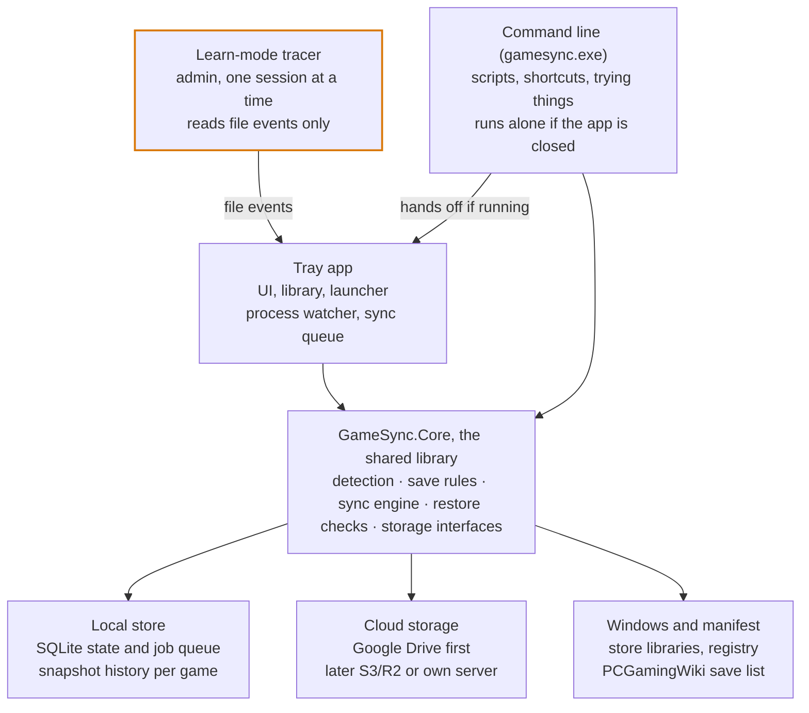
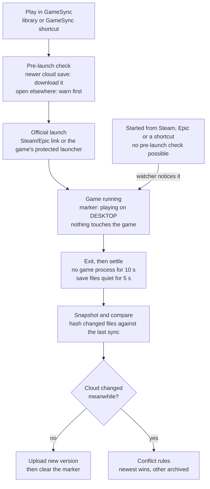

# GameSync: design

Last updated 2026-09-27. This file is the source of truth for the design. A Claude Doc copy with drawn diagrams exists as a snapshot of the same date (link in `CLAUDE.md`).

## Overview

GameSync keeps each game's saves backed up and synced across your PCs, launches your games, and shows every problem on the game it belongs to. It exists because Ludusavi compares whole folders and can't say which game is in conflict.

It's for the owner and a few friends: free, open source on GitHub, Windows first. Each person syncs their own saves between their own PCs; shared co-op worlds come later, with a server.

**Goals**

- Find installed games and their save locations with little or no setup.
- Sync on game launch and exit, plus a daily backup at a time you choose, across two or more PCs.
- Never lose a save: every overwrite keeps the previous version.
- Show one specific status per game, with a manual button for every automatic step.
- Ship as one installer that friends can run without installing anything else.

**Not in scope yet**

- Mods, trainers and anything else that is code.
- Games whose progress lives on the game's servers; they're detected and left unticked.
- Two-way sync for games with Steam, Epic or Xbox cloud saves; those are backed up only.
- Consoles, Linux and Steam Deck; the UI toolkit leaves the door open.

**Principles**

1. Everything is per game: state, history, errors and conflicts. One broken game never blocks the rest.
2. Never destroy a save: snapshot before every overwrite, and keep history, not a mirror.
3. Remember the last synced state, so a failed upload is "pending", not a conflict.
4. Automatic by default, manual always, with a preview of what the next sync will do.
5. Readable without the app: plain files and JSON in the cloud, plus a restore script.
6. Quiet when healthy, specific when not, and never on top of a fullscreen game.
7. Harmless: only save data moves, and nothing touches a running game beyond watching it.

## Architecture

Two small programs share one engine: the tray app, which has no window until you open it, and the command line. A small helper runs as admin only during learn mode.



Only one engine ever touches saves at a time. The tray app and the command line take the same lock, a file in the data folder that Windows lets go of if its program dies. A command waits while the tray app finishes a sync, and says so. The daily run and "I'm done playing" are handed to the tray app when it's running. The highlighted tracer is the only part that runs as admin.

- **GameSync.Core**: all the logic and no UI: game detection, save rules, sync decisions, sessions, safety checks, storage interfaces. Testable without Windows or a cloud.
- **Tray app** (`GameSync.Tray.exe`): Avalonia UI, library and launcher, the agent with its process watcher, Windows' own tray icon and menu, and notifications. Starts at sign-in and runs once per Windows user; closing its window leaves it in the tray (see Background work). It also runs single jobs with no window, such as the daily run from Task Scheduler and launches from Steam's launch options.
- **Command line** (`gamesync.exe`): the same verbs in a terminal (`sync --all`, `plan`, `launch <game>`, `restore <game> <version>`). It's a second program because a Windows program either opens with no window or prints to a terminal, not both.
- **Learn-mode tracer**: a separate small exe, started as admin only for a learn session. It streams file events to the tray app and writes nothing.
- **Local store**: `%LOCALAPPDATA%\GameSync\` holds `state.db`, `history\`, `art\` (cached cover art) and `logs\`. You can move `history\`, the backup folder, anywhere on your PC (Settings, Storage and folders).
- **Cloud storage**: behind two small interfaces, so Drive, S3/R2 and a future server are interchangeable (see Storage backends).

## Game library and detection

The library is built from each store's own records plus a scan of your game folders. Games are matched by IDs and folders, never by display name.

| Source | Where GameSync reads it | How it launches |
| --- | --- | --- |
| Steam | `libraryfolders.vdf` and `appmanifest_*.acf` | `steam://rungameid/<id>` |
| Epic | `C:\ProgramData\Epic\EpicGamesLauncher\Data\Manifests\*.item` | `com.epicgames.launcher://apps/<app>?action=launch` |
| EA app | `__Installer\installerdata.xml` in each game folder | through the EA app |
| Xbox / Microsoft Store | installed game packages | through Windows (backup only) |
| Loose folders | folders you add (e.g. `E:\Games`, `G:\`), matched by folder and exe names | the game's main exe |
| GOG, Ubisoft (later) | GOG registry keys and `goggame-*.info`; Ubisoft's `Installs` registry keys | their own launchers |

**Matching a game**, first hit wins:

1. Store ID (Steam app ID, GOG ID) to the manifest entry with that ID.
2. The manifest's `installDir` names against the install folder's name.
3. Folder, exe and exe product names, compared as letters and digits only ("Slay the Spire 2" equals "SlayTheSpire2").
4. A fuzzy title match, only as a suggestion you confirm.

Each game keeps every ID it has (GameSync ID, store IDs, manifest title, install folder, main exe), so a rename or reinstall still matches.

**Flags set during detection**

- **Anti-cheat**: EasyAntiCheat, BattlEye, GameGuard, EA AntiCheat or XIGNCODE files in the install folder, PCGamingWiki's anti-cheat info, or set by hand. Turns off learn mode and forces the official launch route. Example from the owner's PC: Apex Legends, Helldivers 2, Rocket League, GTA V Enhanced.
- **Store cloud**: the manifest's cloud info (Steam, Epic, GOG, Ubisoft, EA) and every Xbox game. The store moves these saves between PCs, so GameSync keeps a backup of every version and leaves the syncing to it. The status reads "Synced by Steam" (or Epic, Xbox), since "Backup only" confused the owner (28 Sep 2026).
- **Probably online-only**: only settings files found, or progress known to live on servers. Unticked by default.

**Your fixes stick.** Merge two entries ("Spacewar" into the real game), split one, rename, or add a game by hand; the mapping survives rescans.

**Your own games and folders** (LIB-13, asked for by the owner, 28 Sep 2026): Add a game or folder, in first run and the library, takes a name and a folder, such as a game GameSync didn't find or a Minecraft server's world, and syncs it like any game. A session is when the program you pick (optional) runs; without one, the folder counts as quiet, and syncs, once nothing in it has changed for 5 minutes, so a server's world syncs between its autosaves and when it stops. All the usual guards apply: the files have to settle before a copy, program files are never copied (R1: pick the world, not the server folder), a folder that shrinks by over half or empties is held, and every version is kept. Two PCs changing the same world is a conflict like any other.

Built on 30 Sep 2026 (design system version 22, AddGameDialog), with `gamesync add <name> <folder> [--program <exe>]` doing the same from the command line:
- **In the library.** The game joins this PC's library under the person's name for it, with the folder as a place they added (found "by hand"). Rescans keep it and that place; it's installed while its folder is here.
- **With a program**, it's a game in its own folder (LIB-24's): the agent watches that program like any game's, and Play starts it.
- **Without one**, the agent watches the folder all the time. A change opens a session from just before it, and 5 quiet minutes close it. While the folder is changing it counts as in use: no sync, restore or backup touches it, but it doesn't hold other games' syncs back (BG-08 is for play). Once quiet it syncs, and its changes count as made in a session, so they aren't held for review. Stopping GameSync closes an open spell at its last change, and after a crash the next start closes it from the files' own times, as a game's session is closed.
- **Not play.** A folder's spells of changes aren't play: Home never makes it the hero or puts it in Jump back in, the activity calendar and play time leave it out, and its page offers Back up now, with Last changed where a game has Last played.
- **Its ID comes from its name**, so the other PC joins by adding its own folder under the same name. A folder outside Windows' own folders is kept as a full path, and a PC whose folder is elsewhere keeps its own path, as with an install folder.
- **In first run**, Something missing?'s Add a game or folder adds it unconfirmed, ticked in Sync, and Start using GameSync confirms it with the rest.
- **What's refused**, with why: the folders Add a place refuses (a drive's root, a whole Windows folder, Program Files, GameSync's own folders), a file rather than a folder, a name another game already has, and a program that isn't an `.exe` or sits in one of those folders.

**Games in their own folders** (the owner, 29 Sep 2026; LIB-22 to LIB-24): a game outside Steam, Epic and EA, such as `G:\Black Myth Wukong`, is found only in a folder GameSync is told to look in; until then its saves may be found but the game reads Not installed, with no Play. The library's Local view lists the games in their own folders and offers **Scan a folder for games…**: the folder picked (`G:\`, `E:\Games`) joins the ones every scan looks in, and this PC is scanned at once, outside the engine lock (only folding the findings into the library waits for a sync in the background). Each folder in it with a game's program becomes a game, joining the one its saves were already known by. Windows' folder, the whole system drive, the user folder, Program Files and AppData as a whole are refused, since they hold far more programs than games. For one game, its page offers **Locate the game…**: the program picked marks it installed in its game's own folder (the program's folder, above `Binaries\Win64`, `bin\x64` and the like, and above an Unreal project folder that sits beside `Engine`), and Play starts that program. Rescans keep a located game installed there while the folder is on this PC. The view picked (All games, Installed, Local) is kept per PC.

**Rescans** run at startup, when a store's records change, and on demand. A game that disappears becomes "not installed", never deleted, and its saves stay in the cloud.

**Onboarding groups**

| Group | Ticked by default | Why |
| --- | --- | --- |
| Sync | yes | saves found, no store cloud |
| Synced by their store | yes | Steam, Epic or Xbox already syncs it; GameSync keeps a backup of every version |
| Probably online-only | no | only settings files found |
| Saves found, game not installed | yes | keeps history until you decide |
| Installed, no saves found yet | watching | the first session may reveal them |

"Saves found, game not installed" comes from checking every game in the save list for saves on this PC, from its paths that don't need an install folder (built in Milestone 3; Cyberpunk 2077, The Witcher 3 and Forza Horizon 6 on the owner's PC). In the command line, `confirm --all` also leaves out games only the name search found, since it goes by names alone.

**First run** (ONB-01 to ONB-06; built 30 Sep 2026 from the design system's OnboardingScreen and ConnectCloudDialog, version 21): four steps down the left, with no rail until it's done. Until **Start using GameSync** there's no `games.json`, the scan only reads, and nothing syncs.

1. **Scan this PC** starts when the window opens. It reads what Steam, Epic and EA know and looks through the game folders added there (Add a game folder, LIB-05, which scans again). Each store's games show as soon as they're read, then the progress of looking for each game's saves.
2. **Choose games** shows the groups above. Each group is ticked or unticked whole and shows its first four games until Show more. Each game shows where its saves are, as a person reads it ("Documents\My Games\Terraria", "Game folder\Saves"), and how they were found. Games that ship an anti-cheat are named in a note (ONB-05). Steam's software (Wallpaper Engine, 3DMark) is left out once Steam's store has said what it is. On a fresh PC it hasn't yet, so as soon as the scan finishes the store is asked the usual once-per-game question (ART-09) while the person chooses: Home then has the art, and knows the software, by the time setup is done.
3. **Connect the cloud**: Sign in with Google, or a folder, or Skip for now.
   - Google needs GameSync's Google client (CLOUD-12); a copy without one keeps the button off and says why.
   - A folder can be a NAS, a USB drive or another disk. GameSync keeps its files in a `GameSync` folder inside it, and never in its own data folder.
4. **Backups and startup**: Start GameSync when you sign in, and the daily backup at 20:00 (Change time). Both are on by default, as the person's own Run key and task, with no admin (BG-01, BG-02).

Start using GameSync saves the cloud, then confirms the ticked games with the command line's checks (FIND-06, R8). It sets the two switches and turns the window into Home, and the agent makes the first backup in the background.

**Skip for now** (ONB-06, 30 Sep 2026): the cloud is `none` in `games.json`, and a stand-in cloud answers every call "not connected", so syncs work as they do offline.
- Every version is kept in the backup folder on this PC and waits in the outbox.
- A game's first sync keeps its files aside, as it does offline, and the first-sync rule runs once a cloud is there.
- Statuses say "No cloud is connected yet" rather than offline.
- Nothing about it is trouble: the tray reads synced ("every version is kept on this PC"), nothing needs you, and the agent doesn't retry uploads.

Home's top bar shows **Connect the cloud** in place of where the saves go. Its dialog offers the same two ways and connects the choice at once, under the engine lock, then syncs, so what waited goes up.

**A copy on another data folder never changes what starts at sign-in**: first run sets the Run key and the daily task only when GameSync runs on its usual data folder (`%LOCALAPPDATA%\GameSync`). A copy on another one (a test, a second setup) says so instead, since its entries would replace the real ones.

**Moving from Ludusavi** (ONB-04, decided 28 Sep 2026; since later that day a command-line tool only, `gamesync import-ludusavi`, because almost nobody migrates that way, so first run doesn't offer it): the import takes over Ludusavi's ignore list (games already confirmed in GameSync stay synced) and the games added by hand in it, and brings each game's latest Ludusavi backup into its history as a named save, "Ludusavi backup (date)": kept aside and pinned, never current by itself. An older backup as a game's first current version would win that game's first sync over the live save, so it isn't one. A game no longer installed gets its backup as history under the save list's rules. Ludusavi's own files are never changed.

## Save discovery

Four layers look for save locations in order. The first answer you confirm is pinned to the game, so later list updates can't silently change what's synced.

| Layer | Uses | Catches | Cost |
| --- | --- | --- | --- |
| 1. PCGamingWiki list | the Ludusavi manifest: about 22,000 games with file paths | most commercial games | instant |
| 2. Engine rules | Unity `app.info`, Unreal `*-Win64-Shipping.exe`, Godot `.pck`, GameMaker, Ren'Py, RPG Maker | indie games the list misses | instant |
| 3. Name search | folder, exe, and the exe's company and product names, against the usual save folders | most of the rest | about a second |
| 4. Learn mode | one play session: a folder watcher (no admin), plus optional admin file tracing | anything, including emulator folders on other drives | one session |

In the spike (`spikes/Find-GameSaves.ps1`) on 16 loose game folders, layers 2 and 3 alone found 12; the other 4 need learn mode.

**Where it looks**: Documents, Public Documents, Saved Games, AppData (Roaming, Local, LocalLow), ProgramData, the install folder, the registry, Steam's `userdata`, and any folders you add. On the owner's PC, Roaming was the most common location (5 of 12).

**Save rules.** A game's saves are a list of rules, each with a root, a pattern, a category and a mode:

```yaml
game: Cuphead
rules:
  - path: "<roaming>/Cuphead/**"
    category: save
  - registry: "HKCU/Software/Studio MDHR/Cuphead"
    category: config        # Unity PlayerPrefs
found: name search, confirmed 2026-09-27
```

- **Roots** are placeholders each PC resolves for itself: `<documents>`, `<savedGames>`, `<roaming>`, `<localAppData>`, `<localLow>`, `<public>`, `<publicDocuments>`, `<programData>`, `<home>`, `<installDir>`, and `<steamRoot>` (Steam's own folder, where `userdata` is). User IDs are `<steamUser>` and `<epicUser>`; in paths from the save list, an account folder is a `*`, so each PC's own matches.
- **A rule's root key** comes from its portable root (`<documents>/My Games/Terraria` is `documents-my-games-terraria`), so both PCs give the same folder the same key.
- **Categories**: `save` syncs. `config` is backed up but stays per PC unless you opt in. `screenshots` is off by default.
- **Excludes**: logs, crash dumps, shader and web caches by default, plus the fixed safety blocklist (see Safety rules).
- **Choosing files** (FIND-12, the owner, 29 Sep 2026): a game's Properties → Saves lists every file in its save places, ticked when it's backed up, with why each other one is out: you left it out, it's a log, dump or cache (the default excludes), or it's a program file, which is never taken (R1). Unticking a file adds an exclude for it to the game's own rules (dropping a rule of its own first, if it had one); unticking a whole place excludes all of it; ticking a file the defaults skip gives it a rule of its own. A file left out stays on the PC, untouched. The choices are rules like any other, so they travel with the saves and another PC is asked before it takes them (R8). Nothing changes until Save changes, and the dialog shows the effect first ("12 of 14 files, 5.9 MB").
- **Places by hand** (FOLD-01, built 29 Sep 2026): Add a place, on a game's saves, picks a folder or one save file and shows how every PC will read it (the portable form, with `<installDir>` for the game's own folder) and what's there before anything is added. It becomes a root of the game's own, keyed from its portable form like any other, with a rule taking all of it (or just the file), so it travels with the saves (R8). A drive, a whole Windows folder (Documents, AppData and the rest), the game's whole install folder, GameSync's own data and backup folders, and anything the safety guard blocks (R5) are refused with the reason; program files in it are counted and never taken (R1); another game saving there too is a warning. The game's rules are checked as the engine checks them before they're saved, so games.json always opens.
- **Defaults** (SET-06, designed 29 Sep 2026, built with Settings): Settings → Backup and sync → What to back up sets what every new game starts from: game saves always; settings files synced between PCs, backed up on this PC only, or not backed up; screenshots; logs, crash dumps and caches skipped; extra patterns to skip. Changing a default offers to apply it to the games already syncing, which otherwise keep their own.

**Shared and ID-named folders**

- **ID-named folders**: you mark a folder whose subfolders are named by Steam app ID (Steam's `userdata`, emulator save folders, Ubisoft's numbered folders). The manifest's Steam IDs map each subfolder to its game. These folders live in your local settings, not the public repo.
- **Shared folders**: several games may claim different files in one folder. Two rules claiming the same file is an error shown on both games.
- **Swap mode**: for games that write identical file names to the same place, GameSync keeps each game's copy, swaps it in before launch and back out after exit. Those games must launch through GameSync.
- **Session attribution**: files written into a shared folder while a game runs are proposed for that game. That's how Spacewar's screenshots get matched to the game that actually took them.

**Registry saves** are exported per key to JSON (value names, types, data) and restored only under that game's approved key.

- Each key is exported, before each scan of the game, into GameSync's own folder (`%LOCALAPPDATA%\GameSync\registry\<game>`), which joins the game as one more root, so versions, history and crash-safe restores treat the export like a save file. The export takes the key's own last-change time, so a change made during play counts as in-session.
- A restored export is checked before anything is written (it must name one of the game's own keys, never a startup key, R7), then written back once the files are in place. Values keep their exact type and bytes, including Unity's 8-byte REG_DWORD floats.
- A key that vanishes leaves its last export: missing isn't deleted.

**Rules travel with the saves.** Each version records the portable rules it was taken with. A PC that doesn't sync the game yet is offered those rules and the save (PC-04); a PC whose rules differ is told, and keeps its own until you confirm the other PC's (R8). A restore leaves alone the files outside the rules its version was taken with.

**Confirm once, then pinned**

- Every found location is a proposal with its evidence: layer, files, size, newest date. You confirm once.
- Confirmed rules are pinned. Changes in the list or engine rules show up as suggestions.
- If a pinned folder stops changing while a new one appears during play, the game shows "saves may have moved".

## Sessions and launching

A session starts when a game's process appears. It ends once none has run for 10 seconds and the save files have been quiet for 5; every sync decision hangs on that.



Only launches through GameSync can pull a newer save first. Games started elsewhere join at "Game running", so a newer cloud save found at exit becomes a conflict for that game instead of an overwrite.

**Spotting the game with minimal access**

- Running processes come from a system-wide snapshot, which opens no process.
- Only processes named like one of the game's exes are opened, once each, with query-limited access (what Task Manager uses) to confirm the path and start time.
- The session starts at the process's real start time minus 2 seconds, because games write saves the moment they start.
- Launchers, crash reporters and anti-cheat services are ignored. An "I'm done playing" button ends a stuck session.
- If the watcher stops mid-session (a crash, a power cut), the session is recorded up to the last save written, and the game syncs when the watcher starts again.

**Every game installed here is watched** (the owner, 29 Sep 2026; PLAY-12): not only the games that sync, so Home shows what's being played, however it started, and its play time and the activity calendar count it. The game playing now is Home's hero ("Playing now · since 20:41 · In its own folder"), the rail's library dot names it, and its tile, row and page say Playing. Only a game that syncs gets the now-playing marker, the Playing status, the sync after its session and the pause on disk work (BG-08); a game that doesn't sync is just watched, as it was never watched at all before, so a program taken for a game never holds every sync back. Ignored games and Steam's software (Wallpaper Engine) aren't watched: Steam says an app is software in the same request that brings its art, so a fresh install learns it at its first art refresh, and the agent then reads its watch list again. A game's programs are looked for again within the hour, or at once when a game is located, a folder is scanned or a game starts syncing.

**Launch routes**

- Store games start through the store's own link, so its DRM and anti-cheat start normally.
- Loose games start from the program picked for them in their Properties on this PC, or else the biggest program in their folder, with the game folder as working directory and the launch options typed there, never as admin (PLAY-11). Both choices are this PC's own. A store game's launch options belong to its store: Properties shows Steam's, read only, beside the line to paste into them.
- Swap-mode games must start through GameSync; the watcher warns if one starts elsewhere.
- Shortcuts call `gamesync launch <game>`, so they get the pre-launch check too. Steam's launch options call `GameSync.Tray.exe launch <game> -- %command%`, which runs Steam's command itself with no window.
- GameSync never stands between you and the game. From Steam's launch options, the game starts even when the check can't run, and you're told why. A launch waits up to 2 minutes for a sync in the background, then starts without the check.

**Now-playing marker**

- A small cloud file per game, written at launch with the device and start time, and cleared after the exit upload.
- A marker older than 12 hours with no upload reads "DESKTOP never synced back". You can play anyway; if both PCs then change the save, the conflict rules apply.
- Each PC notes the markers it put up, so one it couldn't clear (offline at the game's exit) is cleared at a later sync.

**Long sessions**: optional local-only snapshots every 30 minutes guard against in-game corruption. They're never uploaded before the session ends.

## Achievements (later)

*Added 28 Sep 2026, for after v1 (the owner's request).* Each game shows its achievements the way Steam does: which ones you've unlocked and when, how rare each is, and your progress on the game's tile.

- **Steam games first.** Steam keeps a copy of each account's achievement progress on the PC (`appcache\stats`), so GameSync can read it there with no key, offline too; a spike confirms the format before building. Names, descriptions and icons come from the game's achievement list, and rarity from Steam's public global percentages, which need no key. A Steam Web API key the person adds in Settings, like the SteamGridDB key, fills in whatever the local files miss.
- **Where they show**: a game's page, with Achievements in its play bar (unlocked of total) and an Achievements card under About: how many are unlocked with a progress bar, the latest five with their dates, the rarest, and View all, which lists every one with hidden ones blurred until unlocked (drawn in the design system, version 16, 29 Sep 2026). Also a progress ring on library tiles, and recent unlocks in the home screen's activity.
- **Only what a store tracks.** A loose copy of a game has no store tracking its achievements, so it shows none.
- **Safety and privacy**: read only. Icons are untrusted images, cached and checked like cover art (ART-07, ART-08). Nothing is uploaded, and achievements don't sync between PCs, since the store already keeps them per account.
- **Other stores** (Epic, Xbox, GOG) come after Steam, each through its own records or API.

## Sync engine

Each game syncs on its own, by comparing this PC's saves and the cloud's newest version against the version both last agreed on.

**Terms**

- **Snapshot**: a game's save files on this PC right now: path, size, modified time, SHA-256.
- **Version**: an immutable cloud record of one snapshot: file list, parent version, device, time and session. File contents are stored once, by hash.
- **Base**: the version this PC last synced for that game.

| This PC vs base | Cloud vs base | Action |
| --- | --- | --- |
| same | same | nothing |
| changed | same | upload a new version whose parent is the base |
| same | changed | download the cloud version; the local snapshot is archived first |
| changed | changed | conflict for this game only, unless both are identical |

Two uploads from the same parent show up as two newest versions (a fork), which counts as a conflict. That's how Drive works without locks.

**Conflict policy**

- Default: the newest save wins, judged by the save files' own modified times. The other side is kept as a pinned version, and a notification offers Swap.
- Never automatic, so the game shows "Conflict: needs you" instead, when:
  - it's the first sync of this game on this PC (the cloud wins, local is archived);
  - the newer side lost more than half its size or files, or is empty;
  - the newer side changed while the game wasn't running;
  - this PC's clock is more than 2 minutes off Google's.
- Per game, you can switch to "always ask" or "this PC always wins".
- **The conflict screen** (SYNC-10, built 29 Sep 2026) shows both sides from this PC's own records: when each saved, its last session and play since the last sync, size, and changed files, with Compare files listing what changed on which PC. It suggests a side (the newest, and the longer play; not a side that lost half its files or changed outside play) and says why GameSync asked, in the words the engine used when the conflict arose, which a waiting conflict keeps until it's settled. Keeping this PC's save uploads it at once; keeping another PC's writes its files here, so it asks first. Settled, by newest wins or by hand, the same screen says which save is current and offers Swap, until a newer save or a restore replaces the winner; the game's saves show the same in one line.

**Guardrails**

- **Missing is not deleted.** A vanished folder, unplugged drive or uninstalled game never becomes an empty version; the game shows "Drive G: not connected" or "not installed".
- Deleting some files inside a session is normal (rotating autosaves) and syncs. Losing every file never does.
- **Out-of-session changes are held.** They're backed up, but not made current or pulled by other PCs until you approve. That stops ransomware and stray edits from spreading.
- No download or restore while any of the game's processes run.

**Game updates keep the old save**

- GameSync watches each game's build: Steam's `buildid`, Epic's app version, or the main exe's version and date for loose games.
- As soon as the build changes, before the updated game runs, it saves the current files as a pinned old version, labelled like "before update to build 20117 (27 Sep)".
- If the update converts or overwrites the save slot, that version is one click away. Its label shows which build wrote it, since older saves may need the older game.
- A fresh download or reinstall that writes a new save into an existing slot hits the first-sync rule: your existing save wins, and the new one is kept as an old version.
- Nothing is ever deleted, so the last version before any update stays in history even if that snapshot is missed.

**Named saves** (added 27 Sep 2026, BAK-18 and BAK-19)

- **Save as…** keeps the save as it is now under a name you give, like "Before Lady Maria". It's a version with a named pin, so it's never thinned, syncs to every PC, and stays in this PC's backup folder while it fits in the size limit.
- When nothing else changed, the named save is also the new current save. Asking for it counts as your say-so, so a change made outside play isn't held. When the other PC changed the game too, it's set aside with its name, and the next sync decides as usual.
- Named saves are listed by when the save was made, and one restores in a step like any version: your current files are kept first. A name can be changed or removed; removing it leaves the save in history.
- **Import kept saves** brings in folders you made by hand next to the live save folder, like Bloodborne's `CUSA00207\Before Orphan\SPRJ0005` next to the live `CUSA00207\SPRJ0005`. A folder holding a copy of the live folder, the save's files directly, or a `.zip` of one becomes a named save, named after the folder. The folders are never changed, files a copy shares with another are stored once, and `.rar` files are listed as skipped. The same checks as any import apply (R1, R6).
- For a game like that, the save rule points at the live folder (`SPRJ0005`), never the folder around it, or every kept copy would count as part of the live save.
- In the app (29 Sep 2026): a named save's ⋯ on the game's saves renames it or takes its name away, and **Import kept saves…** on its Named saves card picks the folder and lists each copy by name before anything is imported. A copy the same as another in the folder isn't named twice, and one already in the history only gets its name.
- Save as… works while the game runs: it reads the save files as they are, so save in the game first (or quit to the title screen) for a clean copy. Restoring waits until the game closes (BAK-10).

**Crash safety**

- Upload file contents first and the version record last, so a version exists only once it's complete.
- Restore into a temporary folder next to the target, check hashes, then swap by rename. The previous local state goes to local history first.
- Restored files keep their original modified times, since some games pick "Continue" by date.
- The job queue lives in SQLite, so unfinished jobs resume after a crash or reboot.

**Retention: every version is kept forever**

- Nothing is deleted automatically, in the cloud now or on the server later.
- History stays small because each unique file is stored once and gzip-compressed; the `latest/` copy stays plain.
- Each game shows how much space its history uses, and the app warns when Drive passes 80% full.
- Thinning is a manual, per-game choice, and it never touches pinned versions: pre-update saves, conflict sides, or ones you pin. It also keeps the current version, this PC's base, held versions and each PC's newest. A thinned version leaves a small marker behind, so the history graph stays intact; only its files go to the trash.
- Local history is a fast cache of the last 10 versions per game (2 GB in total) by default; you can choose to keep everything locally too. The cloud holds everything either way.
- **Choosing the backup folder**: moving it copies every file, checks every hash, and only then removes the old copy; if anything fails, the old folder stays in use. It can't be inside a game's install folder, a folder another sync tool manages (OneDrive, Dropbox, Google Drive for desktop), Program Files or Windows. A missing drive pauses backups, never reads as empty.

**Plan preview**: the same decisions, computed without acting. The Sync button, the daily run and the Plan screen show one line per game: the action and the reason.

## Storage backends

The sync engine needs only a file store and a per-game version log, so Google Drive, S3-style buckets and a future server are interchangeable.

As built (`src/GameSync.Core/Storage/Interfaces.cs`). A folder backend (another drive, a NAS, the tests) and the Drive backend implement both, bundled in `ICloud` with devices, the `latest/` copy, the restore kit and account info:

```csharp
public interface IBlobStore
{
    Task<bool> ExistsAsync(GameId game, BlobId id, CancellationToken ct);
    // Throws if the content doesn't hash to id, so a file that changed mid-upload is never stored under the wrong name.
    Task PutAsync(GameId game, BlobId id, Stream content, CancellationToken ct);
    Task<Stream> GetAsync(GameId game, BlobId id, CancellationToken ct);
    Task TrashAsync(GameId game, BlobId id, CancellationToken ct);   // manual thinning only
}

public interface IVersionLog
{
    Task<IReadOnlyList<VersionRecord>> ListAsync(GameId game, CancellationToken ct);
    // Ids alone, cheaply, so a pull downloads only records it hasn't seen.
    Task<IReadOnlySet<VersionId>> ListIdsAsync(GameId game, CancellationToken ct);
    Task<VersionRecord?> GetAsync(GameId game, VersionId id, CancellationToken ct);
    // Appending an existing id throws. A server or S3 backend also rejects it when `parent` is no longer the newest version.
    Task AppendAsync(GameId game, VersionRecord version, CancellationToken ct);
    Task<IReadOnlyList<PinRecord>> ListPinsAsync(GameId game, CancellationToken ct);
    Task SetPinAsync(GameId game, PinRecord pin, CancellationToken ct);
    Task RemovePinAsync(GameId game, VersionId version, CancellationToken ct);
    // Thinning marks versions instead of deleting them, so which version replaced which is never lost.
    Task MarkThinnedAsync(GameId game, VersionId version, CancellationToken ct);
    Task<IReadOnlySet<VersionId>> ListThinnedAsync(GameId game, CancellationToken ct);
    Task<SessionMarker?> GetMarkerAsync(GameId game, CancellationToken ct);
    Task SetMarkerAsync(GameId game, SessionMarker? marker, CancellationToken ct);
}
```

| Backend | Who pays | Two PCs writing at once | When |
| --- | --- | --- | --- |
| Google Drive, each person's own | free; 15 GB shared with Gmail and Photos | fork found after the fact | v1 |
| S3-style bucket (Cloudflare R2, Backblaze B2) | the owner; R2 is free to 10 GB, then $0.015 per GB-month | conditional write on a head file; the second PC pulls first | v2 |
| GameSync server (ASP.NET Core, files in R2) | the owner | the server accepts one; the other pulls first | v3 |

**Local first** (built in Milestone 2)

- Every sync writes to the backup folder on this PC first, then uploads from there: new versions and pins go into an outbox, and a push sends each version's files first and its record last. Before planning, a pull copies the records this PC hasn't seen, so decisions read local files.
- Offline, a sync still snapshots this PC and queues the upload; downloads and conflicts wait for the cloud, with this PC's changes kept meanwhile (PC-05).
- The backup folder keeps every record, plus the files of the last 10 versions per game within 2 GB and anything not uploaded yet (BAK-17). Older files come back from the cloud when a restore needs them.
- If the cloud loses versions this PC has (its folder was deleted, or it's a new account), they go back in the outbox and upload again.
- A cloud folder that can't be reached is offline, never empty.

**Google Drive**

- Scope `drive.file`: the app sees only files it created. Your other Drive files are invisible to it, and to anyone holding its token.
- Folders are found by app properties, not names, so you can rename or move the GameSync folder. When two PCs create the same folder at once, the older one wins and the other's contents move into it. The emptied copy is renamed and unmarked, then trashed.
- Other apps can put files into GameSync's folders, such as a Drive sync client on another PC. `drive.file` hides those files from GameSync, and Drive then won't let GameSync trash the folder. Nothing in normal syncing trashes a folder, and a merged copy that can't be trashed just stays, renamed and unmarked.
- Each upload is checked against the MD5 Drive reports; a mismatch is thrown away and tried again.
- Sign-in: a "Desktop app" OAuth client with PKCE and a redirect to 127.0.0.1. The Google project is set to "In production", because "Testing" expires sign-ins after 7 days.
- Release builds carry GameSync's own client ID and secret, so friends sign in with one click and never make a Google Cloud project (decided 28 Sep 2026). They're kept out of the public repository and added when a release is built; Google treats a desktop app's client secret as not confidential, since anyone can read it out of the program. A build from source asks for a client JSON, as today.
- One Google account per PC in v1: changing it means signing out and in again (decided 28 Sep 2026).
- Errors are typed (quota full, sign-in expired, rate limited, offline), retried with backoff where that helps, and shown on the game's status.
- Files Google flags as malware are never downloaded. The app doesn't set `acknowledgeAbuse`; it shows the error on the game.
- Drive handles many small files slowly, so a first upload of about 1,300 save files takes minutes. Later uploads send only changed files; bundling small files is a later optimisation.

```
GameSync/
  HOW-TO-RESTORE.txt
  restore.ps1
  devices/<device-id>.json
  games/<game-id> <title>/
    latest/                                  plain copy of the newest version, plus VERSION.txt
    versions/2026-09-27T21-04Z_DESKTOP_3f2a.json
    blobs/ab12….gz                           each unique file, stored once (in ab/ subfolders on a folder backend)
    pins/  thinned/                          pins added later; marks left by thinning
    playing.json                             now-playing marker
```

**Encrypted mode** (off on Drive, and perhaps a later opt-in there; the default on a shared server)

- Decided 27 Sep 2026: Drive stays unencrypted, so the `latest/` copy and `restore.ps1` get saves back without GameSync, and `drive.file` already keeps the app out of your other files. `IBlobStore` still takes an encrypting wrapper; turning encryption on later means one re-upload into the new layout.
- A sync key, shown once as a recovery code and entered on each PC, encrypts every file and version record with AES-256-GCM. Anything altered without the key fails to decrypt.
- File IDs become an HMAC-SHA256 of the content keyed with the sync key, so hashes don't reveal which files you have.
- The cost: no readable `latest/` copy, and losing the key makes the cloud copy unreadable. Local history still works.

**Future server**

- ASP.NET Core minimal API, SQLite or Postgres for version logs, R2 for files.
- Discord sign-in, one folder per user, a storage limit per person, short-lived upload and download links.
- Clients can add versions but never delete; only the owner can thin history, by hand.
- Groups for shared co-op worlds come after that.

## Multiple PCs

Each PC is a named device with its own base per game, and paths travel in portable form, so one save lands in the right place on every PC.

- **Device identity**: a random ID plus a name you pick (DESKTOP, LAPTOP), created at first run and recorded in `devices/<id>.json` with the app version and last-seen time.
- **Portable paths**: versions store `<documents>/My Games/Terraria/…` or `<installDir>/b1/Saved/…`, never `C:\Users\<you>\…`. Each PC fills in its own folders and install paths, so Wukong's saves move from `G:\Black Myth Wukong` to wherever the laptop installed it. The placeholders: `<home>`, `<documents>`, `<publicDocuments>`, `<roaming>`, `<localAppData>`, `<localLow>`, `<savedGames>`, `<programData>` and `<installDir>` start a folder; `<steamUser>` and `<epicUser>` can sit anywhere in it. One a PC can't fill makes the game Not available there, never empty.
- **Account IDs**: `<steamUser>` and `<epicUser>` resolve per PC. If they differ (another account), the game warns that some saves, like FromSoftware's, embed the ID and won't load.
- **Game not installed here**: its saves wait in the cloud, and a restore is offered once the game is detected. Install-folder saves need the game installed first.
- **First sync on a new PC**: the cloud wins and the local files are archived. That blocks the "fresh install overwrote 100 hours" disaster.
- **Clock check**: every sync compares the PC's clock with the `Date` header from Google. More than 2 minutes off turns off "newest wins" on that PC and shows a warning.
- **Settings stay per PC**: `config` files are backed up per device and synced only if you opt in, so the laptop keeps its own graphics settings.
- **Offline laptop**: sessions snapshot locally and uploads queue. Back online, the normal rules apply, conflicts included.

## Background work

The tray app does the work while it runs, a daily backup covers the rest, and neither ever interrupts a fullscreen game.

- **Tray app**: starts at sign-in from your own Run key (`GameSync.Tray.exe --background`), with no admin, so Task Manager's Startup apps lists it and can turn it off. It runs once per Windows user and data folder, held by a named mutex; starting it again asks the running one, over a pipe only your Windows user can open, to bring its window forward, and the command line's jobs will come the same way (BG-09). It holds the agent (the watcher and the syncs), the tray icon and the UI. Closing the window leaves it in the tray and lets go of the window's pictures, so it waits small (PERF-01); Quit is in the tray menu.
- **Between sessions**: every game syncs every 15 minutes and when the tray app starts, so what another PC played comes down without a click. Each synced game's build is read every minute, so its save is kept before an update runs.
- **Daily backup**: each person picks the time in Settings; setup suggests an evening hour when the PC is usually on. A Task Scheduler entry runs `GameSync.Tray.exe daily` with no window, or hands the job to the tray app when it's running. It runs as you, without admin rights, at below-normal priority, and never wakes the PC.
- **Missed runs catch up**: if the PC was off at that time, the backup runs about 10 minutes after the next sign-in (a second entry, which runs only then). Most syncing happens at game exit anyway; the daily run is the safety net.
- **What the daily run does**: skips games that are running, backs up and uploads changed games, checks for game updates, refreshes the save list weekly, and writes one line per game to the activity log.
- **Retries**: failed jobs wait 1 minute, then double the wait each time, up to 1 hour. Jobs survive restarts.
- **Notifications**: Windows toasts only for things that need you (a conflict needing a decision, an expired sign-in, saves not found, a blocked file, saves that may have moved), plus an optional daily summary. They're held while a fullscreen game runs (checked with `SHQueryUserNotificationState`) and shown after it closes. Each shows once while its problem lasts, an expired sign-in is one toast for all games, and more than three at once become one.
- **Tray icon** (the owner's choice, 28 Sep 2026): the GameSync mark in the taskbar's own white or black, like Windows' own icons, with nothing else when every game is synced. Anything else is a small badge in the fixed status colours, its symbol cut out so the taskbar shows through: an up arrow in cyan while working, "!" in amber when something needs you, a dash in grey when offline (the mark greys too), and a play sign in violet while a game runs. When several apply, needs you wins, then offline, playing, working. Hovering shows the news and the counts ("GameSync: 2 games need you", "41 of 44 synced · 2 need you · 1 waiting"). A click opens the window; the right-click menu is Windows' own, in Windows' light or dark (LOOK-11): Open GameSync, Sync now, Quit GameSync.
- **No disk work during play**: hashing and uploads wait for the session of a game that syncs to end. Only the watcher, and learn mode when you start it, run while you play. A game that doesn't sync is only watched, for Home (PLAY-12), and doesn't pause the other games' syncs.

## UI

Ten screens share one idea: every game shows exactly one status, and every status has a button that deals with it. The look, components and screens are in the GameSync design system; the older mockups are in `design/mockups/` (both links are in `CLAUDE.md`).

| Screen | Shows | Actions |
| --- | --- | --- |
| Onboarding | detected games in their groups, save paths found, cloud sign-in, daily backup time | tick or untick, confirm paths, Add a game or folder, connect Google Drive |
| Library | laid out like Steam's: every game by name in a list on the left (search, sort, Favourites first) beside the cover grid, or beside the page of the game picked; a status badge, playtime and last played per game | Play, search, sort, add to favourites, hide from the launcher, filter by view (all, installed, local, needs you, software, hidden; kept per PC), Scan a folder for games… (Local), open a game's page |
| Game detail | a game's page, beside the library's list, about the game like Steam's: its art and logo, a play bar (last played, play time, achievements later, its save status; Playing while it runs), About from its Steam store page, a small Saves card, and On this PC (where it's installed, its size, how it starts) | Back, Play (or its status's action; Install through Steam; Locate the game… for one no store installs), add to favourites, Properties, Change the art…, hide from the launcher, open the game's or the save folder, Back up now, Save as…, Sync these saves, Choose files…, Open in Saves, Store page |
| A game's saves | in the save manager: its status and what happened (and the last conflict, while its winner is current), named saves, where its saves are, every version from every PC, its log; for a game not syncing yet, the saves found | Back, Resolve, Retry, Keep the new save or Restore the previous save (held), See both and Swap, Save as…, Back up now, Restore a named save or a version, rename a named save or remove its name, Import kept saves…, Add a place…, Export, Open the folder, Choose files…, Sync these saves |
| Game properties | a dialog like Steam's: General, Art (its cover, banner and logo), Launch, Installed files, Saves (every file in its save places, ticked when backed up) and Sync | rename, favourite, show in the library, copy its ID, choose its own cover, banner or logo and Use Steam's, pick the program, launch options, copy Steam's launch line, choose files, sync between PCs or back up only, who wins a conflict, stop syncing, Save changes, Cancel |
| Plan | what the next sync would do for each game, and why | Run, skip a game |
| Conflict | in the save manager: both sides (changed files, sizes, save times, PCs, sessions), the suggestion and why GameSync asked; settled, which save is current | Back, Keep this PC's, Keep the cloud's, Compare files, Decide later, Change for this game; settled, Swap |
| Settings | appearance, storage and folders (backup folder, history to keep, game folders to scan, extra and ID-named save folders, where shared zips go), what new games back up (SET-06), daily backup time and conflict default, cloud, devices, notifications, safety | pick a theme and colours, change or move a folder, add or remove a folder, rename a device, sign out, start at sign-in on or off, Copy diagnostics (logs and version lists, never tokens) |
| Launcher home | the game playing now (Playing now, since when), or else the last-played game, as a hero with its save status and newest named save, Needs you, Jump back in, play activity by day | Continue playing (not while it runs), Save as…, Restore a named save, Manage saves (the game's saves), Properties, Resolve or Review (the game's saves) |
| Save manager | every game's saves in a dense console-style table (status, path, versions, size, last backup), a stats strip (games, the space the backups take on this PC's drive with its free space, versions, last backup, needs you), the live log | open a game's saves, select, Share selected, Share all, Import saves, Sync now |

**Statuses**

| Status | Meaning | Buttons |
| --- | --- | --- |
| Synced | this PC and the cloud match | none |
| Playing | a session is running; sync waits | I'm done playing |
| Upload pending | changed here, with the reason (offline, quota full, sign-in expired) | Retry, Details |
| Newer in cloud | another PC uploaded; which one and when | Download, Compare |
| Conflict | both changed; resolved automatically or waiting for you | Swap, Keep this PC's, Keep the cloud's |
| Held for review | changed while the game wasn't running, or looks like a reset | Approve, Restore previous |
| Files in use | a save file is locked, and by which process | Retry |
| Saves not found | every path that was tried | Add a place, Learn mode |
| Not available | drive disconnected or game not installed | none |
| Blocked | antivirus, a Google malware flag, or a failed safety check | Details |
| Synced by Steam (or Epic, Xbox) | the store's cloud syncs this game; GameSync keeps a backup of every version | Back up now |

- **Look** (chosen 2026-09-27): the launcher follows the owner's reference images in `Design inspirations/` (dark rounded cards, pill tabs, a cover-art hero, a play-activity calendar), and the save manager uses the Console look, because it shows more detail. Tokens, components and showcase screens live in the GameSync design system (link in `CLAUDE.md`).
- **Theming**: Dark (default), Light or Match Windows; pure black backgrounds for OLED screens in dark mode; six preset themes (Arcade, the default cyan, then Moss, Tidal, Sakura, Citrus, Mono) plus one that follows the Windows accent colour. Each preset sets a primary and a secondary colour and a faint surface tint, and either colour can be swapped from 11 curated swatches. One engine derives every colour from those choices and keeps text at 4.5:1 and controls at 3:1 in every combination. Status colours never change with the theme. Choices are saved per PC and apply live. Later: any custom colour (adjusted until it passes contrast), theme export and import, tinting a game's pages from its cover art.
- **Glossy and Solid** (the owner's choice, 28 Sep 2026, drawn on the mockups canvas): two surface modes, picked under Appearance → Surface and saved per PC; a fresh install starts in Glossy (the owner, 28 Sep 2026) (LOOK-17). **Glossy** puts each page on a blurred, darkened copy of a game's art (the page's own game on game detail and conflict, otherwise the last one played) and lets it show through the surfaces, in three strengths: full glass on game detail, conflict and the save manager; a step more solid on Home; a soft glow at the top of the page over nearly solid cards on first run and settings. **Solid** is the plain look, as the app was before Glossy. The app makes the backdrop once per game on the CPU (a small blurred bitmap, no live blur), so it runs on Windows 10 and 11 with the app's CPU drawing. Bright art is darkened more, so text keeps 4.5:1 on every surface over any picture (LOOK-18). Glossy falls back to Solid when Windows' transparency effects are off, with pure black, and on a page with no art; it is dark mode only until a light version is designed.
- **The game library, like Steam's** (the owner's wishes, 28 Sep 2026; drawn in the design system, version 14, 29 Sep): every game by name in a list down the left, with a search at its top (Ctrl+F, or the rail's Search), the sort under it (Recently played, the default, Name, Hours played, Recently added) and Favourites first; the covers beside it, favourites first there too, or the page of the game picked, so the next game is one click away (LIB-14 to LIB-18). The views are All games, Installed, Local (games in their own folders, with Scan a folder for games…), Needs you, Software and Hidden; the one picked in the library is kept per PC (LIB-22, 29 Sep). The view, the search and the sort apply to both sides. A row shows the status under the name only when the game needs you or runs, and a game not installed here is dimmed. A right-click offers Play, Add to favourites and Hide from the launcher. Favourites and the sort are kept per PC, like hidden games. A game's page is read from this PC alone (the backup folder's copy of the version records, pins and PCs), so it opens at once, offline too; a game not syncing yet shows the saves found with Sync these saves, which confirms them (FIND-06).
- **A game's page is about the game** (the owner, 29 Sep 2026; design system versions 16 and 17): like Steam's, with the save work moved to the save manager. The hero shows the art and the logo; under it, a play bar holds Play (or, when the game needs you, its status's own action with Play beside it; Install through Steam for a Steam game not installed here), Last played, Play time, Achievements once they're read, and Saves with its status, then the favourite star, Properties and More. About comes from the game's Steam store page (description, developer, publisher, release date, top tags as genres, engine); a small Saves card says what's happening and when it last backed up, with Back up now and Save as… (Sync these saves and Choose files… for a game not syncing yet) and Open in Saves; On this PC shows where it's installed, its size, how it starts and its launch options (LIB-19). A game's saves open in the save manager: its status, with Keep the new save and Restore the previous save for a held one, named saves, where its saves are, every version from every PC, and its log (MGR-07).
- **Game properties** (the owner, 29 Sep 2026; LIB-20): a dialog like Steam's, from the gear, a game's menus and On this PC, in six sections: General (name, favourite, shown in the library, the ID for the command line), Art (its own cover, banner and logo, ART-06; also from its More menu, Change the art…), Launch (PLAY-11), Installed files, Saves (choosing files, FIND-12) and Sync (between PCs or back up only, who wins when both PCs changed it, stop syncing). Changes wait for Save changes, which the foot counts; Cancel, Esc and the close button ask before dropping them.
- **Navigation and feedback** (the owner asked for Nielsen's heuristics and Shneiderman's golden rules, 29 Sep 2026; A11Y-05): the design system's README sets them for GameSync. Always a way back: Back at the top left of every page below a rail destination, with a breadcrumb, and Esc, Alt+Left and the mouse's back button doing the same (LIB-21). Status in words where it happens; nothing on screen that does nothing (disabled with the reason in its tooltip, or not shown until built); asking before anything writes into a game's folders; easy undo; recognition over recall; the same thing in the same place (Back top left, the gear is always Properties); shortcuts for people who use it a lot; errors that say which game, what happened and what to do.
- **The window** (the owner, 29 Sep 2026): no separate title bar. The page runs to the window's top edge, so Glossy's art does too; the top strip moves the window, and the minimize, maximize and close buttons sit level at its right in the theme's ink and light up under the pointer, close turning Windows' red, and keep Windows' own behaviour, snap layouts included (LOOK-19). A cover's hover ring is even on all four sides. Screens fill the window at any size with no gaps (the owner, 29 Sep 2026): on Home the cards take what their content needs and the banner, whose art is cropped to fit, takes the rest; side cards keep a readable width, and shelves show more covers on wider screens rather than bigger ones.
- **Sharing saves** (reworked 28 Sep 2026: sharing is mostly of current saves, and should be quick): Share selected packs the ticked games (the current save each, or exact versions picked in the share window) into one zip; Share all packs the current save of every game that can be shared. Any version can be picked, including one that only the cloud or another PC kept: the share window lists versions from their version records, which are small, and downloads only the files of the versions picked. Only save data goes in (R1). Single-player saves and multiplayer world files can be shared; games with an anti-cheat, or that play only online, are locked out (R16). The zip carries a manifest plus a README with manual restore steps. **Import saves** adds a shared zip's saves as pinned versions, never current ones, after the same checks as a restore (R1, R3, R6, R7); saves that embed another account's ID get a warning.
- **Cover art**: official Steam art for every game with a Steam app ID, taken from the store's records or from the save list's Steam ID, so Epic and loose copies of Steam games get it too. Image file names come from Steam's store API (`IStoreBrowseService/GetItems` with `include_assets`, no key needed), because newer games keep their art under hashed paths that can't be guessed from the app ID. Tiles use the 600×900 library capsule; the hero uses the library hero with the game's `logo.png` over it, since Steam's hero art never contains text; rows use the 300×450 capsule.
  - The same request brings the store page's basics for a game's About (ART-09, 29 Sep 2026): its short description, developers, publishers, release date and top tags, named from Steam's tag list (asked for once a month, no key). Steam's words are cleaned, cut to length and kept with the art, never synced. It also says which apps are software rather than games. First run asks it as soon as its scan has found the games, while the person chooses (30 Sep 2026); covers the Steam client already has come straight after the scan, with no network.
  - Games with no Steam art use SteamGridDB only if the person has added their own free API key in Settings. Otherwise, and whenever nothing matches, the tile shows a title cover: the game's name on a themed tile, never an empty box.
  - **Your own art** (the owner, 29 Sep 2026; ART-06): in a game's Properties, Art, the person can use an image of their own for its cover, banner and logo, picked in Windows' picker. It's checked by its content like downloaded art (JPEG, PNG or WebP, up to 8 MB), kept on this PC in `art\own\<game>\` under a name of its own (so a new picture never shows as the old one), shown before Steam's everywhere, never synced or put in a shared zip; Use Steam's puts Steam's back.
  - Art is cached in `art\`, works offline, refreshes when Steam's image timestamp changes, and never goes to the cloud or into a shared zip. Downloaded images are untrusted: JPEG, PNG or WebP only, size-limited, checked by content.
  - `design/real-art-preview.html` shows the owner's library filled this way; it loads the images from Steam when opened.
- **Accessibility**: every status has a text label and an icon, not colour alone, and everything works from the keyboard.

## Safety and security rules

Only save data ever moves, restores can write only inside a game's approved folders, and nothing touches a running game beyond watching it. Each rule below gets an automated test.

**Data only**

- **R1.** Program files are never backed up or restored. They're caught by extension (`.exe .dll .sys .scr .com .bat .cmd .ps1 .vbs .js .jse .wsf .hta .msi .lnk .url .reg .cpl .jar`) and by content (the Windows program header).
- **R2.** A program file found in a save folder raises a warning on that game.
- **R3.** Restored files are scanned through AMSI, Windows' built-in "scan this" interface, before they're moved into place. A detection blocks the restore.
- **R4.** Files Google flags as malware are never downloaded.
- **R5.** No rule can include browser profiles, credential stores, `.ssh`, `.aws`, crypto wallets, Windows credential folders, or GameSync's own token store.

**Restores**

- **R6.** Every restored path must resolve inside the game's approved folders: no `..`, absolute paths, alternate data streams, reserved names, or links that point elsewhere.
- **R7.** Registry restores touch only the game's own approved key, never `Run`, `RunOnce` or anything outside it.
- **R8.** Rules and paths from the cloud or the save list get the same checks, and a new or changed rule needs your confirmation.

**Accounts and tokens**

- **R9.** Google access uses the `drive.file` scope only.
- **R10.** Tokens are encrypted with DPAPI for your Windows user, and "Sign out" revokes them at Google.
- **R11.** Nothing listens on the network except the sign-in redirect on 127.0.0.1, for the seconds sign-in takes.
- **R12.** Launch commands never leave the PC, and `gamesync://` links can only launch a game GameSync already knows.

**Anti-cheat**

- **R13.** Game processes are opened with query-limited access at most: never memory access, injection, suspension, hooks, debugging or overlays.
- **R14.** No kernel driver. Learn mode uses ETW in its own uniquely named session, never the shared NT Kernel Logger, and never touches other sessions.
- **R15.** Learn mode is off for games with an anti-cheat, and those games launch only through their official route.
- **R16.** Saves are never edited. Saves of games with an anti-cheat, or that play only online, are never moved between accounts, sharing included; single-player saves and multiplayer world files of other games can be shared (widened 28 Sep 2026).

**Admin helper**

- **R17.** The main app never runs as admin.
- **R18.** The tracer runs only during learn mode. It's installed under Program Files, signature-checked before it starts, reachable only through a pipe limited to your user, and accepts no command that writes.

**Releases**

- **R19.** Releases are code-signed through SignPath's free open-source program, and the updater checks the signature before installing.
- **R20.** GitHub uses a passkey or 2FA, a protected main branch, pinned dependencies (`packages.lock.json`), and CI with least-privilege tokens and pinned actions.

**Server, later**

- **R21.** Ownership is checked on every request, each person has a storage limit, and the owner gets a spending alert. Upload links are short-lived and scoped to one user's folder, clients can't delete, and encryption is on by default.

| Threat | Stopped by |
| --- | --- |
| Malware spreading between PCs or friends | R1–R5 |
| A tampered cloud planting a program on your PC | R6–R8 |
| A stolen token reading or wiping your Drive | R9–R11, plus local history |
| Ransomware encrypting saves | held out-of-session changes (Sync engine), plus cloud history written through the API |
| Anti-cheat bans | R13–R16 |
| Abuse of the admin helper | R17–R18 |
| A malicious update reaching every friend | R19–R20 |

## Data model

Local state lives in one SQLite database; the cloud holds immutable JSON version records plus files stored by hash.

| Table | Main columns | Holds |
| --- | --- | --- |
| games | id, title, steam_id, install_dir, build, anti_cheat, store_cloud, online_only, selected | the library |
| save_rules | game_id, root, pattern, category, mode, source, confirmed_at | pinned save locations |
| devices | id, name, last_seen | known PCs |
| sync_state | game_id, base_version, local_hash, status, status_detail | each game's base and status |
| versions | id, game_id, parent_id, device_id, created_at, bytes, held, pinned, label | cloud versions seen |
| version_files | version_id, path, size, mtime, sha256 | each version's file list |
| sessions | id, game_id, started_at, ended_at, launch_route | play sessions and playtime |
| jobs | id, kind, game_id, state, attempts, next_run_at, last_error | the durable queue |
| events | id, game_id, at, level, message | each game's activity log |
| settings | key, value | folders, schedule, backend config |

On disk, `%LOCALAPPDATA%\GameSync\` holds `state.db`, the backup folder in `history\` (the cloud's layout, plus `outbox\` per game for what hasn't uploaded yet; it can move, FOLD-02), cached cover art in `art\`, and `logs\`. A Drive sign-in adds `google-client.json` and `google-token.bin`, the token encrypted with DPAPI (R10).

A version record, as stored in the cloud (the shape built in Milestone 1):

```json
{
  "schema": 1,
  "id": "2026-09-27T21-04-10Z_DESKTOP_3f2a9c",
  "game": "sekiro",
  "parent": "2026-09-25T19-30-02Z_LAPTOP_91be04",
  "supersedes": [],
  "kind": "Normal",
  "origin": "Session",
  "device": { "id": "d-7c1e04b2a9f3d611", "name": "DESKTOP" },
  "createdUtc": "2026-09-27T21:04:10Z",
  "session": { "startUtc": "2026-09-27T19:12:40Z", "endUtc": "2026-09-27T21:03:55Z" },
  "pinned": false,
  "label": null,
  "files": [
    {
      "path": "saves/76561198000000000/S0000.sl2",
      "size": 10486304,
      "modifiedUtc": "2026-09-27T21:03:51Z",
      "hash": "9f2c…",
      "category": "Save"
    }
  ]
}
```

- **Kinds**: `Normal` versions form the history line; the current save is the Normal version nothing replaced, by `parent` or `supersedes`. Two such versions mean a fork. `Held` versions are out-of-session changes waiting for approval. `Kept` versions are copies set aside, such as a conflict's losing side or a PC's files before its first sync. Neither Held nor Kept ever becomes current by itself.
- **Paths**: a file's path starts with its rule's root key (`saves/…`), and each PC maps that key to its own folder, through placeholders such as `<roaming>`. A version records the account IDs its folders used (`"accounts": { "steamUser": "7656…" }`), so another PC can warn when its own differ (PC-03). `<steamUser>` will also record the form the game used (SteamID64, SteamID3 or hex), so each PC writes its own ID the same way.
- **Rules** (from Milestone 3): `"rules": { "title", "mode", "roots", "rules", "registry" }`, the portable save rules the version was taken with (see Save discovery → Rules travel with the saves). Records from before Milestone 3 have none.
- **Settings and screenshots** go into a per-PC stream of the game (`<game>--pc-<device>`), backed up only and never downloaded by another PC.
- The now-playing marker, `playing.json`, holds just the device and start time.

## Tech stack, layout and packaging

GameSync is C# on .NET 10 with an Avalonia UI, shipped as one signed installer, with the sync logic in a library the future server can reuse.

| Need | Choice |
| --- | --- |
| Runtime | .NET 10 (LTS), C# |
| UI and tray | Avalonia, with the owner's own styles, drawn by Skia on the CPU so the app waits small in the tray (about 70 MB, against about 120 MB with the GPU); Windows' own tray icon and menu |
| Local database | SQLite through Microsoft.Data.Sqlite |
| Google Drive | Google.Apis.Drive.v3 |
| S3, R2, B2 | AWSSDK.S3 |
| Learn-mode tracing | Microsoft.Diagnostics.Tracing.TraceEvent |
| Daily backup | Task Scheduler, through `schtasks` and a task definition (no extra package) |
| Notifications | Windows' own toast API, no extra package |
| Save list | YamlDotNet, cached as a compact local index |
| Hashing and encryption | System.Security.Cryptography (SHA-256, AES-GCM, HMAC) |
| Code signing | SignPath, free for open source |

```
GameSync.sln
  src/
    GameSync.Core/            detection, save rules, sync engine, sessions, safety checks, storage interfaces
    GameSync.Storage.Drive/   Google Drive backend
    GameSync.Storage.S3/      S3/R2 backend (v2)
    GameSync.Windows/         process watcher, known folders, registry, AMSI, DPAPI, the fullscreen check
    GameSync.Host/            the engine as a program: verbs, the agent, the daily run, Task Scheduler entries
    GameSync.Tray/            GameSync.Tray.exe: the app (window, tray icon, the agent inside), and jobs with no window
    GameSync.UI/              the screens, the theme engine and the design system's components
    GameSync.App/             gamesync.exe: the command line
    GameSync.Tracer/          the learn-mode helper
    GameSync.Server/          later
  tests/
    GameSync.Core.Tests/      decision table, guardrails, portable paths, safety rules
    GameSync.FakeGame/        a stand-in game for the watcher and session timing
    GameSync.Integration/     real folders, a fake cloud, two simulated PCs, crash and resume
  spikes/                     Find-GameSaves.ps1
  docs/
  design/mockups/
```

**Packaging**

- A per-machine installer (Inno Setup) puts GameSync under Program Files, so other programs can't swap out the tracer. It costs one admin prompt at install.
- Self-contained .NET publish, so friends don't need .NET installed.
- Runs on Windows 11 and Windows 10 22H2 (decided 28 Sep 2026). Nothing in it needs Windows 11: the fonts ship inside the app, and notifications, Task Scheduler and the process watcher all work on Windows 10.
- The updater checks GitHub Releases, downloads the signed installer, and verifies the signature before running it.
- A portable zip for people who want no installer, with the admin tracer disabled.

**Testing**

- Unit tests for the decision table, every guardrail, portable path mapping, and every safety rule (R1–R21).
- An in-memory cloud that simulates two PCs, forks, offline stretches and clock skew.
- Crash tests that kill the process between uploading files and writing the version record, and between a temporary restore and the swap.
- A fake-game harness, as in the spike, for the watcher and session timing.
- CI on GitHub Actions Windows runners; release builds are signed only from the protected main branch.

## Milestones

Six milestones, riskiest first: the sync engine is proven on copies of real saves before any UI exists. Each ends in something usable.

| # | Milestone | Builds | Done when |
| --- | --- | --- | --- |
| 1 | Sync engine, command line only | versions, three-way decisions, guardrails, crash safety | all decision and crash tests pass on copies of the owner's real saves |
| 2 | Google Drive and a second PC | Drive backend, device IDs, portable paths, markers | desktop and laptop sync for a week with no false conflicts |
| 3 | Detection and save discovery | store detectors, save list, engine rules, Ludusavi import | finds everything Ludusavi finds, plus 12 of 16 loose games |
| 4 | Sessions and launching | watcher, launch routes, daily backup, notifications | play, quit, and the laptop has it without a single click |
| 5 | The UI | launcher, library, save manager, game detail, plan, conflict screen, settings with appearance and folders, share and import, tray | a friend installs and syncs without help |
| 6 | Learn mode and release | tracer, safety audit, signing, installer, updater | every safety test green; signed v1.0 on GitHub |
| later | | achievements, S3/R2, own server, co-op worlds, Steam Deck | |

Milestone 1 can use the owner's Ludusavi backup folder (about 1 GB across 46 games) as test data from day one.

## Open questions

Eight decisions are still open; eight are settled. Until chosen, the design assumes the first option in each. The requirements doc (link in `CLAUDE.md`) lists every testable requirement and the remaining gaps.

- [x] **UI look**: the reference-image launcher plus the Console save manager, with preset themes (see UI).
- [ ] **Name**: keep "GameSync" (check it isn't taken on GitHub first), or pick another?
- [x] **Daily backup time**: each person sets it; missed runs catch up after the next sign-in.
- [ ] **Installer**: per-machine with one admin prompt, or portable by default?
- [x] **Encrypted mode on Drive**: off, so the `latest/` folder stays readable and you can restore without GameSync. It may come later as an opt-in (see Storage backends).
- [x] **Retention**: every version is kept forever; thinning is a manual, per-game choice.
- [ ] **Screenshots**: ignore them, back them up, or sync them?
- [ ] **Friends' setups**: Windows only, or does anyone need Steam Deck or Linux early?
- [ ] **Server**: build it after v1, or only if Drive falls short?
- [x] **Sharing between friends** (28 Sep 2026): single-player saves and multiplayer world files can be shared; games with an anti-cheat, or that play only online, stay locked out (R16).
- [x] **Share all** (28 Sep 2026): the current save of each game; any single version, even one only in the cloud, can be picked, and only its files download (see UI → Sharing saves).
- [x] **Tray icon** (28 Sep 2026): the mark in the taskbar's own ink, with a badge in the status colours (see Background work).
- [x] **Friends' sign-in, accounts, language, diagnostics, speed** (28 Sep 2026): release builds carry GameSync's Google client; one Google account per PC; English only in v1; Copy diagnostics in Settings (SET-05); the performance targets PERF-01 to PERF-03 stand.
- [ ] **SteamGridDB key**: each person adds their own free key (assumed), or the future server fetches art for everyone?
- [ ] **An animated Home** (the owner, 29 Sep 2026: "we'll talk feasibility later"): art or animation on the front page, like the PS4's home screen. A slow pan or cross-fade over the hero's art is cheap; a trailer or music costs downloads, sound and memory (PERF-01).
- [ ] **Friends' activity** (the owner, 29 Sep 2026): a tab showing what friends are playing. It needs accounts that know each other, so it waits for the server.
